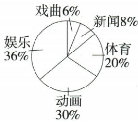
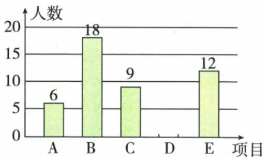
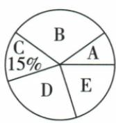
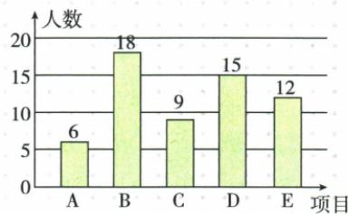

## 讲解

### 是什么

统计调查为回答明确问题收集一组数据，再分类计数、图表表示与分析。先写“研究谁的什么”：谁决定范围，什么决定数据指标；随后选普查或抽样、设计中性问卷、实施记录、汇总表示，最后作符合证据的推断。

### 怎么来的

若调查主题或对象不清，不同受访者会答不同问题，汇总后的数字不可比；若先表达调查者态度，回答可能被引导。原两句问卷警示体现主题类型混乱与引导偏好。原班级上学方式只让每人落同一明确类别，用正字划记每划代表1条记录，再计15、9、26合50，能核查漏记重复。记录后先检验总数和分类条件，图表只是表达已收数据，不能修补来源偏差。

### 什么时候能用

方法取决于调查目的、对象与可实施条件。人数表调查容量是记录数，而多选问卷类别次数可能超过人数，不能直接画“互斥组成”饼图。原每人只选一类的节目和球类题才可百分比和100%。资料里的设计句是警示证据，不自编整份调查冒充原题。

## 例题

### 原问卷两句主题类型与引导性警示

> 来源ID Q29-22；第29章数据的收集整理与描述；351-377/full.md 第44–44行。原答案与解析定位：351-377/full.md 第44–44行。

在设计调查问题时，需注意主题明确，且避免使用引导性问题，例如“报纸是你喜欢的图书吗？”“我很喜欢猫，你是否喜欢呢？”这两个问题设计得都不合理.

**原资料答案与解析：**

在设计调查问题时，需注意主题明确，且避免使用引导性问题，例如“报纸是你喜欢的图书吗？”“我很喜欢猫，你是否喜欢呢？”这两个问题设计得都不合理.

**展开解析（依据原详解补足理由与步骤）：**

原“报纸是你喜欢的图书吗”把报纸与图书类型混杂，主题不清；“我很喜欢猫，你是否喜欢呢”先表达调查者偏好可能引导受访者。先明确要问对象与指标，以中性措辞问同一主题，避免用态度暗示或类型混淆来改变答案。原只有设计警示，没有独立完整数值调查题，保留原两句作证据。

### 原五十上学方式三图与气温冷饮趋势示意

> 来源ID Q29-25；第29章数据的收集整理与描述；351-377/full.md 第276–318行。原答案与解析定位：351-377/full.md 第276–318行。

知识解读 某班共有50名学生,其中有15人步行上学,9人骑车上学,剩余26人乘车上学.下面分别是条形图、扇形图和折线图的图示.

某班学生上学方式条形图

某班学生上学方式扇形图

某班学生上学方式折线图

**原资料答案与解析：**

知识解读 某班共有50名学生,其中有15人步行上学,9人骑车上学,剩余26人乘车上学.下面分别是条形图、扇形图和折线图的图示.

某班学生上学方式条形图

某班学生上学方式扇形图

某班学生上学方式折线图

**展开解析（依据原详解补足理由与步骤）：**

原上学50人，步行15、骑车9、乘车26；频率30%、18%、52%，和100%。条形清楚数量，扇形清楚比例，原还画折线但分类上学方式没有自然时间顺序，连线起伏不能当随时间发展的趋势。原气温与冷饮点图显示该样本总体随气温增大而杯数增多，趋势线用于概括而非每一点精确等式；不能把统计相关当气温单独导致所有销量变化。

### 五类喜爱节目普查五十体育角七二逐项D

> 来源ID Q29-17；第29章数据的收集整理与描述；351-377/full.md 第659–681行。原答案与解析定位：351-377/full.md 第614–622行。

例3（2024山东济宁）为了解全班同学对新闻、体育、动画、娱乐、戏曲五类节目的喜爱情况，班主任对全班50名同学进行了问卷调查（每名同学只选其中的一类），依据50份问卷调查结果绘制了全班同学喜爱节目情况扇形统计图(如图所示).下列说法正确的是 （）

A.班主任采用的是抽样调查

B.喜爱动画节目的同学最多

C. 喜爱戏曲节目的同学有 6 名

D.“体育”对应扇形的圆心角为 $72^{\circ}$

**原资料答案与解析：**

例3 解析 对全班 50 名同学都进行了调查, 班主任采用的是全面调查, 故选项 A 不正确;

喜爱娱乐节目的同学最多,故选项 B 不正确;

喜爱戏曲节目的同学应为 $50 \times 6\% = 3$ (名), 故选项 C 不正确;

“体育”对应扇形的圆心角为 $360^{\circ} \times 20\% = 72^{\circ}$ , 故选项 D 正确.

答案D

**展开解析（依据原详解补足理由与步骤）：**

调查全班50人所以A说抽样错；娱乐36%比动画30%大，B动画最多错；戏曲6%×50=3人，C6人错；体育20%×360=72°，D对。各人只选一类，五类互斥完备，总百分6+8+20+30+36=100，圆周角份额才能一一对应。

### 五球项目篮球九占百分十五求六十补排球十五角七二估乒乓二四〇

> 来源ID Q29-20；第29章数据的收集整理与描述；351-377/full.md 第752–781行。原答案与解析定位：351-377/full.md 第787–811行。

例6（2024江苏苏州）某校计划在七年级开展阳光体育锻炼活动，开设以下五个球类项目：A（羽毛球），B（乒乓球），C（篮球），D（排球），E（足球），要求每位学生必须参加，且只能选择其中一个项目。为了了解学生对这五个项目的选择情况，学校从七年级全体学生中随机抽取部分学生进行问卷调查，对调查所得到的数据进行整理、描述和分析，部分信息如下：

各项目选择人数条形统计图

各项目选择人数占比扇形统计图

图①

  
图②

根据以上信息,解决下列问题:

(1) 将图①中的条形统计图补充完整(画图并标注相应数据).  
(2)图②中项目 E 对应的圆心角的度数为  
(3) 根据抽样调查结果, 请估计本校七年级 800 名学生中选择项目 B(乒乓球) 的人数.

**原资料答案与解析：**

例6 解析 (1) $9 \div 15\% = 60$ .

D 的人数为 60-6-18-9-12=15.
补全条形统计图如下：

各项目选择人数条形统计图

(2)72.   
(3) $800\times\frac{18}{60}=240$ （人）.

答:本校七年级800名学生中选择项目B(乒乓球)的人数约为240.

**展开解析（依据原详解补足理由与步骤）：**

C篮球9人占15%，样本总9/0.15=60。D排球缺人数=60−6−18−9−12=15，补图柱高15并标数。E足球12/60=20%，扇角360×20%=72°。B乒乓18/60=30%，估七年级800×30%=240人。四步使用同一60为样本分母，不把字母C/D项目当选择题选项，更不能把未画D柱解释为0。

## 易错

原“我很喜欢猫”影响语气；“报纸是图书”混指标类型。题未画柱通常是待补值，不是已收0条。
