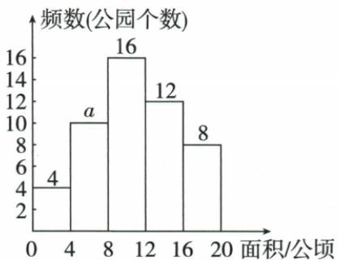

## 讲解

### 是什么

组距是同一小组上下端点之差；频数分布表按区间整理数据。分组必须覆盖研究范围而不重叠，每条记录只入一组；端点用一侧含等号另一侧不含。某组无数据频数可0，不能为追求每组有值而漏去原范围。

### 怎么来的

原1≤x≤10、10≤x≤20会把10计两次；1<x<10、10<x<20又使10无组可入。可采用原视力表4.6≤x<4.9、4.9≤x<5.2这类连续相接的一闭一开，4.9只入后组。公园题用0<x≤4、4<x≤8等，恰12只在8<x≤12，超过12则只后两档。完成计数后总频数必须回到原数据数，才能查漏/重。

### 什么时候能用

上下界、有效数据范围及闭开符号依原题，不能统一强改为左闭右开。等距非必需，但不等距直方图纵轴解释要另查。原“不空”是尽量合理选组的建议，不是数学禁止频数0；整数或测量精度数据可用半单位边界避切实际值。

## 例题

### 原频数组距与五分组直方辨析端点不重不漏

> 来源ID Q29-24；第29章数据的收集整理与描述；351-377/full.md 第390–401行。原答案与解析定位：351-377/full.md 第390–401行。

1. 频数 = 频率 × 数据总数. (√)  
2.一般地，各组的频数之比等于各组的频率之比. （√）  
3. 根据问题的需要，各组的组距可以相同或不同. （√）

# 5 易错辨析

1. 频数分布直方图与条形图没有任何区别. (×)  
2. 当纵轴为频数时，频数分布直方图中各小长方形的高之和为数据总数. （√）  
3.频数分布直方图中的分组数据可以不连续. (×)  
4. 对数据分组时，可以出现 $1 \leqslant x \leqslant 10$ ， $10 \leqslant x \leqslant 20$ 的情况.
(×)  
5. 对数据分组时，可以出现 1 < x < 10，10 < x < 20 的情况。（×）

**原资料答案与解析：**

1. 频数 = 频率 × 数据总数. (√)  
2.一般地，各组的频数之比等于各组的频率之比. （√）  
3. 根据问题的需要，各组的组距可以相同或不同. （√）

# 5 易错辨析

1. 频数分布直方图与条形图没有任何区别. (×)  
2. 当纵轴为频数时，频数分布直方图中各小长方形的高之和为数据总数. （√）  
3.频数分布直方图中的分组数据可以不连续. (×)  
4. 对数据分组时，可以出现 $1 \leqslant x \leqslant 10$ ， $10 \leqslant x \leqslant 20$ 的情况.
(×)  
5. 对数据分组时，可以出现 1 < x < 10，10 < x < 20 的情况。（×）

**展开解析（依据原详解补足理由与步骤）：**

频数=频率×本总体数，√；同一总体中两组频数比与频率比相同（分母同总数可约去），√，比较比值须分母组频数非0。组距可不同，√，不同组距图须以面积或密度解释，不能比较高度即频数。直方图与条形图用途轴含义不同，×；纵轴真为频数时各高之和为总数，√；连续量分组不能任意漏中间区间，×；原1≤x≤10与10≤x≤20重复10，×；原1<x<10与10<x<20漏10，×。分组可以出现频数0的空组，原“不空”只是力求有用分组的建议，不是必须删空组的硬条件。

### 视力两高档频数七十除总二百得0点35

> 来源ID Q29-12；第29章数据的收集整理与描述；351-377/full.md 第469–471行。原答案与解析定位：351-377/full.md 第473–475行。

例1 某校对七年级全体学生进行了一次视力普查,得到如下统计表,则视力 x 在 $4.9 \leqslant x < 5.5$ 这个范围内的频率为 \_\_\_\_.

| 视力x | 4.0≤x<4.3 | 4.3≤x<4.6 | 4.6≤x<4.9 | 4.9≤x<5.2 | 5.2≤x<5.5 |
| --- | --- | --- | --- | --- | --- |
| 频数 | 20 | 40 | 70 | 60 | 10 |

**原资料答案与解析：**

解析 视力 $x$ 在 $4.9 \leqslant x < 5.5$ 这个范围内的频数为 $60 + 10 = 70$ , 则视力 $x$ 在 $4.9 \leqslant x < 5.5$ 这个范围内的频率为 $\frac{70}{20 + 40 + 70 + 60 + 10} = 0.35$ .

答案 0.35

**展开解析（依据原详解补足理由与步骤）：**

范围4.9≤x<5.5由相邻两档4.9≤x<5.2及5.2≤x<5.5合成，频数60+10=70。全体总数20+40+70+60+10=200，所以频率70/200=0.35。不能只拿60/200，或将两组端点重复计5.2。

### 灯泡寿命不小二二〇〇两档二十三估四百六十

> 来源ID Q29-15；第29章数据的收集整理与描述；351-377/full.md 第598–602行。原答案与解析定位：351-377/full.md 第606–608行。

例1 (2023 北京) 某厂生产了 1 000 只灯泡. 为了解这 1 000 只灯泡的使用寿命, 从中随机抽取了 50 只灯泡进行检测, 获得了它们的使用寿命(单位: 小时), 数据整理如下:

| 使用寿命 | $x < 1\,000$ | $1\,000 \leqslant x < 1\,600$ | $1\,600 \leqslant x < 2\,200$ | $2\,200 \leqslant x < 2\,800$ | $x \geqslant 2\,800$ |
| --- | --- | --- | --- | --- | --- |
| 灯泡只数 | 5 | 10 | 12 | 17 | 6 |

根据以上数据,估计这 1 000 只灯泡中使用寿命不小于 2 200 小时的灯泡的数量为 \_\_\_\_ 只.

**原资料答案与解析：**

例1 解析 估计这 1 000 只灯泡中使用寿命不小于 2 200 小时的灯泡的数量为 $1\ 000 \times \frac{17+6}{50} = 460$ (只).

答案 460

**展开解析（依据原详解补足理由与步骤）：**

不小于2200含2200≤x<2800和x≥2800两档，17+6=23。样本50频率23/50=0.46，估1000×0.46=460只。寿命恰2200属于前者，不能漏等号；只数是数量、小时是寿命指标，单位不能错。

### 公园五档总五十缺频十最大第三超过十二二十逐项B

> 来源ID Q29-19；第29章数据的收集整理与描述；351-377/full.md 第729–748行。原答案与解析定位：351-377/full.md 第783–785行。

例5（2024 广东广州）为了解公园用地面积 x（单位：公顷）的基本情况，某地随机调查了本地 50 个公园的用地面积，按照 $0 < x \leqslant 4, 4 < x \leqslant 8, 8 < x \leqslant 12, 12 < x \leqslant 16, 16 < x \leqslant 20$ 的分组绘制了如图所示的频数分布直方图，下列说法正确的是（）

A.a 的值为 20  
B.用地面积在 $8 < x \leqslant 12$ 这一组的公园个数最多  
C. 用地面积在 $4 < x \leqslant 8$ 这一组的公园个数最少  
D.这50个公园中有一半以上的公园用地面积超过12公顷

**原资料答案与解析：**

例5 解析 $a = 50 - 4 - 16 - 12 - 8 = 10 \neq 20$ ; 用地面积在 $8 < x \leqslant 12$ 这一组的公园个数为 16, 数量最多; 用地面积在 $0 < x \leqslant 4$ 这一组的公园个数为 4, 数量最少; 50 个公园中有 20 个公园用地面积超过 12 公顷, 不到一半.

答案B

**展开解析（依据原详解补足理由与步骤）：**

频数和50，a=50−4−16−12−8=10，A20错。五档4、10、16、12、8，第三档8<x≤12有16个最多，B对；最少第一档4个而非第二10个，C错。超过12只含末两档12+8=20，占20/50=40%，不到一半，D错；恰12落第三档不计超过。

## 易错

只记端点数字而不看≤/<会误判阈值，既会错比例也会错估总体。缺柱是未知还是0由原题说明，不凭空断定。
