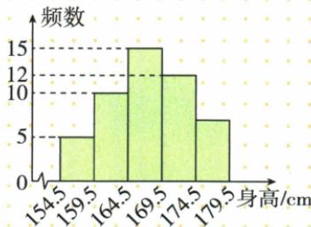

## 讲解

### 判据

题给总体人数与样本分类表/图，目标是满足某条件的估计人数。

### 流程

1.明确总体和样本两个数，500样本不是12000总体。2.把不低4.8合80+93+127=300，频率300/500，乘12000得7200。3.不小2200合17+6=23，除50乘1000得460。4.阅读20/100乘800得160；身高原图目标8/50乘300得48。5.检验估计人数不超总体、目标频数不超样本，结论写估计而非普查事实。

## 例题

### 五百视力不低四点八三档估一万二七千二

> 来源ID Q29-05；第29章数据的收集整理与描述；351-377/full.md 第125–129行。原答案与解析定位：351-377/full.md 第131–133行。

例3 为了解某区初中学生的视力情况,随机抽取了该区500名初中学生进行调查.整理样本数据,得到下表:

| 视力 | 4.7以下 | 4.7 | 4.8 | 4.9 | 4.9以上 |
| --- | --- | --- | --- | --- | --- |
| 人数 | 102 | 98 | 80 | 93 | 127 |

根据抽样调查结果,估计该区 12 000 名初中学生视力不低于 4.8 的人数是 \_\_\_\_.

**原资料答案与解析：**

解析 估计该区 12000 名初中学生视力不低于 4.8 的人数是 $12000 \times \frac{80 + 93 + 127}{500} = 7200$ .

答案 7 200

**展开解析（依据原详解补足理由与步骤）：**

不低于4.8含4.8、4.9、4.9以上三档，共80+93+127=300。全表102+98+80+93+127=500，目标频率300/500=0.6，估全区12000×0.6=7200人。不能漏掉等于4.8的80，或拿目标300当总体数；7200是样本推断，不是已逐一调查的精确普查结果。

### 阅读百分之二十推八百一百六逐项D

> 来源ID Q29-08；第29章数据的收集整理与描述；351-377/full.md 第171–179行。原答案与解析定位：351-377/full.md 第193–195行。

例3（2024 贵州）为了解学生的阅读情况,某校在 4 月 23 日世界读书日,随机抽取 100 名学生进行阅读情况调查,每月阅读两本以上经典作品的有 20 名学生,估计该校 800 名学生中每月阅读经典作品两本以上的人数为 ( )

A.100

B.120

C.150

D.160

**原资料答案与解析：**

例3 解析 $800 \times \frac{20}{100} = 160$ .

答案 160

**展开解析（依据原详解补足理由与步骤）：**

样本符合条件20/100=20%，估800×20%=160，D。A100是样本量，B120/C150均不满足所给20%与总体800乘积。沿原题“两本以上”的统计类别计20人，不私改原调查分类；估计以代表性样本为前提。

### 五十男生身高末组原图八估三百四十八

> 来源ID Q29-11；第29章数据的收集整理与描述；351-377/full.md 第405–420行。原答案与解析定位：351-377/full.md 第422–422行。

例3 为了解某中学300名男生的身高情况,随机抽取50名男生进行身高测量,将所得数据整理后,画出频数分布直方图(如图),估计该校男生的身高在174.5\~179.5cm的人数为\_\_\_\_.

**原资料答案与解析：**

答案 48

**展开解析（依据原详解补足理由与步骤）：**

原图174.5至179.5这一组柱高为8，五组频数5、10、15、12、8合50。目标频率8/50=0.16，估全校300×0.16=48人。OCR图表误录最后组7还添端点179.5对应0，不能当真实数据；以原JPEG实际五个区间与柱高为准。

### 灯泡寿命不小二二〇〇两档二十三估四百六十

> 来源ID Q29-15；第29章数据的收集整理与描述；351-377/full.md 第598–602行。原答案与解析定位：351-377/full.md 第606–608行。

例1 (2023 北京) 某厂生产了 1 000 只灯泡. 为了解这 1 000 只灯泡的使用寿命, 从中随机抽取了 50 只灯泡进行检测, 获得了它们的使用寿命(单位: 小时), 数据整理如下:

| 使用寿命 | $x < 1\,000$ | $1\,000 \leqslant x < 1\,600$ | $1\,600 \leqslant x < 2\,200$ | $2\,200 \leqslant x < 2\,800$ | $x \geqslant 2\,800$ |
| --- | --- | --- | --- | --- | --- |
| 灯泡只数 | 5 | 10 | 12 | 17 | 6 |

根据以上数据,估计这 1 000 只灯泡中使用寿命不小于 2 200 小时的灯泡的数量为 \_\_\_\_ 只.

**原资料答案与解析：**

例1 解析 估计这 1 000 只灯泡中使用寿命不小于 2 200 小时的灯泡的数量为 $1\ 000 \times \frac{17+6}{50} = 460$ (只).

答案 460

**展开解析（依据原详解补足理由与步骤）：**

不小于2200含2200≤x<2800和x≥2800两档，17+6=23。样本50频率23/50=0.46，估1000×0.46=460只。寿命恰2200属于前者，不能漏等号；只数是数量、小时是寿命指标，单位不能错。

## 易错

严格大于与至少的等号不同；分母不能只取目标几档，样本率也不先拿总体除。
