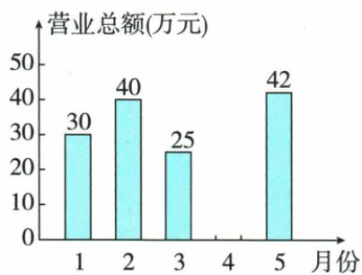
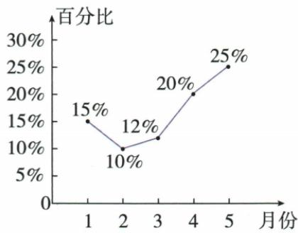
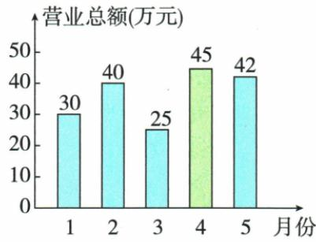

## 讲解

### 判据

一个图给各月总量、另图给类别占该月比例，求缺月与类别最大值。

### 流程

1.五个月总182，已知和137，补4月45。2.5月类别=42×25%=10.5。3.逐月算4.5/4/3/9/10.5，最大5月，不能仅比份额或总营业额。4.补柱同纵轴单位万元和刻度，标45，不改其他柱。5.每一比的分母是当月总量，不能拿182给每个月都乘。

## 例题

### 五个月营业总一八二补四月四五党史逐月乘比

> 来源ID Q29-14；第29章数据的收集整理与描述；351-377/full.md 第516–553行。原答案与解析定位：351-377/full.md 第555–578行。

例3 图1表示的是某书店今年1\~5月的各月营业总额的情况,图2表示的是该书店“党史”类书籍的各月营业额占书店当月营业总额的百分比情况.若该书店1\~5月的营业总额一共是182万元,观察图1、图2,解答下列问题:

图 1

图2

(1) 求该书店 4 月份的营业总额, 并补全条形图.  
(2) 求 5 月份“党史”类书籍的营业额.  
(3)请你判断这5个月中哪个月“党史”类书籍的营业额最高,并说明理由.

**原资料答案与解析：**

解析（1）该书店4月份的营业总额为 $182 - (30 + 40 + 25 + 42) = 45$ （万元）.补全条形图如图所示.

(2)5月份“党史”类书籍的营业额为 $42 \times 25\% = 10.5$ (万元).  
(3) 这 5 个月中 5 月份“党史”类书籍的营业额最高.

理由:4月份“党史”类书籍的营业额为 $45\times20\%=9$ (万元).

∵ 10.5>9,且1\~3月的营业总额以及“党史”类书籍的营业额占当月营业总额的百分比都低于4、5月份，

∴ 这 5 个月中 5 月份“党史”类书籍的营业额最高.

**展开解析（依据原详解补足理由与步骤）：**

(1)其余月份30+40+25+42=137，4月182−137=45万元，按图同刻度补45高柱并标值。(2)5月党史42×25%=10.5万元。(3)依次求五个月该类别营业额：30×15%=4.5，40×10%=4，25×12%=3，45×20%=9，42×25%=10.5万元，最大5月。百分比最高本身不一定数量最高，本题以各月本身营业额为分母，必须乘回各月总量。

### 原条形截轴与扇图不同分母两辨析

> 来源ID Q29-23；第29章数据的收集整理与描述；351-377/full.md 第217–219行。原答案与解析定位：351-377/full.md 第217–219行。

1. 条形图中，条形柱的高度与相应的数量一定成正比。（×）

2. 在两个扇形图中，若一个统计图中的某一部分 $A$ 所占的百分比比另一个统计图中的某一部分 $B$ 所占的百分比多，那么 $A$ 的数量大于 $B$ 的数量。（×）

**原资料答案与解析：**

1. 条形图中，条形柱的高度与相应的数量一定成正比。（×）

2. 在两个扇形图中，若一个统计图中的某一部分 $A$ 所占的百分比比另一个统计图中的某一部分 $B$ 所占的百分比多，那么 $A$ 的数量大于 $B$ 的数量。（×）

**展开解析（依据原详解补足理由与步骤）：**

①若柱从零起且同刻度，画高才与数值成正比；截轴省略底部时视觉高度比例不等于数值比例，原无条件断言×。②两扇图整体总量可能不同，部分数量=本图总体×本部分百分比，仅较大百分比不能推出跨图数量较大，×。原利润两图不同纵轴也体现必须读刻度，原书店逐月不同总量体现必须乘各自分母。

## 易错

本题5月百分最大且类别也最大是计算后的结果，不构成不同分母下普遍推论。
