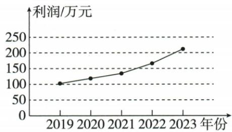
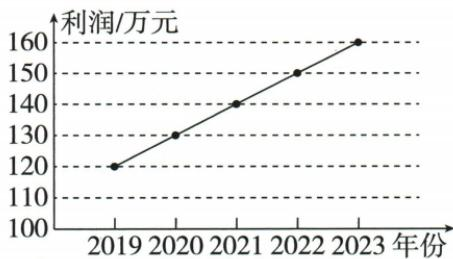

## 讲解

### 判据

两公司图纵轴刻度或起点不同，问同年间增长快慢，应以实际增量比较。

### 流程

1.甲原100/120/140/170/210，四差20/20/30/40。2.乙原120/130/140/150/160，四差都10。3.每段都20或更多大于10，A始终快；B先慢、C全慢、D后慢分别不合相应段。4.两图乙轴从100截起且刻度10，甲轴刻度50，视觉更陡不代表实际增量更大。5.题若问增长率需再除前期数，本题口径为等长时间的绝对增长。

## 例题

### 两利润图刻度不同甲年增二十二十三十四十乙十逐项A

> 来源ID Q29-18；第29章数据的收集整理与描述；351-377/full.md 第685–725行。原答案与解析定位：351-377/full.md 第624–627行。

例4（2024 江苏盐城）甲、乙两家公司 2019—2023 年的利润统计图如下, 比较这两家公司的利润增长情况知 ( )

甲公司

乙公司

A.甲始终比乙快

B.甲先比乙慢，后比乙快

C.甲始终比乙慢

D.甲先比乙快，后比乙慢

**原资料答案与解析：**

例4 解析 由折线图可知,甲公司2020年到2023年每年利润增长高于10万元,乙公司2020年到2023年每年利润增长10万元.
∴ 甲始终比乙快.

答案A

**展开解析（依据原详解补足理由与步骤）：**

读数甲100、120、140、170、210万元，四年增20、20、30、40；乙120、130、140、150、160，四年都增10。每段甲增量都大于乙，A始终更快对，B先慢后快、C始终慢、D先快后慢都错。原图两纵轴刻度不同，乙还从100截起，不能按绘出的视觉坡度比较真实增长。

### 原条形截轴与扇图不同分母两辨析

> 来源ID Q29-23；第29章数据的收集整理与描述；351-377/full.md 第217–219行。原答案与解析定位：351-377/full.md 第217–219行。

1. 条形图中，条形柱的高度与相应的数量一定成正比。（×）

2. 在两个扇形图中，若一个统计图中的某一部分 $A$ 所占的百分比比另一个统计图中的某一部分 $B$ 所占的百分比多，那么 $A$ 的数量大于 $B$ 的数量。（×）

**原资料答案与解析：**

1. 条形图中，条形柱的高度与相应的数量一定成正比。（×）

2. 在两个扇形图中，若一个统计图中的某一部分 $A$ 所占的百分比比另一个统计图中的某一部分 $B$ 所占的百分比多，那么 $A$ 的数量大于 $B$ 的数量。（×）

**展开解析（依据原详解补足理由与步骤）：**

①若柱从零起且同刻度，画高才与数值成正比；截轴省略底部时视觉高度比例不等于数值比例，原无条件断言×。②两扇图整体总量可能不同，部分数量=本图总体×本部分百分比，仅较大百分比不能推出跨图数量较大，×。原利润两图不同纵轴也体现必须读刻度，原书店逐月不同总量体现必须乘各自分母。

## 易错

比较当前利润高低与比较增长不是同一题；甲2019比乙低也不妨碍此后每年增得更多。
