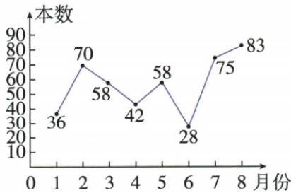
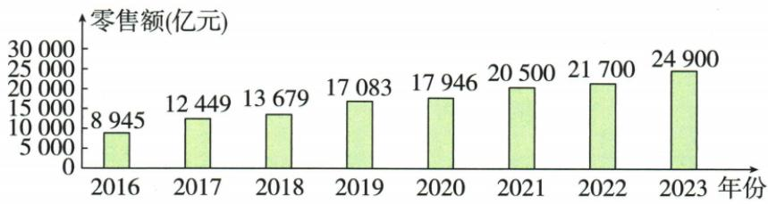

## 讲解

### 判据

题问错误项、最大最小、首次过阈值或相等次数，先完整读对应记录而非看形状猜。

### 流程

1.阅读八月83最大、六月28最小、三/五月58相同；超过40逐月点数得六个月，所以错误D。2.零售图2020原值17946未过20000，2021的20500才过，错误D；在给定2016–2023范围内2023最大、2016最小且逐年增。3.核单位本/亿元与时间范围，不能将图外年份补入结论。4.一项有多个条件须全部满足，先注意问正确还是错误。

## 例题

### 八月阅读图六个月超过四十逐项D

> 来源ID Q29-13；第29章数据的收集整理与描述；351-377/full.md 第481–506行。原答案与解析定位：351-377/full.md 第508–510行。

例2 某校七(2)班班长统计了今年 1\~8 月“书香校园”活动中全班同学的课外阅读数量(单位:本),绘制了如下折线图,下列说法错误的是 ( )

A. 阅读量最多的是 8 月份

B. 阅读量最少的是6月份

C.3月份和5月份的阅读量相等

D. 阅读量超过 40 本的有 5 个月

**原资料答案与解析：**

解析 由题图可得,阅读量最多的是8月份,为83本,A中说法正确;阅读量最少的是6月份,为28本,B中说法正确;3月份的阅读量为58本,5月份的阅读量为58本,故阅读量相等,C中说法正确;阅读量超过40本的有6个月,D中说法错误.

答案 D

**展开解析（依据原详解补足理由与步骤）：**

读原各月36、70、58、42、58、28、75、83。A最多8月83真；B最少6月28真；C3月与5月都是58真；D超过40的是2、3、4、5、7、8六个月，声称5个假。本题选错误项D。不能漏4月42，也不按线段跨过40的位置数月份。

### 农村网络零售原图首破二万为二〇二一逐项D

> 来源ID Q29-16；第29章数据的收集整理与描述；351-377/full.md 第631–655行。原答案与解析定位：351-377/full.md 第610–612行。

例2（2024甘肃）近年来，我国重视农村电子商务的发展.下面的统计图反映了2016—2023年中国农村网络零售额情况.根据统计图提供的信息，下列结论错误的是 （）

2016—2023年中国农村网络零售额统计图

A.2023年中国农村网络零售额最高  
B.2016年中国农村网络零售额最低  
C.2016—2023年,中国农村网络零售额持续增加  
D.从 2020 年开始,中国农村网络零售额突破 20 000 亿元

**原资料答案与解析：**

例2 解析 由统计图可知,中国农村网络零售额从2021年开始突破了20 000亿元,而非2020年.

答案D

**展开解析（依据原详解补足理由与步骤）：**

原图2016至2023依次8945、12449、13679、17083、17946、20500、21700、24900亿元。A2023最大真；B2016最小真；C每相邻年增加真；D2020只有17946不足20000，2021的20500才突破，假，选错误项D。这仅讨论原图年份范围内首次突破，不编2024以后数据。

## 易错

不能用线段越阈的交点数量代月份数；不把刚好达到当严格突破。
