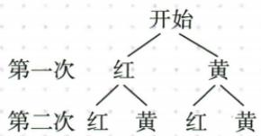
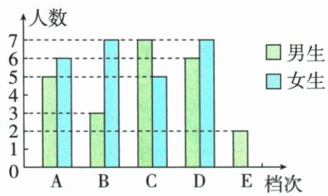
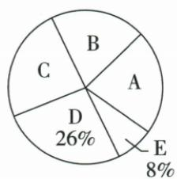
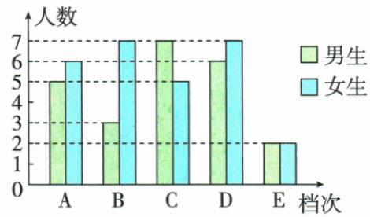

## 错法

不放回数字球仍16总数；红黄放回两红误认为无第二个红球所以0。

## 正解

不放回删原同一个体，每个首次后剩3，共12，奇和8/12。放回原红重新参与第二步，红红是合法四路径之一1/4。同色不同人仍各路径，双女编号两条才能除12。

## 例题

### 四数球不放回有序十二奇和八率二三逐项C

> 来源ID Q31-16；第31章概率；351-377/full.md 第1917–1925行。原答案与解析定位：351-377/full.md 第1927–1961行。

例3 有四个完全一样的小球,分别标上数字1,2,3,4,再放到一个不透明的口袋中.若从口袋中随机摸出一个小球后不放回,接着再随机摸出一个小球,则两次摸出的小球上的数字之和为奇数的概率是 ( )

A. $\frac{1}{2}$

B. $\frac{1}{3}$

C. $\frac{2}{3}$

D. $\frac{3}{4}$

**原资料答案与解析：**

解析 画树状图如图.

由树状图可知,共有12种等可能的结果,其中数字之和为奇数的结果有8种,所以两次摸出的小球上的数字之和为奇数的概率是 $\frac{8}{12}=\frac{2}{3}$ .

答案 C

**展开解析（依据原详解补足理由与步骤）：**

首次4种、第二剩3种，12有序对，禁止(1,1)等同一个球重复。奇和需奇偶不同，首奇1/3各可接偶2/4共4，首偶2/4各可接奇1/3共4，总8，率8/12=2/3，C。A1/2把放回16总8有利误套；B1/3是同奇偶补事件；D3/4不能匹配8/12。也可一次选无序两球6组其中异奇偶4，4/6同值，但全过程总数和有利数都必须同口径。

### 红黄各一放回两红四一逐项A

> 来源ID Q31-20；第31章概率；351-377/full.md 第2203–2211行。原答案与解析定位：351-377/full.md 第2179–2199行。

例1（2024 北京）不透明袋子中仅有红、黄小球各一个，两个小球除颜色外无其他差别。从中随机摸出一个小球，放回并摇匀，再从中随机摸出一个小球，则两次摸出的都是红球的概率是（）

A. $\frac{1}{4}$

B. $\frac{1}{3}$

C. $\frac{1}{2}$

D. $\frac{3}{4}$

**原资料答案与解析：**

例1 解析 画树状图如下：

共有 4 种等可能的结果, 其中两次摸出的都是红球的结果有 1 种, ∴ 两次摸出的都是红球的概率为 $\frac{1}{4}$ .

答案A

**展开解析（依据原详解补足理由与步骤）：**

两次均红/黄各半，完整四路径红红、红黄、黄红、黄黄等可能，两红仅红红，率1/4，A。B1/3把混色两有序对合一而当三类等权；C1/2只算一次红；D3/4是至少一次黄/非两红的补事件。放回且摇匀第二次仍有红球，不能按不放回算0。

### 劳动双图D十三占二六总五十E四女二选两女一六

> 来源ID Q31-18；第31章概率；351-377/full.md 第2017–2048行。原答案与解析定位：351-377/full.md 第2050–2074行。

例5 为贯彻教育部《大中小学劳动教育指导纲要(试行)》文件精神,某学校举办“我参与,我劳动,我快乐,我光荣”活动.为了解学生周末在家劳动情况,学校随机调查了八年级部分学生在家劳动时间(单位:小时),并进行整理和分析(劳动时间x分成五档,A档:0≤x<1;B档:1≤x<2;C档:2≤x<3;D档:3≤x<4;E档:x≥4),调查的八年级男生、女生劳动时间的不完整统计图如下.

(1)本次调查中,共调查了\_\_\_\_名学生,补全条形图.   
(2)学校为了提高学生的劳动意识,现从 E 档中选两名学生进行劳动经验交流,请用列表法或画树状图法求所选两名学生恰好都是女生的概率.

**原资料答案与解析：**

解析（1）50.详解：本次调查中，共调查了 $(6 + 7)\div 26\% = 50$ 名学生

E 档的学生人数为 $50 \times 8\% = 4$ , E 档中女生人数为 4 - 2 = 2.

补全条形图如图所示.

(2)由(1)知,E档中有2名男生,2名女生.列表如下:

|  | 男 | 男 | 女 | 女 |
| --- | --- | --- | --- | --- |
| 男 |  | (男,男) | (男,女) | (男,女) |
| 男 | (男,男) |  | (男,女) | (男,女) |
| 女 | (女,男) | (女,男) |  | (女,女) |
| 女 | (女,男) | (女,男) | (女,女) |  |

共有12种等可能的结果,其中所选两名学生恰好都是女生的结果有2种,所以所选两名学生恰好都是女生的概率为 $\frac{2}{12}=\frac{1}{6}$ .

**展开解析（依据原详解补足理由与步骤）：**

D男6女7合13，占26%，总13/0.26=50。E占8%总4，男2已知故女2，按图补女柱2，不是OCR缺图0。(2)四名实际学生编号男1/男2/女1/女2，随机选两人不放回，有序4×3=12等可能，双女仅女1女2与女2女1两种，率2/12=1/6。不能把两个男都合“男”成三种性别组合等权，个体不同产生路径不同。
