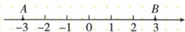
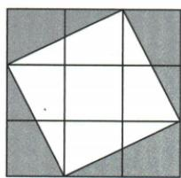
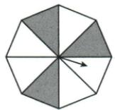

## 讲解

### 是什么

连续区域无法数有限个点，采用均匀落点模型时用目标长度/总长度或目标面积/总面积。转盘指针从中心按转角选区，用角度份额；同中心等角扇区才可直接以扇形面积份额替代转角份额。不能因图上任意两块面积相等便断言指针落它们概率相同。

### 怎么来的

数轴AB−3至3总6，距1≤2先解−1至3，再与原区间交合，目标4、率2/3；不是数标出的整数点。飞镖原3×3板9，四角各三角底2高1面积1，合4、率4/9；原正八边中心三角对应8等角，阴影3份率3/8。目标必须截在有效区域里，区外重投改的是有效试验范围，分母按板内区域。

### 什么时候能用

长度/面积公式要求相应均匀分布，真实投点偏向中心不能仅面积估。原几何题按教材均匀任取或均匀有效落点模型解释，原没明说的均匀性在缺口记录中注明；不把物理图形本身等大小当充分概率机制。拓展边界：单点长/面积0，不等于该点从几何图形中不存在，不把有限模型0/1口径无条件推广连续模型。

## 例题

### 数轴原负三到三距离一点不超过二目标负一到三率二三

> 来源ID Q31-03；第31章概率；351-377/full.md 第1548–1550行。原答案与解析定位：351-377/full.md 第1552–1554行。

例3 如图, 数轴上有两点 A、B, 在线段 AB 上任取一点 C, 则点 C 到表示 1 的点的距离不大于 2 的概率是 \_\_\_\_.

**原资料答案与解析：**

解析 观察数轴可知, 若点 C 到表示 1 的点的距离不大于 2, 则点 C 在以表示 -1 与 3 的两点为端点的线段上, 故所求概率为 $\frac{4}{6} = \frac{2}{3}$ .

答案 $\frac{2}{3}$

**展开解析（依据原详解补足理由与步骤）：**

原图A−3、B3，总长6。C坐标x到1距离不大于2即|x−1|≤2，等价−2≤x−1≤2，两端加1得−1≤x≤3。与原可选AB交集仍[−1,3]，目标长4。按沿线段均匀任取模型，概率4/6=2/3；不把七个整数标点当总结果，因为C可在线段任意位置，不仅整数。

### 九格飞镖四角各面积一阴影四九逐项C

> 来源ID Q31-05；第31章概率；351-377/full.md 第1588–1604行。原答案与解析定位：351-377/full.md 第1606–1610行。

例2 如图,飞镖游戏板中每一个小正方形除颜色外都相同.若某人向游戏板投掷飞镖一次(若飞镖落在游戏板外或阴影边界线上则重新投掷),则飞镖落在阴影部分的概率是()

A. $\frac{1}{2}$

B. $\frac{1}{3}$

C. $\frac{4}{9}$

D. $\frac{5}{9}$

**原资料答案与解析：**

解析 设每个小正方形的边长为 1, 则总面积为 $3 \times 3 = 9$ , 阴影部分的面积为 $4 \times \frac{1}{2} \times 1 \times 2 = 4$ ,

∴ 飞镖落在阴影部分的概率是 $\frac{4}{9}$ .

# 答案 C

**展开解析（依据原详解补足理由与步骤）：**

以原每格边1只作面积比的共同单位，整板3×3=9。四角阴影各为底2、高1三角，单面积2×1/2=1，合4，均匀落在有效板内的模型概率4/9，C。D5/9是白区补事件；A1/2误认阴影与白面积相同；B1/3与实际四角总面积不符。原规定板外和边界重投，分母为有效整板而非板外区域；真实掷准偏向某处时单靠面积比不足。

### 正八边转盘八等角阴影三率三八

> 来源ID Q31-11；第31章概率；351-377/full.md 第1700–1702行。原答案与解析定位：351-377/full.md 第1707–1708行。

例5 (2024 江苏苏州) 如图, 正八边形转盘被分成八个面积相等的三角形, 任意转动这个转盘一次, 当转盘停止转动时, 指针落在阴影部分的概率是 \_\_\_\_.

**原资料答案与解析：**

例5 解析 设正八边形的面积为8,则阴影部分的面积为3,所以指针落在阴影部分的概率是 $\frac{3}{8}$ .
答案 $\frac{3}{8}$

**展开解析（依据原详解补足理由与步骤）：**

原八个由中心连顶点形成的等面积三角也对应相同转角，每份1/8。阴影共3份，三角位置分开不改变总份数，概率3/8。此为中心扇形角度等份的转盘模型，不能推广“任意转盘上任意形状面积比”总等概率；指针在中心按转角选择。

## 易错

先求目标条件再截总区域。转盘任意图形面积份额不一定对应指针角份额，原八等角题才可三八。
