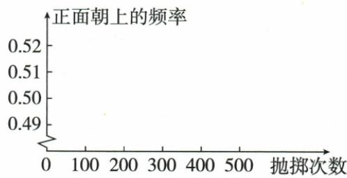
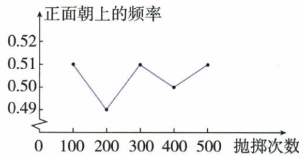

## 讲解

### 是什么

概率是固定试验模型下的发生可能性，频率是这次已观察成功数/试验数。频率会变；重复条件稳定、大量试验时可用附近摆动的频率估概率，但不会每次增加次数就必然更近，也不保证固定短期成功次数。

### 怎么来的

原公平硬币概率1/2，两次有正正、反反路径，恰一次正并不必然。原硬币频率0.51/0.49/0.51/0.50/0.51，400次等0.5后500又偏到0.51，是“逐次必更近”的原数据反证。投篮估0.4表示一次可能不中也可能中，10次不一定中4，4次不一定中1。瓶盖频率稳定附近0.53，由于形状不对称，不能只凭两面名字给半。

### 什么时候能用

估计须保相同机制和条件，改变训练水平、物体或投法后不能仍称原概率固定。原“只能取唯一值”依固定模型，不否认样本估计值随数据变化；只观察30次球频给红20是估计，不是证明真实袋数。

## 例题

### 奖票次序偶数少三骰全六随机硬币两次不保一次逐项C

> 来源ID Q31-08；第31章概率；351-377/full.md 第1669–1674行。原答案与解析定位：351-377/full.md 第1650–1652行。

例2 (2024 江苏连云港)下列说法正确的是 ( )

A.10 张票中有 1 张奖票, 10 人去摸, 先摸的人摸到奖票的概率较大  
B.从1,2,3,4,5中随机抽取一个数,取得偶数的可能性较大  
C. 小强一次掷出 3 颗质地均匀的骰子, 3 颗全是 6 点朝上是随机事件  
D. 抛一枚质地均匀的硬币, 正面朝上的概率为 $\frac{1}{2}$ , 连续抛此硬币 2 次必有 1 次正面朝上

**原资料答案与解析：**

例2 解析 A:10 个人中每个人摸到奖票的概率均相同; B:1,2,3,4,5 中奇数多, 所以取得奇数的可能性较大; C: 一次掷出 3 颗质地均匀的骰子, 3 颗全是 6 点朝上可能发生, 是随机事件; D: 连续抛一枚质地均匀的硬币 2 次, 可能 1 次正面朝上, 也可能 2 次正面朝上, 还可能 0 次正面朝上.

答案 C

**展开解析（依据原详解补足理由与步骤）：**

A在10张票充分混匀、每人一次且未获知前人结果的抽取模型，奖票等可能处任何次序，人人事先中奖1/10，先摸不更大。B1至5奇数3、偶数2，偶概率2/5小于奇3/5，错。C三骰全6能发生也能不发生，随机，对。D两次硬币有正正/正反/反正/反反，可能0/1/2次正，概率1/2不保证两次恰1次，错。

### 放十白三十摸白十频率反估红二十

> 来源ID Q31-13；第31章概率；351-377/full.md 第1777–1777行。原答案与解析定位：351-377/full.md 第1779–1781行。

例2 在不透明的口袋中有若干个红色小球,现放入10个白色小球,这些小球除颜色外无其他差别,均匀混合后,有放回地随机摸取30次,有10次摸到白色小球,据此估计该口袋中原有红色小球的个数为\_\_\_\_.

**原资料答案与解析：**

解析 设原有红色小球的个数为 x，用频率估计概率，可得 $\frac{10}{x+10} = \frac{10}{30}$ ，解得 x = 20。经检验，x = 20 是原方程的解且符合题意。

答案 20

**展开解析（依据原详解补足理由与步骤）：**

白频率10/30=1/3作为白概率估计。设原红x，现白10、总x+10，10/(x+10)≈1/3；依题估计方程交乘30≈x+10，x≈20个。原解析写等号解20，这是估计模型而非由有限30次必推出真实红恰20；放回混匀保证每次条件近似一致。

### 硬币五频率点按原表0点51等估0点5

> 来源ID Q31-17；第31章概率；351-377/full.md 第1967–1988行。原答案与解析定位：351-377/full.md 第1990–2011行。

例4 下面是同学们做“抛掷质地均匀的硬币”试验获得的数据.

| 抛掷次数n | 100 | 200 | 300 | 400 | 500 |
| --- | --- | --- | --- | --- | --- |
| 正面朝上的频数m | 51 | 98 | 153 | 200 | 255 |
| 正面朝上的频率 $\frac{m}{n}$ |  |  |  |  |  |

(1) 完成表格.   
(2) 在图中画出折线图.  
(3) 抛掷质地均匀的硬币, 正面朝上的概率的估计值是多少? (精确到 0.1)

**原资料答案与解析：**

解析（1）完成表格如下.

| 抛掷次数n | 100 | 200 | 300 | 400 | 500 |
| --- | --- | --- | --- | --- | --- |
| 正面朝上的频数m | 51 | 98 | 153 | 200 | 255 |
| 正面朝上的频率 $\frac{m}{n}$ | 0.51 | 0.49 | 0.51 | 0.50 | 0.51 |

(2)画折线图如图.   
(3) 当试验次数很大时, 正面朝上的频率在 0.5 附近摆动,

∴ 正面朝上的概率的估计值是 0.5.

**展开解析（依据原详解补足理由与步骤）：**

五频率51/100=0.51、98/200=0.49、153/300=0.51、200/400=0.50、255/500=0.51。按坐标(100,0.51)、(200,0.49)、(300,0.51)、(400,0.50)、(500,0.51)依次连折线。围绕0.5上下摆，按精确0.1估0.5，不是每增试验必更贴近，最后0.51比400次0.50更远。原空坐标图OCR伪造点表，以原数据与完成图为准。

### 投篮估0点4单次不一定中逐项A

> 来源ID Q31-22；第31章概率；351-377/full.md 第2220–2225行。原答案与解析定位：351-377/full.md 第2250–2252行。

例3（2024 贵州）小星同学通过大量重复的定点投篮练习,用频率估计他投中的概率为 0.4,下列说法正确的是()

A. 小星定点投篮 1 次, 不一定能投中  
B. 小星定点投篮 1 次, 一定可以投中  
C. 小星定点投篮 10 次, 一定投中 4 次  
D. 小星定点投篮 4 次, 一定投中 1 次

**原资料答案与解析：**

例3 解析 概率是理论值,不一定等于试验频率.小星投中的概率为0.4说明他定点投篮不能投中的可能性较大.

答案 A

**展开解析（依据原详解补足理由与步骤）：**

概率估0.4表示成功可能性较小而非不可能，A单次不一定中对。B一定中错，C10次一定4中错，D4次一定1中错，有限次数实际成功数随机；0.4并不等于每5次必须2次。仍不能由小于1/2说这一次必不中。

### 瓶盖频率原大样本0点53非自动半

> 来源ID Q31-23；第31章概率；351-377/full.md 第2227–2231行。原答案与解析定位：351-377/full.md 第2254–2256行。

例4（2024 江苏扬州）数学兴趣小组做抛掷一枚瓶盖的试验后,整理的试验数据如下表:

| 累计抛掷次数 | 50 | 100 | 200 | 300 | 500 | 1 000 | 2 000 | 3 000 | 5 000 |
| --- | --- | --- | --- | --- | --- | --- | --- | --- | --- |
| 盖面朝上次数 | 28 | 54 | 106 | 157 | 264 | 527 | 1 056 | 1 587 | 2 650 |
| 盖面朝上频率 | 0.560 | 0.540 | 0.530 | 0.523 | 0.528 | 0.527 | 0.528 | 0.529 | 0.530 |

根据以上试验数据可以估计出“盖面朝上”的概率为\_\_\_\_。(精确到0.01)

**原资料答案与解析：**

例4 解析 经过大量重复试验，频率稳定于 0.53，因此估计概率为 0.53.

答案 0.53

**展开解析（依据原详解补足理由与步骤）：**

原后几列频率0.527、0.528、0.529、0.530，围绕约0.53；按精确0.01估0.53。瓶盖两面形状不同，两个名称不是等可能，因此不能仅看正反两结果便取1/2。频率随累计次数上下变，大样本帮助估计而不保证每一步误差单调小。

### 原放回区别及大样本频率并非逐次更接近警示

> 来源ID Q31-28；第31章概率；351-377/full.md 第1766–1773行。原答案与解析定位：351-377/full.md 第1766–1773行。

# 2 易错警示

遇到摸球问题（或抽卡问题）时，若事件的发生经过两个步骤，则需注意区分“放回”和“不放回”，它们的列举结果是不同的，当没有明确指出是否放回时，要根据过程确定。比如“从袋子中随机摸出两个球”可以理解为先摸出一个球不放回，再摸出一个球。

# ③ 易错警示

1. 概率是理论值，由事件的本质决定，只能取唯一值，它能精确地反映事件发生的可能性大小。因此，试验频率是理论概率的近似值，不一定等于理论概率。  
2. 进行大量重复试验时，事件发生的频率稳定在概率附近，但并不是试验次数越多频率就越接近概率.

**原资料答案与解析：**

# 2 易错警示

遇到摸球问题（或抽卡问题）时，若事件的发生经过两个步骤，则需注意区分“放回”和“不放回”，它们的列举结果是不同的，当没有明确指出是否放回时，要根据过程确定。比如“从袋子中随机摸出两个球”可以理解为先摸出一个球不放回，再摸出一个球。

# ③ 易错警示

1. 概率是理论值，由事件的本质决定，只能取唯一值，它能精确地反映事件发生的可能性大小。因此，试验频率是理论概率的近似值，不一定等于理论概率。  
2. 进行大量重复试验时，事件发生的频率稳定在概率附近，但并不是试验次数越多频率就越接近概率.

**展开解析（依据原详解补足理由与步骤）：**

放回并混匀使第二次候选恢复；不放回须删已抽个体。频率是观察成功数/试验数，会随记录变化，概率为给定模型的可能性；大量重复时频率通常在概率附近摆动，却不保证下一列比上一列更近。原硬币400频率0.50、500频率0.51已展示可以离开0.5，不把一次吻合称从此不变。

## 易错

“理论”与“经验”不是互相否定：概率不等于某一批频率，频率仍可为估计提供证据；不借小概率宣称一次必失败。
