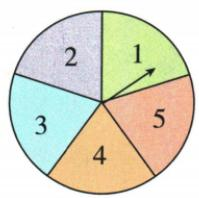
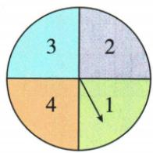
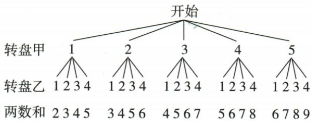

## 讲解

### 是什么

原同等奖励、成本及机会的两方游戏，以各方获胜概率相同判断机会公平。无平局且必决胜，双方各1/2；有平局时单轮胜率可以同为1/3，不能强迫各半。按同规则平局重开到决胜，最终概率是另一件事。

### 怎么来的

原五乘四双盘20路径，和4/5/6吴11份、黄9，不公；原改奇/偶双方10份，公。原三牌和大4、小4各3份、等4也3，单轮双方1/3平1/3；重开后设明最终q，首轮直接1/3胜、平后同规则重新开始仍q，所以q=1/3+q/3，移得2q/3=1/3，q1/2。红方同理，最终相等，原公平判断成立但“获胜概率均1/3”须限定单轮。

### 什么时候能用

重开须恢复原牌、洗匀及相同规则，才能把平后的问题视为同一个q。若成本/奖品不同，仅胜率相同不包揽所有现实公平含义；原只讨论等机会规则，不自编新奖励。概率相等不保证短期两人恰各赢同次数。

## 例题

### 五乘四转盘和四五六十一胜不公改奇偶各十

> 来源ID Q31-19；第31章概率；351-377/full.md 第2086–2120行。原答案与解析定位：351-377/full.md 第2122–2155行。

例6 如图所示,小吴和小黄在玩转盘游戏,准备了两个可以自由转动的转盘甲、乙,每个转盘被分成面积相等的几个扇形区域,并在每个扇形区域内标上数字,游戏规则:同时转动两个转盘,当转盘停止转动后(如果指针恰好指在分割线上,那么重转一次,直到指针指向某一扇形区域),指针所指扇形区域内的数字之和为4或5或6时,小吴胜;否则小黄胜.

(1) 这个游戏规则对双方公平吗?  
(2)请你设计一个对双方都公平的游戏规则.

甲

乙

**原资料答案与解析：**

解析 如图所示.

(1) 共有 20 种等可能的情况, 和为 4 或 5 或 6 的情况有 11 种, 则 $P(\text{小吴胜}) = \frac{11}{20}, P(\text{小黄胜}) = \frac{9}{20}$ , $\because \frac{11}{20} > \frac{9}{20}, \therefore$ 这个游戏规则对双方不公平.

(2) 答案不唯一.

规则:和为奇数小吴胜,和为偶数小黄胜.

理由:共有20种等可能的情况,和为偶数、奇数的情况各有10种, $\therefore P(\text{小吴胜})=P(\text{小黄胜})=\frac{1}{2}$ .

**展开解析（依据原详解补足理由与步骤）：**

甲1至5、乙1至4均匀独立，5×4=20有序对。和4有3格(1,3)(2,2)(3,1)，和5有4格(1,4)(2,3)(3,2)(4,1)，和6有4格(2,4)(3,3)(4,2)(5,1)，吴11/20、黄其余9/20，不公平。原给改法为和奇吴胜、和偶黄胜：每个甲值配乙1至4时两奇两偶，五行各2有利，双方各10/20=1/2，公平。规则为原资料答案，不另编新玩法。

### 三牌和大四小四各三平四重开最终半区分单轮三一

> 来源ID Q31-24；第31章概率；351-377/full.md 第2235–2238行。原答案与解析定位：351-377/full.md 第2258–2286行。

例5（2024 山东青岛）学校拟举办庆祝“中华人民共和国成立 75 周年”文艺汇演,每班选派一名志愿者.九年级一班的小明和小红都想参加,于是两人决定一起做“摸牌”游戏,获胜者参加.规则如下:将牌面数字分别为 1,2,3 的三张纸牌(除牌面数字外,其余都相同)背面朝上,洗匀后放在桌面上,小明先从中随机摸出一张,记下数字后放回并洗匀,小红再从中随机摸出一张,若两次摸到的数字之和大于 4,则小明胜;若和小于 4,则小红胜;若和等于 4,则重复上述过程.

(1) 小明从三张纸牌中随机摸出一张, 摸到“1”的概率是 \_\_\_\_.  
(2)请用列表或画树状图的方法,说明这个游戏对双方是否公平.

**原资料答案与解析：**

例5 解析 (1) $\frac{1}{3}$ .

(2)画树状图如图所示:

由树状图可知,一共有9种等可能的结果,其中两次摸到的数字之和大于4的结果有3种,两次摸到的数字之和小于4的结果有3种,

∴ 小明和小红获胜的概率均为 $\frac{3}{9}$ $=\frac{1}{3},\therefore$ 该游戏对双方公平.

**展开解析（依据原详解补足理由与步骤）：**

(1)三张同质牌充分洗匀，各1/3，摸1概率1/3。(2)两次有放回9有序对，和>4是(2,3)(3,2)(3,3)3种，和<4是(1,1)(1,2)(2,1)3种，和=4是(1,3)(2,2)(3,1)3种。所以单轮双方直接胜各1/3、平局1/3，对称且公平。原末句把各1/3称获胜概率，须限定单轮。若按原平局重开直到决出，设小明最终胜率q，一轮直接胜1/3，平局后仍同一问题给(1/3)q，故q=1/3+(1/3)q；两边减q/3得2q/3=1/3，q=1/2，小红亦1/2。单轮不能因还1/3平局而强把双方说1/2，最终也不能仍说1/3。

## 易错

把平局删除却仍用9总数会混单轮/最终；原提出奇偶改法已有依据，不为凑例改成新玩法。
