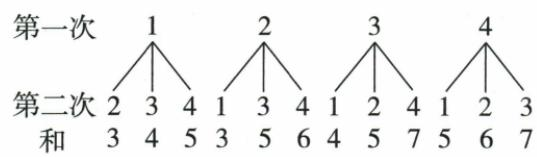

## 讲解

### 判据

四球1–4两次不放回，和奇要奇偶各一，先定有序总路径再按配对筛。

### 流程

1.第一4、第二3，12有序对，禁同球对角。2.首奇两种各可接两偶共4，首偶两种各接两奇共4，总8。3.8/12=2/3C；A放回算半、B同奇偶补1/3、D3/4不合。4.若用同时无序，两球6组、异奇偶4组得4/6也2/3，不能混4有利除12。5.颜色相同不允许原同一球重选，但不同同色个体仍可。

## 例题

### 四数球不放回有序十二奇和八率二三逐项C

> 来源ID Q31-16；第31章概率；351-377/full.md 第1917–1925行。原答案与解析定位：351-377/full.md 第1927–1961行。

例3 有四个完全一样的小球,分别标上数字1,2,3,4,再放到一个不透明的口袋中.若从口袋中随机摸出一个小球后不放回,接着再随机摸出一个小球,则两次摸出的小球上的数字之和为奇数的概率是 ( )

A. $\frac{1}{2}$

B. $\frac{1}{3}$

C. $\frac{2}{3}$

D. $\frac{3}{4}$

**原资料答案与解析：**

解析 画树状图如图.

由树状图可知,共有12种等可能的结果,其中数字之和为奇数的结果有8种,所以两次摸出的小球上的数字之和为奇数的概率是 $\frac{8}{12}=\frac{2}{3}$ .

答案 C

**展开解析（依据原详解补足理由与步骤）：**

首次4种、第二剩3种，12有序对，禁止(1,1)等同一个球重复。奇和需奇偶不同，首奇1/3各可接偶2/4共4，首偶2/4各可接奇1/3共4，总8，率8/12=2/3，C。A1/2把放回16总8有利误套；B1/3是同奇偶补事件；D3/4不能匹配8/12。也可一次选无序两球6组其中异奇偶4，4/6同值，但全过程总数和有利数都必须同口径。

## 易错

原不放回是改变总数的关键，不能把对角删了后仍以16为分母。
