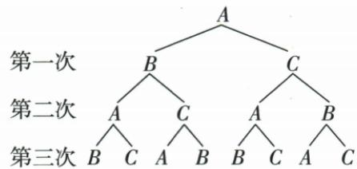

## 讲解

### 判据

规则每次向另两人之一等可能传，当前持球者变化，因此每节点重新取候选而非一直B/C。

### 流程

1.首A给B/C，两次四路径ABA/ABC/ACA/ACB，只有ACB末B，率1/4。2.每条向当前人之外两人扩第三层，共8。3.回A只ABCA/ACBA两路径，2/8=1/4。4.末A/B/C的字母不是三个等可能结果，路径贡献不相同。5.以原树JPEG核，OCR Mermaid乱连和自传节点排除。

## 例题

### 三人随机传两次到B三次回A路径各四一

> 来源ID Q31-15；第31章概率；351-377/full.md 第1876–1879行。原答案与解析定位：351-377/full.md 第1881–1911行。

例2 A、B、C三人玩篮球传球游戏,游戏规则:第一次传球由A将球随机地传给B、C两人中的某一人,之后的每一次传球都是由上次的接球者将球随机地传给其他两人中的某一人.

(1) 求两次传球后, 球恰在 B 手中的概率.  
(2) 求三次传球后, 球恰在 A 手中的概率.

**原资料答案与解析：**

解析（1）两次传球后的所有可能的结果有4种，分别是 $A \to B \to C, A \to B \to A, A \to C \to B, A \to C \to A$ ，每种结果发生的可能性相等，其中两次传球后，球恰在 $B$ 手中的结果只有一种，所以两次传球后，球恰在 $B$ 手中的概率是 $\frac{1}{4}$ .

(2)画树状图如图.

由树状图可知,三次传球后的所有可能的结果有8种,每种结果发生的可能性相等,其中三次传球后,球恰在A手中的结果有2种,所以三次传球后,球恰在A手中的概率是 $\frac{2}{8}=\frac{1}{4}$ .

**展开解析（依据原详解补足理由与步骤）：**

(1)原不传自己、每次对另两人等可能，两次完整路径A-B-A、A-B-C、A-C-A、A-C-B各1/4，仅末B的A-C-B，概率1/4。(2)每条再从当前人传另两人，8条完整三次路径；回A仅A-B-C-A与A-C-B-A，2/8=1/4。不能把末端A/B/C三个名字当等可能三种；传球规则是每一步从当前持球者选其他两人。原树图可核，OCR Mermaid节点乱接不作证据。

## 易错

同一人可隔步再次持球，但不能连续一步传自己；传球次数是边数，初始A不计一次传球。
