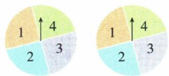

## 讲解

### 判据

两盘各四等份、和满足2倍或3倍，先16有序格，不按和名称等分。

### 流程

1.两轴各1–4，原完整表16格。2.2倍8格，3倍5格，交集和6有3格，或合8+5−3=10。3.概率10/16=5/8C；D13/16重复交，A3/16只交，B3/8漏有利。4.可逐格布尔标记只数一次，和为6同时满足仍只一条路径。5.列出的十个实际有序对可复核表中位置。

## 例题

### 四等份双盘和二或三倍数十种去交重复五八逐项C

> 来源ID Q31-14；第31章概率；351-377/full.md 第1843–1864行。原答案与解析定位：351-377/full.md 第1866–1874行。

例1 如图,让两个转盘(转盘被等分成四个扇形区域,指针的位置是固定的)分别自由转动一次,当转盘停止转动时,两个指针分别落在某两个数所表示的区域内,则这两个数的和是2的倍数或3的倍数的概率等于()

A. $\frac{3}{16}$

B. $\frac{3}{8}$

C. $\frac{5}{8}$

D. $\frac{13}{16}$

**原资料答案与解析：**

解析 列表如下(表中数据为两个数之和):

| 第一个数 | 第二个数 / 1 | 第二个数 / 2 | 第二个数 / 3 | 第二个数 / 4 |
| --- | --- | --- | --- | --- |
| 1 | 2 | 3 | 4 | 5 |
| 2 | 3 | 4 | 5 | 6 |
| 3 | 4 | 5 | 6 | 7 |
| 4 | 5 | 6 | 7 | 8 |

由表知共有 16 种等可能的结果, 其中两个数的和是 2 的倍数或 3 的倍数的结果有 10 种.

根据概率计算公式得所求概率 $P=\frac{10}{16}=\frac{5}{8}$ .

答案 C

**展开解析（依据原详解补足理由与步骤）：**

两转盘各1/2/3/4四等份，各一次共16等可能有序对。原表和为2倍数有8格，3倍数和3有2格、6有3格共5；同时两倍即和6的3格已计，取“或”总8+5−3=10，率10/16=5/8，C。D13/16重复计交集；A3/16只数和6这个同时事件；B3/8只有6格，与十格不符。完整名单(1,1),(1,2),(1,3),(2,1),(2,2),(2,4),(3,1),(3,3),(4,2),(4,4)。

## 易错

“或”包含同时满足，不是二选一排交；不将和的2至8七种数等概率。
