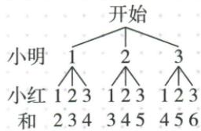

## 讲解

### 判据

三牌放回和>4明胜、<4红胜、=4重开，先完整9路径，单轮与最终分别表述。

### 流程

1.首摸1率1/3。2.9有序对中大4三、小4三、等4三；单轮各直接胜1/3、平1/3。3.重开后同牌同混匀同规则，最终明胜q满足q=1/3+q/3，解q1/2，红亦半。4.单轮平局未分配，不能当双方各半；最终已剔除重开影响，不能仍各1/3。5.原公平结论正确，原“获胜率三一”需限定单轮，不改原件。

## 例题

### 三牌和大四小四各三平四重开最终半区分单轮三一

> 来源ID Q31-24；第31章概率；351-377/full.md 第2235–2238行。原答案与解析定位：351-377/full.md 第2258–2286行。

例5（2024 山东青岛）学校拟举办庆祝“中华人民共和国成立 75 周年”文艺汇演,每班选派一名志愿者.九年级一班的小明和小红都想参加,于是两人决定一起做“摸牌”游戏,获胜者参加.规则如下:将牌面数字分别为 1,2,3 的三张纸牌(除牌面数字外,其余都相同)背面朝上,洗匀后放在桌面上,小明先从中随机摸出一张,记下数字后放回并洗匀,小红再从中随机摸出一张,若两次摸到的数字之和大于 4,则小明胜;若和小于 4,则小红胜;若和等于 4,则重复上述过程.

(1) 小明从三张纸牌中随机摸出一张, 摸到“1”的概率是 \_\_\_\_.  
(2)请用列表或画树状图的方法,说明这个游戏对双方是否公平.

**原资料答案与解析：**

例5 解析 (1) $\frac{1}{3}$ .

(2)画树状图如图所示:

由树状图可知,一共有9种等可能的结果,其中两次摸到的数字之和大于4的结果有3种,两次摸到的数字之和小于4的结果有3种,

∴ 小明和小红获胜的概率均为 $\frac{3}{9}$ $=\frac{1}{3},\therefore$ 该游戏对双方公平.

**展开解析（依据原详解补足理由与步骤）：**

(1)三张同质牌充分洗匀，各1/3，摸1概率1/3。(2)两次有放回9有序对，和>4是(2,3)(3,2)(3,3)3种，和<4是(1,1)(1,2)(2,1)3种，和=4是(1,3)(2,2)(3,1)3种。所以单轮双方直接胜各1/3、平局1/3，对称且公平。原末句把各1/3称获胜概率，须限定单轮。若按原平局重开直到决出，设小明最终胜率q，一轮直接胜1/3，平局后仍同一问题给(1/3)q，故q=1/3+(1/3)q；两边减q/3得2q/3=1/3，q=1/2，小红亦1/2。单轮不能因还1/3平局而强把双方说1/2，最终也不能仍说1/3。

## 易错

概率公平不要求少量游戏双方恰同胜次数；重开如果不恢复条件，递推同q前提失效。
