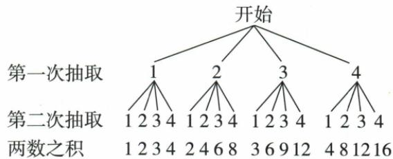

## 讲解

### 判据

两次从1–4有放回抽牌，积偶等价至少一数偶，补事件两数都奇较少便于列。

### 流程

1.原16有序路径。2.奇数只有1/3，奇积四对11/13/31/33。3.偶积为补剩16−4=12，概率3/4。4.用原树每层4支验证，乘积列表不是新增第三层抽取。5.不能把积的不同值名称当等可能，也不能只数一次偶而漏首奇后偶。

## 例题

### 原四牌放回树十六积偶十二率三四

> 来源ID Q31-27；第31章概率；351-377/full.md 第1789–1815行。原答案与解析定位：351-377/full.md 第1817–1817行。

例如,一个不透明的袋子中有四张完全相同的卡片,把它们分别标上数字1、2、3、4.随机抽取一张卡片,放回后搅匀,再随机抽取一张卡片,求两次抽取的卡片上数字之积为偶数的概率,可画树状图如下:

**原资料答案与解析：**

由树状图知共有 16 种等可能的结果, 其中两次抽取的卡片上数字之积为偶数的结果有 12 种, 所以所求概率为 $\frac{12}{16} = \frac{3}{4}$ .

**展开解析（依据原详解补足理由与步骤）：**

两次各1至4，放回混匀，16等可能有序对。奇积只可能两次都从奇数1/3取，四对(1,1)(1,3)(3,1)(3,3)，其余12偶，所以偶概率12/16=3/4。树图每条从根到第二层叶子的完整路径算一次，叶子下标出的乘积不是第三次抽取。

## 易错

放回是16的前提；不放回只12路径，会改变奇积对数，需重新计。
