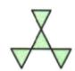
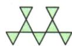
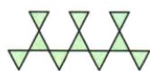

## 讲解

### 是什么

按同一规则逐次构造的图形，可把总数分成不随序号改变的固定部分与重复增加的部分。每一重复组有相同数量，第n个图形的组数用n或n−1表示，依据它从第几个开始计数。

### 怎么来的

原三角形图案第1个4个，第2个7个，第3个10个。结构中最左下一个可固定，其余每组上方、中间、右下三个，第n个有n组，数目1+3n。也可把第1个整个4个固定，之后新增n−1组，每组3个，得到4+3(n−1)，展开与3n+1一致。

两种拆法说明截距和增长量各有几何来源，公式不是只看数字差3就猜出来。归纳观察提示规律，重复构造提供继续成立的理由；前三项代入核对起点、组数和增量，可发现把n−1误写n导致多加一组。

### 什么时候能用

适用于题目给出“按此规律”的同构增长，原图确实每次添相同结构。若只是列前三个数、没有继续规则，可能有许多不同的后续，不能据有限项唯一证明全体。

计数对象须始终一致，原题数摆成的等边小三角形，不能中途改数由几个小形拼成的大三角形。共享部分只能算一次；新的组若与旧组重叠，要明确增加的是新增对象，不按新图外框盲目重复计。

### 第13章排号计数与整数边界

剧院原首排50、相邻排增3，第x排是50+3(x−1)=3x+47。固定部分可改写47，但它不表示实际第0排存在；物理输入是正整数排号。解90座得到43/3意味着没有某一整排恰90，不能四舍五入。原规律已指定持续每排增3，使用它建一次模型，不由有限三排观察擅断任意后续。

## 例题

### 由三角形增长结构写序号表达式

> 来源ID Q04-08；第4章整式的加减；51-100/full.md 第466–475行。原答案与解析定位：51-100/full.md 第477–479行。

例7 一组有规律的图案如图所示,它们是由边长相等的正三角形摆成的,第1个图案有4个三角形,第2个图案有7个三角形,第3个图案有10个三角形,……,按此规律摆下去,第n个图案有\_\_\_\_个三角形.(用含n的代数式表示)

  
第1个

  
第2个

  
第3个

**原资料答案与解析：**

解析 第1个图案有 $3\times1+1=4$ 个三角形,第2个图案有 $3\times2+1=7$ 个三角形,第3个图案有 $3\times3+1=10$ 个三角形,……,第n个图案有 $(3n+1)$ 个三角形.

答案 $(3n+1)$

**展开解析（依据原详解补足理由与步骤）：**

原图第1、2、3个分别4、7、10个小三角形。图形每增一组相连结构增加3个，最左下方的一个作为固定部分，其余每组上方、中间及右下方共3个；第n个有n组，因此3n+1。也可从第1个的4出发，之后增加n−1组，得到4+3(n−1)=4+3n−3=3n+1。代n=1、2、3分别回到4、7、10，与原图一致；公式适用于题目“按此规律”的相同构造，只有前三个数字而没有继续构造规则不能唯一确定一切后项。

### 剧院座位线性规律先建模再筛整数排

> 来源ID Q13-39；第13章一次函数；151-200/full.md 第402–408行。原答案与解析定位：151-200/full.md 第410–414行。

例1 某剧院的观众席的座位按下列方式设置：

| 排数(x) | 1 | 2 | 3 | 4 | ... |
| --- | --- | --- | --- | --- | --- |
| 座位数(y) | 50 | 53 | 56 | 59 | ... |

(1) 写出座位数 $y$ 与排数 $x$ 之间的关系式.

(2) 按照上表所示的规律, 某一排可能有 90 个座位吗? 请说明理由.

**原资料答案与解析：**

解析（1）从第2排开始，每一排比它前面一排多3个座位，则第 $x$ 排比第1排多 $3(x - 1)$ 个座位，从而得到 $y$ 与 $x$ 之间的关系式为 $y = 50 + 3(x - 1)$ ，即 $y = 3x + 47$

(2) 不可能. 理由: 当 $y = 90$ 时, $3x + 47 = 90$ , 解得 $x = \frac{43}{3}$ ,

因为 $\frac{43}{3}$ 不是正整数,所以某一排不可能有90个座位.

**展开解析（依据原详解补足理由与步骤）：**

第1排50座，第2排53，之后每排增3。第x排从第一排走了x−1次增加，y=50+3(x−1)=3x+47，其中x为正整数。若90座，3x+47=90，3x=43，x=43/3不是整数，所以没有一排恰好90座。直线解析式代小数虽可算，但小数排并不在实际取值范围；也不能四舍五入说第14排。

## 易错

- 第1个算作起点时，后面只新增n−1次。
- 规律应由结构支持，有限数字检验不是全体证明。
- 固定部分与重复部分不能重计共有图形。
