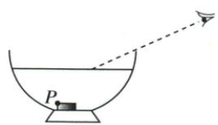
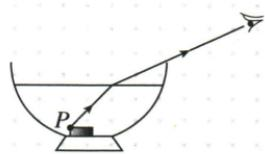

## 错法

原硬币题解析写“虚线画为折射光线”，若直接照抄，会把从水面到眼睛的真实传播段画成虚线。这里是所供原解析的线型错误，不是学生计算错误。

## 正解

实际传播的入射、反射和折射光用带箭头实线；法线及仅用来追溯虚像的反向延长线用虚线。原硬币答案图的真实路径是实线，与第3383行文字不一致，按图与光线含义纠正。保留原题位置，不重画并冒充原资料的答案。

## 例题

### 加水后刚看到硬币P点

> 来源ID Q02-19；第二章光现象；1-50/full.md 第3367–3369行。原答案与解析定位：1-50/full.md 第3383–3386行。

例2（2024江苏扬州中考节选）如图所示，向碗中加水至图示位置，请画出人眼刚好看到硬币上 $P$ 点的光路图。

**原资料答案与解析：**

例2 解析 连接 P 点与入射点为入射光线, 虚线画为折射光线。
答案 如图所示

**展开解析（依据原详解补足理由与步骤）：**

根据原题“刚好看到”，折射光要沿能够掠过碗沿并进入眼睛的方向传播。先用眼睛和限制视线的碗沿确定空气段，与水面交点为O；连P到O为水中入射光。再画O到眼睛的折射段，沿P→O→眼睛标箭头，并可在O作虚线法线检查水到空气折射角更大。

**原解析纠正**：原文第3383行写“虚线画为折射光线”。真实传播的折射光应画实线；虚线用于法线或反向延长线。原图和原解析完整保留在来源证据中，条目按光线实际含义纠正线型，不改变P、眼睛、碗沿和水面的位置条件。
