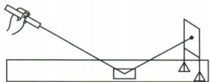
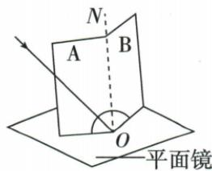
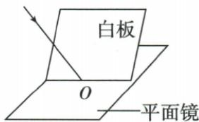
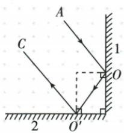

## 讲解

### 是什么

光遇到物体表面返回原介质的现象叫反射。在反射中，反射光、入射光和法线共面；斜入射时入射、反射在法线两侧；反射角等于入射角。法线是过入射点垂直于反射面的辅助线，两角都对法线量。

### 怎么来的

实验在包含法线的纸板上记录入射和反射路径，多次改变入射方向，测得对应角均相等。把纸板折离共同平面不再显示反射光，支持共面关系；不是反射光不存在。让光逆着原反射方向入射，光沿原入射路径返回，说明光路可逆。

### 什么时候能用

镜面和漫反射都在每个局部位置遵循定律。垂直入射时两角均0°，反射沿原路反向，不是没有反射。标准叙述按反射由入射决定说“反射角等于入射角”；数学上两角相等可反向表达，不能把语序当成不对称的等式。

## 例题

### 探究光的反射规律完整题组

> 来源ID Q02-08；第二章光现象；1-50/full.md 第2765–2805；2847–2857行。原答案与解析定位：1-50/full.md 第2815–2845行。

例2（2024 江苏无锡中考）探究光的反射规律,器材有:激光笔、平面镜、标有刻度的白色硬纸板(可沿中缝折叠)、白板。

甲

乙

丙

(1)如图甲所示,将一束光照射到平面镜上,它的反射光在光屏上形成一个光斑。保持光在平面镜上的入射点不变,减小入射光与平面镜的夹角,则光屏上的光斑向\_\_\_\_(选填“上”或“下”)移动。  
(2) 利用图乙所示的装置进行探究。

①平面镜水平放置,标有刻度的白色硬纸板竖直地立在平面镜上,使一束光紧贴纸板 A, 射向镜面上的 O 点, 将纸板 B 绕接缝 ON 向前或向后翻折, 当纸板 B 和纸板 A 在 \_\_\_\_ 时, 纸板 B 上能呈现反射光束。

②改变入射光的方向,读出入射角和反射角的大小,将测得的数据记录在表格中。由此可知:反射角与入射角大小\_\_\_\_。

| 实验序号 | 入射角 | 反射角 |
| --- | --- | --- |
| 1 | 30° | 30° |
| 2 | 45° | 45° |
| 3 | 60° | 60° |

③用另一束光逆着反射光的方向射到镜面,观察到反射后的光会逆着原来入射光的方向射出,这表明:\_\_\_\_。

(3)利用如图丙所示的装置进行探究,让一束光斜射到平面镜上,在入射点O放置白板并调整位置,发现白板只在某一位置能同时呈现入射光和反射光,测得此时白板与镜面成90°角,说明白板与镜面的位置关系是\_\_\_\_,实验表明:\_\_\_\_。

(4) 自行车尾灯是由许多角反射器组成的反光装置, 角反射器是由互相垂直的反光面组成的。当汽车的灯光照在尾灯上时, 司机看到尾灯特别亮, 原因是

**原资料答案与解析：**

例2 解析 (2)①当纸板 B 和纸板 A 在同一平面上时, 反射光线、入射光线和法线在同一平面内, 纸板 B 上能呈现反射光束;

②由表中数据可得,反射角等于入射角;  
③用另一束光逆着反射光的方向射到镜面,观察到反射后的光会逆着原来入射光的方向射出,这个现象表明在光的反射现象中,光路是可逆的;  
(3)由“测得此时白板与镜面成90°角”可知,白板与镜面的位置关系是垂直,在实验过程中,若将白板倾斜(即白板与平面镜不垂直),则法线不在该白板所在平面内,则白板上不能看到反射光线,说明在光的反射现象中,反射光线、入射光线和法线在同一平面内;

(4)两个互成直角的反光面放在一起,如解析图所示,当光线AO射到反光面1上时,发生第一次反射,反射光线为 $OO'$ ,反射光线 $OO'$ 作为入射光线又射到反光面2上,发生第二次反射,最终的反射光线为 $O'C$ ,反射光线将沿与原光线平行的方向反射回去,光线在反光面上发生的是镜面反射。

答案 (1) 下

(2)①同一平面上 ②相等

③在光的反射现象中,光路是可逆的

(3) 垂直 反射光线、入射光线和法线在同一个平面内

(4)汽车的灯光在反光面上发生镜面反射,反射光线将沿与原光线平行的方向反射回去

**展开解析（依据原详解补足理由与步骤）：**

(1) 入射光与镜面夹角减小，意味着与法线的入射角增大；反射角跟着增大，反射光更接近镜面。按原图右侧竖直光屏，光斑下移，填“下”。

(2)①两纸板在同一平面上，且这个平面含法线，B上才显示反射光束；离开该平面不表示光消失。②三组30°、45°、60°数据逐组比较，反射角均与入射角相等。③让光逆着原反射方向入射，新反射沿原入射路径返回，说明光路可逆。

(3) 白板与镜面垂直，才可同时包含入射、反射和法线；体现三线共面。多次改变入射角是检验规律的普遍性，不是反复测同一值取平均。

(4) 角反射器两反射面互相垂直，光连续经历两次镜面反射，最终沿与原光线平行、反向的方向返回。原解答图显示这一几何关系，司机附近能接收到返回光，所以尾灯显得亮。按原答案填写，不把反光尾灯当作光源。

## 易错

- 把镜面夹角当入射角：两者互余，量角前先画法线。
- 纸板看不见光就说光消失：纸板离开光所在平面，只是不再截获光。
