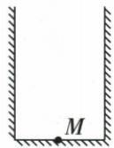
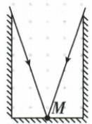
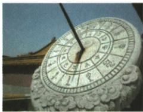

## 讲解

### 是什么

在同种均匀介质中，光沿直线传播。光线是带箭头的直线模型，用来表示传播路径和方向；它不是一根真实存在的实体线。均匀、透明的空气、水或玻璃中的传播可在本章按这一模型判断。

### 怎么来的

光被不透明物体挡住时，直线不能继续穿过遮挡物到达后方，所以形成暗影；井口限制能直达眼睛的光，解释井底视野小。用两条边界光线表示可到达区域，是把传播几何条件画清，而不是眼睛发光。

### 什么时候能用

判断影子、日晷、小孔成像、准直或瞄准时使用。必须带上同种均匀条件；跨介质界面或介质不均匀时不能用“一路直线”排除折射。光可在真空中传播，与声音需介质不同。

## 例题

### 井底青蛙的视野作图

> 来源ID Q02-03；第二章光现象；1-50/full.md 第2526–2528行。原答案与解析定位：1-50/full.md 第2518–2520行。

例1（2023 湖南郴州中考）“井底之蛙”这个成语大家都很熟悉,图中 M 点表示青蛙。请根据光的直线传播知识画图说明为什么“坐井观天,所见甚小”。(温馨提示:必须标出光的传播方向)

**原资料答案与解析：**

例1 答案 如图所示

**展开解析（依据原详解补足理由与步骤）：**

从M点分别连接井口左右边缘并向天空方向延长，用两条边界光线表示能进入M眼睛的光的范围。实际光从天空经井口传入眼睛，所以箭头指向M，不能因为作图时先从M画线就把箭头画成向天空。

范围之外的光被井壁遮挡，不能沿直线到达M，说明坐井所见天区有限。保留原答案图。这里画的是可进入眼睛的边界光线，并不是眼睛主动发光照亮天空。

### 日晷计时的光学原理

> 来源ID Q02-04；第二章光现象；1-50/full.md 第2532–2548行。原答案与解析定位：1-50/full.md 第2522–2522行；1-50/full.md 第2550–2552行。

例2（2024黑龙江牡丹江中考）如图所示，日晷是我国古代的一种计时工具，它的计时原理是 （）

A. 光的直线传播

B. 光的反射

C. 光的折射

D. 光的色散

**原资料答案与解析：**

例2 解析 太阳光照射日晷的晷针,在晷面上形成的影子的长度和方位是不断变化的,日晷据此

来计时,利用了光的直线传播。

答案 A

**展开解析（依据原详解补足理由与步骤）：**

晷针挡住太阳光，使晷面形成影子。太阳的方向随时间变化，影子的方位和长度也改变，所以利用光的直线传播形成的影子计时。

- A对：挡光成影符合直线传播。
- B错：日晷用的不是镜中反射像。
- C错：不是借两种介质间偏折观察物体。
- D错：没有把白光分为不同颜色。

原解析跨页被拆成两段，本条已按题组接回；没有把中间插入的其他题干当作解析。

## 易错

- 少写同种均匀条件：跨界面或不均匀介质需检查路径改变。
- 从眼睛画线就让箭头朝外：作图顺序不是光实际传播方向。
