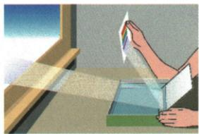

## 讲解

### 是什么

白光经过三棱镜等光学过程分解为各种色光，称色散。资料列红、橙、黄、绿、蓝、靛、紫，说明白光是多种色光组成的复色光；彩虹体现这一现象。

### 怎么来的

不同色光在同一棱镜中折射偏折程度不同，原混合的色光走向不同方向，于屏上分开。资料的通常棱镜条件下红光偏折较小、紫光较大。分色的关键是折射差别，平面镜改向本身不等于将光分解成色光。

### 什么时候能用

题目强调彩虹、彩色光带或白光组成时使用。复杂水滴过程可含反射，但所问不同色光分开的特征按色散判断。不把“红绿混合能看成黄”说成单色黄光一定能经棱镜拆为红绿。

## 例题

### 平面镜水中装置产生彩色光斑

> 来源ID Q02-20；第二章光现象；1-50/full.md 第3416–3418行。原答案与解析定位：1-50/full.md 第3426–3426行。

用一块平面镜将室外的阳光照射到室内,这是光的\_\_\_\_现象;如图所示,把一块平面镜斜插在水中,将装置放在从窗口射入的阳光下,让镜面对着阳光,在白纸上看到一个彩色的光斑,说明白光由\_\_\_\_混合而成的。

**原资料答案与解析：**

答案 反射 各种色光

**展开解析（依据原详解补足理由与步骤）：**

原答案“反射、各种色光”。平面镜把室外光改向射入室内属于反射；装置出现彩色光斑，说明白光含多种色光，经过折射时不同颜色偏折不同而分开。

原资料只有填空答案，以上解释按反射和色散的定义补写。不要说平面镜自行发出各种颜色，也不要把镜面反射单独当作分色原因；水和空气的折射参与装置中的分色。

### 瀑布水雾中的彩虹

> 来源ID Q02-22；第二章光现象；1-50/full.md 第3524–3540行。原答案与解析定位：1-50/full.md 第3566–3568行。

例1 (2024 江苏镇江中考)诗句“香炉初上日,瀑水喷成虹”描述了如图所示的情景:太阳刚升起时,从瀑布溅起的水雾中可看到彩虹,此现象属于()

A. 光的直线传播

B. 光的色散

C. 光的反射

D.小孔成像

**原资料答案与解析：**

例1 解析 彩虹是太阳光沿着一定角度射入小水滴后发生色散形成的彩色光带。

答案 B

**展开解析（依据原详解补足理由与步骤）：**

题目突出彩色光带，原解析将太阳白光经小水滴分成不同色光，属于色散。

- A错：直线传播本身不能把白光分出各色。
- B对：色散是所问彩虹的主要特征。
- C错：水滴中虽可能涉及反射，单说反射不足以表达不同色光分开这一现象。
- D错：没有小孔后形成倒立物像的条件。

原答案B。辨析按题目强调的现象回答，不能因为一个光路可能包含多个过程，就把每个过程都当成该题正确选项。

## 易错

- 镜子照阳光一律叫色散：改向属反射，出现分色还须解释折射。
- 混色等于任意色散逆过程：相同视觉颜色不保证相同色光组成。
