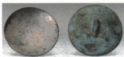

## 讲解

### 是什么

反射面向外凸的是凸面镜，对平行入射光起发散作用；向内凹的是凹面镜，对合适的入射光起会聚作用。平面镜、凸面镜和凹面镜均利用反射，与透镜利用光穿过介质后的折射不同。

### 怎么来的

曲面上各位置的法线方向不同，虽每束光都按反射定律，整体反射方向会发散或会聚。凹面镜可把光能集中到较小区域，原阳燧题据此点火；凸面镜能提供较宽视野，资料列道路拐弯反光镜和后视镜。

### 什么时候能用

先看反射面形状，不能仅凭“凹”字把凹面镜当成凹透镜。太阳灶、阳燧或原答案医用头灯体现凹面反射作用。本章独立题只验证凹面镜应用，凸面镜特点来自原比较表，未补造凸面镜题。

## 例题

### 阳燧与凹面镜会聚

> 来源ID Q02-09；第二章光现象；1-50/full.md 第2970–2972行。原答案与解析定位：1-50/full.md 第2974–2974行。

中华民族成就了诸多发明创造，为人类文明做出了巨大贡献。如图所示，“阳燧”是我国光学史上的一项重要发明，其作用相当于凹面镜，可以用来点火，俗称古代“打火机”。由此可知“阳燧”对光有\_\_\_\_（选填“发散”或“会聚”）作用。请列举出一个生活中应用凹面镜的例子：\_\_\_\_。

**原资料答案与解析：**

答案 会聚 医用头灯

**展开解析（依据原详解补足理由与步骤）：**

原资料答案是“会聚、医用头灯”。阳燧利用凹面反射面把入射光集中，能在一定区域集中光能用于点火，因此第一空会聚。第二空保留原答案实际列举的医用头灯，不另编应用。

这是反射镜的作用，不能因为看到“会聚”就断言一定是凸透镜折射。凹面镜与凹透镜同有“凹”字，光学作用与成因不同。

## 易错

- 会聚一律当凸透镜：还须看光是否通过透镜或被镜面反射。
- 凹面镜和凹透镜混读：名称相近，结构和作用不同。
