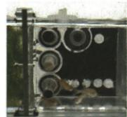
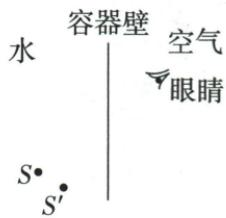
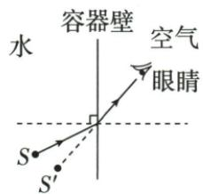

## 讲解

### 是什么

人接收到折射光后，按进入眼睛的光线反向直线追溯，看到的像可能偏离实际物体位置。岸上观察水底时通常看起来较浅，这个像是虚像，真实光没有在所见位置会聚。

### 怎么来的

水中物点的光跨界面进入空气，方向改变。人向后追溯空气中的直线段，把延长线位置看成物体，所以产生视位置偏移。原池水题的界面水平，视深较小；原航天鱼题界面竖直，要按S、S′及观察方向作图，不能用“像总在物体正上方”替代原位置。

### 什么时候能用

区分水中鱼的折射像与水面云的反射倒影。实际物的位置不因观察成像改变；不改变容器壁被原题忽略的条件。视深结论必须带上界面和观察方向，不自行补具体深度比或位移数值。

## 例题

### 池水看起来较浅

> 来源ID Q02-15；第二章光现象；1-50/full.md 第3171–3179行。原答案与解析定位：1-50/full.md 第3181–3181行。

(2024 天津中考)清澈见底的池水看起来比实际的浅，为了安全不要贸然下水。池水变“浅”的原因是（）

A. 光的折射

B. 平面镜成像

C. 光的反射

D. 光的直线传播

**原资料答案与解析：**

答案 A

**展开解析（依据原详解补足理由与步骤）：**

原资料只有A，理由补写。池底反射的光由水进入空气，斜入射时折射光偏离法线，再进入眼睛。人沿进入眼睛的光线向后直线追溯，看到的位置比实际池底浅，是折射形成的虚像。

- A对：所问视深变化源于水到空气的折射。
- B错：不是把池底当作在水面上的平面镜反射像。
- C错：池底有反射才能送出光，但使观察位置变浅的关键界面过程是折射。
- D错：仅用一路直线传播不能解释界面前后的方向变化。

像较浅不表示实际水深减小，也不能据表面清澈就推断水浅。

### 航天员看到水中斑马鱼的光路

> 来源ID Q02-17；第二章光现象；1-50/full.md 第3311–3329行。原答案与解析定位：1-50/full.md 第3331–3348行。

例2 (2024 山东菏泽中考)2024 年 4 月 26 日,神舟十八号载人飞船成功对接中国空间站,装有 4 条斑马鱼的特制透明容器顺利转移到问天实验舱,如图甲所示。请你在图乙中画出航天员看到斑马鱼的光路图(S 表示斑马鱼的实际位置,S'表示航天员看到的斑马鱼像的位置,不考虑容器壁对光线的影响)。

  
甲

乙

**原资料答案与解析：**

丙

解析 航天员能看到水中的斑马鱼, 是鱼反射的光线斜射入空气中发生折射后进入了人眼, 折射角大于入射角, 折射光线远离法线。物体的像是人眼逆着折射光线看到的, 所以 $S'$ 与眼睛的连线与水面的交点即为入射点; 连接 $S$ 和入射点即为入射光线, 入射点和眼睛的连线即为折射光线, 如图丙所示。

答案 如图丙所示

**展开解析（依据原详解补足理由与步骤）：**

题目明确不计容器壁，光路只按水与空气界面处理。S是真实鱼位置，S′是看到的像；人逆着到眼睛的折射光线看到S′。

先连接S′与眼睛，交水面于O，这条线确定进入眼睛的方向。再连S与O为水中入射段，O与眼睛为空气中折射段，箭头从鱼经O到眼睛。O到S′只用于追溯虚像，应为虚线，不是实际从鱼发出的光。

水到空气斜射，折射角较大、远离法线；这里界面竖直，不能把“看起来浅”机械理解为像的竖直位置较高，应依题给S′位置作图。原答案图丙保留，容器壁的影响不自行加回原题。

### 鱼儿与云的两种水中像

> 来源ID Q02-18；第二章光现象；1-50/full.md 第3358–3363行。原答案与解析定位：1-50/full.md 第3379–3381行。

例1（2024 山东烟台中考）蓝蓝的天上白云飘，站在湖边的小明看到清澈的水中鱼儿在云中游动，下列说法正确的是 （）

A. 看到的水中的鱼是实像  
B. 看到的水中的云是实像  
C. 看到的水中的云是由于光的折射形成的  
D.看到的水中的鱼是由于光的折射形成的

**原资料答案与解析：**

例1 解析 水面相当于平面镜, 水中的“云”是由光的反射形成的虚像; 鱼生活在水里, 鱼反射的光线由水中斜射入空气时发生折射, 折射光线进入人眼, 人看到的是鱼的虚像, D 正确。

答案D

**展开解析（依据原详解补足理由与步骤）：**

要分开两个实际物体的位置：鱼在水中，云在水面上方空气中。

- A错：从岸上看到鱼的位置由折射光反向延长形成，是虚像。
- B错：水面云像由反射光反向延长形成，也是虚像。
- C错：水中云的倒影主要由水面反射形成，不是云光穿入水中再折射到岸上眼睛。
- D对：水里鱼的光进入空气发生折射，看到的是折射虚像。

原答案D。两个像都好像“在水中”，不能凭视觉位置相同就判相同成因。

## 易错

- 在水中看到的都叫反射：实际鱼与水面倒影分别看来源光路。
- “较浅”一律理解为竖直高：先确认界面方向和题给像点。
