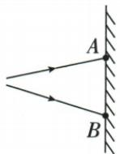
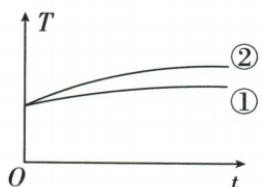

## 讲解

### 判据

光谱两端外侧放传感器，给温度变化或荧光反应，想到间接探测看不见辐射，先看指标及测量位置是否可靠。

### 流程

1. 确认题干所述位置在可见光带红紫两端之外，而非仅看一幅不相关图。
2. 看温度变化，题中较强热效应对应原答案红外线。
3. 紫外端按原资料的荧光或杀菌作用表述，不能以人眼颜色直接辨认。
4. 若原图与题干冲突，保留原题并标出缺漏；不得把错误图当光谱方向证据。
5. 实验结论限于原题条件，不从所有升温现象唯一反推红外。

## 例题

### 光谱外温度曲线辨红外紫外

> 来源ID Q02-23；第二章光现象；1-50/full.md 第3544–3560行。原答案与解析定位：1-50/full.md 第3570–3573行。

例2 (2024 江苏苏州中考) 如图甲所示, $AB$ 之间是太阳光经三棱镜色散后在屏上得到的彩色光带。将电子温度传感器分别放在 $A 、 B$ 两点外侧, 测得温度 $T$ 随时间 $t$ 变化的图像如图乙所示。则曲线①对应光线的特点是 , 曲线②对应的是 线。

  
甲

乙

**原资料答案与解析：**

例2 解析 图中曲线②对应的光线具有显著的热效应,因此是红外线;曲线①对应光线是紫外线,其特点是能使荧光物质发光,并且可以用来消毒杀菌。

答案 使荧光物质发光/消毒杀菌
红外

**展开解析（依据原详解补足理由与步骤）：**

先看原图乙：曲线②温度上升更明显，体现较强热效应，结合光带两端之外的测量，对应红外线，第二空填“红外”。曲线①对应另一端的紫外线，特点按原答案选“使荧光物质发光”或“消毒杀菌”。

**原图甲勘误**：原JPEG及对应PDF实际第39页（书内第23页）都画成了平面镜反射图，与题干的三棱镜光谱不符。保留原图并注明缺漏，不能从该错误图确定光谱红紫端。上述答法依据题干预设测光谱两端外侧、图乙温度趋势及原答案，不另画一幅假称原图的光谱图。

这里温度变化是探测看不见辐射的证据，不能说看见了红外线本身。红端之外的红外与红色可见光不同，紫端之外的紫外也不是紫色可见光。比较温度曲线需使用题目规定的传感器位置和测量条件，不推成所有场景单看升温就能唯一判断辐射种类。

## 易错

- 原图甲已确认误印：不能据它给A、B强行标红紫端。
- 看不见就没有作用：传感器及荧光等是间接证据。
