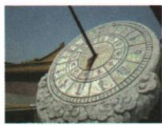
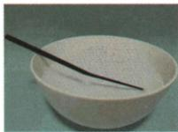
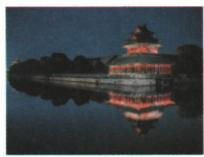
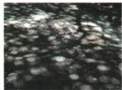

## 讲解

### 判据

同一画面含影子、倒影、折射像或彩色光带，先明确是哪一个所问现象，再追踪光在什么位置发生哪种变化。

### 流程

1. 从遮光形成的暗区想到直线传播；从小孔后倒立物像想到小孔成像。
2. 看物体表面把光返回原介质，如水面倒影，想到反射。
3. 看跨透明介质界面后视位置变化，想到折射。
4. 看白光分出不同颜色，想到色散，而不只说有光经过水。
5. 逐个检查选项的实际成因，同一场景存在多个过程，也须按所问目标作判断。

## 例题

### 影子与小孔成像的区别

> 来源ID Q02-02；第二章光现象；1-50/full.md 第2493–2498行。原答案与解析定位：1-50/full.md 第2500–2502行。

例 北宋的沈括在《梦溪笔谈》中记述了光的直线传播和小孔成像的实验。他首先直接观察老鹰,发现它在空中飞动,地面上的影子也跟着移动,移动的方向与它的方向一致。然后,他在纸窗上开一小孔,使窗外老鹰的影子呈现在室内的纸屏上,结果观察到:“鸢东则影西,鸢西则影东”。阅读了上述材料后,你认为下列说法错误的是 ( )

A.“鸢东则影西，鸢西则影东”的现象是小孔成像  
B. 沈括观察到“鸢在空中飞动, 地面上的影子也跟着移动”, 是小孔成像  
C.影子、小孔成像可用光的直线传播解释  
D. 小孔成像时, 像移动的方向与物移动的方向相反

**原资料答案与解析：**

解析 影子、小孔成像的原理都是光的直线传播,故 C 正确,不符合题意;“鸢东则影西,鸢西则影东”的现象是小孔成像,像移动的方向与物移动的方向相反,故 A、D 正确,不符合题意;“鸢在空中飞动,地面上的影子也跟着移动”,地面上的影子不是小孔成的像,故 B 错误,符合题意。

答案 B

**展开解析（依据原详解补足理由与步骤）：**

先看原文两个“影”具体形成方式：地面暗影是光被鹰挡住；纸窗小孔后屏上的图样由穿孔光线形成倒立像。题问错误的一项。

- A说法正确：室内纸屏上“鸢东则影西”描述倒立像的相反移动，不符合选错要求。
- B说法错误：地面影子没有经过小孔，不是小孔成像；因此选B。
- C说法正确：遮挡成影和光线经小孔交叉都可用同种均匀介质中光的直线传播解释。
- D说法正确：在原装置固定情况下，物体向一个方向移动，倒立像向相反方向移动。

不能只凭原文用了“影子”一词，就把两种物理现象混在一起。

### 日晷计时的光学原理

> 来源ID Q02-04；第二章光现象；1-50/full.md 第2532–2548行。原答案与解析定位：1-50/full.md 第2522–2522行；1-50/full.md 第2550–2552行。

例2（2024黑龙江牡丹江中考）如图所示，日晷是我国古代的一种计时工具，它的计时原理是 （）

A. 光的直线传播

B. 光的反射

C. 光的折射

D. 光的色散

**原资料答案与解析：**

例2 解析 太阳光照射日晷的晷针,在晷面上形成的影子的长度和方位是不断变化的,日晷据此

来计时,利用了光的直线传播。

答案 A

**展开解析（依据原详解补足理由与步骤）：**

晷针挡住太阳光，使晷面形成影子。太阳的方向随时间变化，影子的方位和长度也改变，所以利用光的直线传播形成的影子计时。

- A对：挡光成影符合直线传播。
- B错：日晷用的不是镜中反射像。
- C错：不是借两种介质间偏折观察物体。
- D错：没有把白光分为不同颜色。

原解析跨页被拆成两段，本条已按题组接回；没有把中间插入的其他题干当作解析。

### 诗句与反射现象辨析

> 来源ID Q02-07；第二章光现象；1-50/full.md 第2749–2761行。原答案与解析定位：1-50/full.md 第2811–2813行。

例1（2024 陕西中考）中国古诗词不仅文字优美、意境高远，还蕴含着丰富的科学知识。下列四幅图与诗句“掬水月在手，弄花香满衣”涉及的光现象相同的是 （）

A. 日晷计时  
  
C.筷子弯折

B. 楼台倒影  
  
D. 林间光斑

**原资料答案与解析：**

例1 解析 “掬水月在手” 是光的反射现象; 日晷计时和林间光斑都是由于光的直线传播, A 和 D 均不符合题意; 楼台倒影是光的反射现象, B 符合题意; 筷子弯折是光的折射现象, C 不符合题意。

答案 B

**展开解析（依据原详解补足理由与步骤）：**

“掬水月在手”是手中水面反射月光形成的虚像，找同一成因。

- A错：日晷影子由遮挡太阳光形成，属于直线传播。
- B对：楼台倒影由水面反射形成。
- C错：水中筷子看似弯折，源于水到空气的折射。
- D错：林间亮斑主要由太阳光沿直线穿过树叶间隙形成；本题不把它当水面反射像。

原OCR选项版式为A、C、B、D，标签和内容仍保留，展开按标签逐项核查，不凭相邻图位置改答案。

### 鱼儿与云的两种水中像

> 来源ID Q02-18；第二章光现象；1-50/full.md 第3358–3363行。原答案与解析定位：1-50/full.md 第3379–3381行。

例1（2024 山东烟台中考）蓝蓝的天上白云飘，站在湖边的小明看到清澈的水中鱼儿在云中游动，下列说法正确的是 （）

A. 看到的水中的鱼是实像  
B. 看到的水中的云是实像  
C. 看到的水中的云是由于光的折射形成的  
D.看到的水中的鱼是由于光的折射形成的

**原资料答案与解析：**

例1 解析 水面相当于平面镜, 水中的“云”是由光的反射形成的虚像; 鱼生活在水里, 鱼反射的光线由水中斜射入空气时发生折射, 折射光线进入人眼, 人看到的是鱼的虚像, D 正确。

答案D

**展开解析（依据原详解补足理由与步骤）：**

要分开两个实际物体的位置：鱼在水中，云在水面上方空气中。

- A错：从岸上看到鱼的位置由折射光反向延长形成，是虚像。
- B错：水面云像由反射光反向延长形成，也是虚像。
- C错：水中云的倒影主要由水面反射形成，不是云光穿入水中再折射到岸上眼睛。
- D对：水里鱼的光进入空气发生折射，看到的是折射虚像。

原答案D。两个像都好像“在水中”，不能凭视觉位置相同就判相同成因。

### 瀑布水雾中的彩虹

> 来源ID Q02-22；第二章光现象；1-50/full.md 第3524–3540行。原答案与解析定位：1-50/full.md 第3566–3568行。

例1 (2024 江苏镇江中考)诗句“香炉初上日,瀑水喷成虹”描述了如图所示的情景:太阳刚升起时,从瀑布溅起的水雾中可看到彩虹,此现象属于()

A. 光的直线传播

B. 光的色散

C. 光的反射

D.小孔成像

**原资料答案与解析：**

例1 解析 彩虹是太阳光沿着一定角度射入小水滴后发生色散形成的彩色光带。

答案 B

**展开解析（依据原详解补足理由与步骤）：**

题目突出彩色光带，原解析将太阳白光经小水滴分成不同色光，属于色散。

- A错：直线传播本身不能把白光分出各色。
- B对：色散是所问彩虹的主要特征。
- C错：水滴中虽可能涉及反射，单说反射不足以表达不同色光分开这一现象。
- D错：没有小孔后形成倒立物像的条件。

原答案B。辨析按题目强调的现象回答，不能因为一个光路可能包含多个过程，就把每个过程都当成该题正确选项。

## 易错

- 两个像都在水中就认同成因：鱼的折射像和云的反射像分别追光路。
- 题目选错误项时把正确陈述选上：先标清题目要正还是错。
