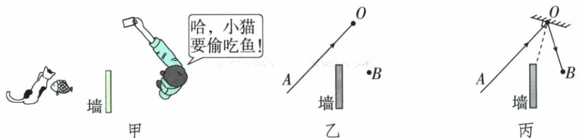

## 讲解

### 判据

已知入射光和眼睛位置，先连反射路径；已知两光线找镜面，先作法线角平分线，再画垂直的镜面。

### 流程

1. 标出入射点O，保留真实入射方向。
2. 光要到眼睛B，连OB并标O→B，是反射光。
3. 作从O指向来源A和指向B的两几何射线夹角平分线，得到法线。
4. 过O画法线垂线为镜面，在背面画短斜线。
5. 核查入射、反射分居法线两侧且夹角相等，真实光实线、法线虚线。

## 例题

### 小镜子隔墙看猫的反射作图

> 来源ID Q02-06；第二章光现象；1-50/full.md 第2731–2735行。原答案与解析定位：1-50/full.md 第2737–2741行。

例（2024 四川成都中考节选）如图甲, 小孟利用一面小镜子隔墙看到院里的小猫要偷吃鱼。如图乙所示, AO 表示来自小猫的入射光线, O 点为入射点, B 点为小孟眼睛所在位置。请在图乙中完成作图: (1) 画出反射光线 OB;

(2)根据光的反射定律画出镜面。(镜面用……表示,保留作图痕迹)

**原资料答案与解析：**

解析（1）连接 OB 并标注方向即可得到反射光线 OB。（2）作入射光线和反射光线夹角的角平分线即法线；过 O 点作法线的垂线，即镜面所在位置；标注镜面背面的短斜线。

答案 如图丙所示

**展开解析（依据原详解补足理由与步骤）：**

(1) 光从小猫A到O，再从O进入眼睛B，连接OB并画O→B箭头，为反射光线。

(2) 为作法线，比较的是以O为顶点、分别指向A和B的两条几何射线OA、OB，作它们夹角的角平分线。过O作与法线垂直的直线，就是镜面所在直线，在背面标短斜线。原答案图保留。

不能把AO的传播箭头直接换成OA；角平分线是用于找法线的几何构造，实际入射方向仍为A→O。镜面不是两条光线夹角的角平分线，而是与该法线垂直。

## 易错

- 把镜面画成角平分线：角平分线是法线，镜面与它垂直。
- 入射AO写成OA：几何找角与传播箭头不能混读。
