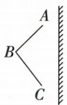
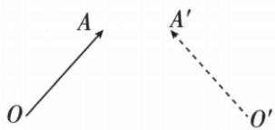
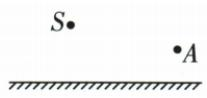
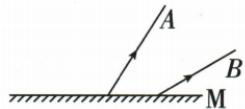
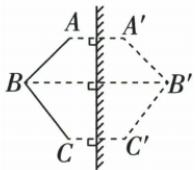
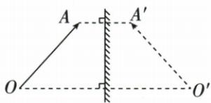
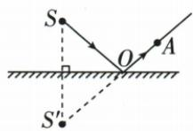
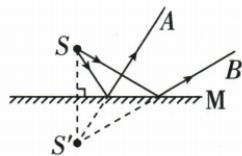

## 讲解

### 判据

已知物、像、镜面或反射线，需要补图时，以物像镜面对称和虚像在反射光反向延长线上为共同入口。

### 流程

1. 已知物与镜面：作对应点的镜面对称点，等垂距取像，用虚线连成像。
2. 已知物与像：对应点连线的垂直平分线给镜面。
3. 已知物点和眼睛：先作像，连像与眼睛求镜面交点，再补真实入射段。
4. 已知两反射光：反向延长交于像，再对称回物点，连物点与入射点。
5. 实际传播段实线并标箭头；虚像及延长线虚线，保留辅助构造。

## 例题

### 平面镜成像四类作图

> 来源ID Q02-10；第二章光现象；1-50/full.md 第2996–3022行。原答案与解析定位：1-50/full.md 第3024–3065行。

例（1）在图甲中作出物体 $ABC$ 经平面镜成的像。

(2)如图乙所示, $A^{\prime}O^{\prime}$ 是AO在平面镜中的像,请根据平面镜成像特点在图中画出平面镜的位置。  
(3)请根据平面镜成像特点,在图丙作出光源 S 发出的光经平面镜反射后通过 A 点的光路图(保留作图痕迹)。  
(4)如图丁所示,A、B是平面镜前一点光源S发出的光线经平面镜M反射后的两条反射光线,请根据平面镜成像的特点在图中标出点光源S和像点 $S'$ 的位置并画出两条入射光线。

  
甲

乙

  
丙

  
丁

**原资料答案与解析：**

解析（1）分别作出 A、B、C 关于平面镜的对称点 $A'$ 、 $B'$ 、 $C'$ ，用虚线连接 $A'B'$ 和 $B'C'$ ，即为物体 ABC 在平面镜中的像 $A'B'C'$ ，如答案图 1 所示。

(2) 连接 $AA'$ 、 $OO'$ ，作这两条线段的垂直平分线，即为平面镜的位置，如答案图 2 所示。  
(3)先通过平面镜作出发光点 $S$ 的对称点 $S'$ , 即为 $S$ 的像; 连接 $S'A$ 交平面镜于点 $O, O$ 即入射点 (反射点), $SO$ 为入射光线, $OA$ 为反射光线, 如答案图 3 所示。  
(4)先将两条反射光线反向延长,交于一点 $S'$ , $S'$ 即为像的位置,再作出点 $S'$ 关于平面镜的对称点S,即为点光源的位置,点S分别与两个反射点连接画出两条入射光线,如答案图4所示。

答案 (1)如图1所示  
  
图1

(2)如图2所示   

图 2

(3)如图3所示   
  
图3

(4)如图4所示   

图4

**展开解析（依据原详解补足理由与步骤）：**

(1) 从A、B、C分别作镜面的垂线，在镜后按等距离取A′、B′、C′，用虚线连接相应点；原图有几段物体边就对应画几段像，不补造边。

(2) 连接对应点AA′或OO′，镜面是这些物像连线的共同垂直平分线。确认反射面朝向物体，背面加短斜线。

(3) 先作S关于镜面的像S′，连S′A与镜面交于O。连接S到O为真实入射光，O到A为真实反射光；S′O是反向延长线，用虚线。箭头沿S→O→A。

(4) 两条已知反射光反向延长交于S′，再作S′的镜面对称点得S。S与两入射点连接，箭头均指向镜面。镜后的S′是延长线交点，并没有真实光在此会聚。

四幅原题图和四幅原答案图均保留，按对应编号核对。

## 易错

- 镜后的虚线也标成真实光：镜后交点只是追溯位置。
- 物像连线不垂直镜面：对应点必须同时等距和垂直。
