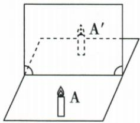

## 讲解

### 判据

玻璃板、两相同物体、像处光屏，想到分别用替代定位大小、测垂距和直接承屏检查虚实。

### 流程

1. 薄玻璃板竖直放置，既形成反射像又能透见替代物。
2. 后方同大小未点燃蜡烛移动到与像重合，从不同位置观察确认定位。
3. 记录镜面、物、像位置，分别测到镜面的垂直距离。
4. 移开替代物，放光屏并直接看屏是否接到像，不能隔着镜面看而误以为像在屏上。
5. 更换物体或位置重复是检验普遍性，原实验不是只平均同一测量值。
6. 若始终不能重合，先排查玻璃板是否竖直，勿立刻否定等距成像。

## 例题

### 探究平面镜像的位置大小与虚实

> 来源ID Q02-13；第二章光现象；1-50/full.md 第3092–3115行。原答案与解析定位：1-50/full.md 第3127–3137行。

例3（2024 山西中考）小明照镜子时,看到镜中自己的像,这个像有什么特点呢?为此他进行了实验探究。

# 实验思路：

(1) 探究平面镜成像的特点, 关键是要确定像的位置和大小。  
(2) 可选用\_\_\_\_作为平面镜观察像, 先将点燃的蜡烛置于镜前, 再用一支外形相同未点燃的蜡烛在镜后移动, 通过是否与像重合来确定像的位置和大小, 进而得到平面镜成像的特点。

# 实验过程：

(3) 按照实验思路进行操作, 观察蜡烛与像完全重合后, 在纸上分别标记平面镜、蜡烛和像的位置, 并测量蜡烛和像到平面镜的 \_\_\_\_, 记录在表格中。试着用光屏承接平面镜后面的像, 观察光屏上能否呈现点燃蜡烛的像。  
(4)换用两个相同的跳棋子、两块相同的橡皮重复上述操作。多次实验的目的是\_\_\_\_。

# 实验结论：

(5)平面镜所成的像为\_\_\_\_（选填“实”或“虚”）像，像与物体关于镜面对称。

**原资料答案与解析：**

例3 解析（2）用玻璃板代替平面镜，便于确定像的位置；

(3)为了探究像与物到平面镜的距离的关系,当未点燃蜡烛与像完全重合后,在纸上分别标记平面镜、蜡烛和像的位置,并测量蜡烛和像到平面镜的距离;  
(4) 多次实验的目的是避免一次实验结果的偶然性, 得出普遍规律;  
(5) 平面镜所成的像是虚像。

答案 (2) 薄玻璃板

(3) 距离   
(4) 得出普遍规律  
(5) 虚

**展开解析（依据原详解补足理由与步骤）：**

题组第(1)问是实验思路陈述，不额外补一个填空。

(2) 选薄玻璃板：既可反射前方蜡烛的像，又能透过板看见后方替代蜡烛。B不点燃，避免它自己的亮焰妨碍重合判断；薄板减轻前后表面造成的重影。

(3) 替代蜡烛与像完全重合时记录位置，分别测物和像到镜面的垂直距离，填“距离”。移去替代物，在像处放光屏，直接观察光屏能否接到像。

(4) 更换相同成对物体并重复探究是为了避免一次结果偶然性，得出普遍规律，不能说目的只是求平均减小误差。

(5) 光屏不能直接承接镜后像，说明为“虚”像。后方替代蜡烛是帮助定位的实物，不是证明像本身由光线在镜后会聚。

## 易错

- 后蜡烛点燃干扰重合：替代物用于定位，不需要自身亮焰。
- 实物B能放到像处就认为实像：像虚实仍需看真实光能否承屏。
