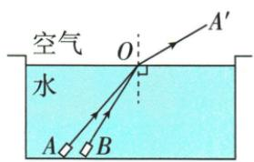
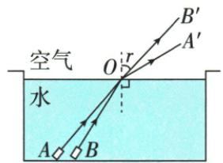

## 讲解

### 判据

给介质界面、真实物点、所见像点或已知折射光，先找入射点和法线，再按介质方向及入射角关系补真实路径。

### 流程

1. 标清光从哪种介质到哪种，真实光从物体到眼睛。
2. 过界面交点作虚线法线，两角都与法线比较。
3. 空气到水斜射靠近法线；水到空气且有折射光时远离法线。
4. 已给像点与眼睛，用两点连线找界面交点，再连接真实物点到交点。
5. 刚能看见的硬币题用眼睛与碗沿限制方向找到空气段，接回水中P点。
6. 真实入射、折射段都为带箭头实线；虚像反向延长线才是虚线。角度和像点位置以原图条件为准。

## 例题

### 两束水到空气的红光作图

> 来源ID Q02-16；第二章光现象；1-50/full.md 第3273–3288行。原答案与解析定位：1-50/full.md 第3290–3309行。

例1 (2024 河南中考) 如图, 观光水池中, 一束红光沿 AO 方向从水射入空气, 折射光线为 $OA'$ 。若另一束红光沿 BO 方向从水射入空气, 请在图甲中大致画出入射光线 BO 的折射光线, 并标出对应的折射角 r。

甲

**原资料答案与解析：**

乙

解析 在光发生折射时,入射角变大,折射角也变大,先分析入射光线 AO 和 BO 入射角的大小,BO 的入射角小,所以 BO 的折射光线 OB' 的折射角也较小,折射光线 OB' 应画在 OA' 和法线之间,OB' 与法线的夹角即折射角 r,如图乙所示。

答案 如图乙所示

**展开解析（依据原详解补足理由与步骤）：**

原图BO更靠近水面法线，入射角比AO小。同一红光、同一水空气界面下，BO的折射角也比AO对应的折射角小。因此从O在空气一侧画OB′，位于OA′与法线之间，同时仍比BO的入射角大。

折射角r标在空气侧折射光OB′与法线之间；光线用实线，箭头从O指向空气。原答案图乙保留。不从光线与水面的夹角直接判断入射角，也不因折射角减小就把它误画到法线另一侧。

### 航天员看到水中斑马鱼的光路

> 来源ID Q02-17；第二章光现象；1-50/full.md 第3311–3329行。原答案与解析定位：1-50/full.md 第3331–3348行。

例2 (2024 山东菏泽中考)2024 年 4 月 26 日,神舟十八号载人飞船成功对接中国空间站,装有 4 条斑马鱼的特制透明容器顺利转移到问天实验舱,如图甲所示。请你在图乙中画出航天员看到斑马鱼的光路图(S 表示斑马鱼的实际位置,S'表示航天员看到的斑马鱼像的位置,不考虑容器壁对光线的影响)。

  
甲

乙

**原资料答案与解析：**

丙

解析 航天员能看到水中的斑马鱼, 是鱼反射的光线斜射入空气中发生折射后进入了人眼, 折射角大于入射角, 折射光线远离法线。物体的像是人眼逆着折射光线看到的, 所以 $S'$ 与眼睛的连线与水面的交点即为入射点; 连接 $S$ 和入射点即为入射光线, 入射点和眼睛的连线即为折射光线, 如图丙所示。

答案 如图丙所示

**展开解析（依据原详解补足理由与步骤）：**

题目明确不计容器壁，光路只按水与空气界面处理。S是真实鱼位置，S′是看到的像；人逆着到眼睛的折射光线看到S′。

先连接S′与眼睛，交水面于O，这条线确定进入眼睛的方向。再连S与O为水中入射段，O与眼睛为空气中折射段，箭头从鱼经O到眼睛。O到S′只用于追溯虚像，应为虚线，不是实际从鱼发出的光。

水到空气斜射，折射角较大、远离法线；这里界面竖直，不能把“看起来浅”机械理解为像的竖直位置较高，应依题给S′位置作图。原答案图丙保留，容器壁的影响不自行加回原题。

### 加水后刚看到硬币P点

> 来源ID Q02-19；第二章光现象；1-50/full.md 第3367–3369行。原答案与解析定位：1-50/full.md 第3383–3386行。

例2（2024江苏扬州中考节选）如图所示，向碗中加水至图示位置，请画出人眼刚好看到硬币上 $P$ 点的光路图。

**原资料答案与解析：**

例2 解析 连接 P 点与入射点为入射光线, 虚线画为折射光线。
答案 如图所示

**展开解析（依据原详解补足理由与步骤）：**

根据原题“刚好看到”，折射光要沿能够掠过碗沿并进入眼睛的方向传播。先用眼睛和限制视线的碗沿确定空气段，与水面交点为O；连P到O为水中入射光。再画O到眼睛的折射段，沿P→O→眼睛标箭头，并可在O作虚线法线检查水到空气折射角更大。

**原解析纠正**：原文第3383行写“虚线画为折射光线”。真实传播的折射光应画实线；虚线用于法线或反向延长线。原图和原解析完整保留在来源证据中，条目按光线实际含义纠正线型，不改变P、眼睛、碗沿和水面的位置条件。

## 易错

- 折射角量到界面：先画法线，角对法线。
- 真实折射光画虚线：原硬币题该句解析有误，条目明确纠正。
