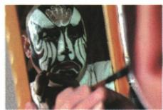

## 讲解

### 判据

题目分别改变物体远近、亮度或镜片侧移，先区分像的实际大小、几何位置和观察到的清晰程度。

### 流程

1. 物体尺寸未变，平面镜像实际尺寸仍相同。
2. 物体朝镜面移动，像在镜后同量朝镜面移动；物像距离随之减小。
3. 亮度增强可使反射像更清晰，不能因此改用像变大的答案。
4. 镜片在原平面内侧移，镜面所在平面不变，对称像位置不变。
5. 镜片转动或沿法线移动则改变几何条件，不能套侧移结论；能否看见像还需镜片截获所需光路。

## 例题

### 可推拉玻璃窗的成像变化

> 来源ID Q02-12；第二章光现象；1-50/full.md 第3076–3080行。原答案与解析定位：1-50/full.md 第3123–3125行。

例2 (2024 江苏扬州中考)如图所示,夜晚,小华通过可左右推拉的竖直窗户玻璃观察发光吊灯的像和自己的像。增大吊灯的亮度,观察到吊灯的像更\_\_\_\_。小华靠近玻璃窗观察,她像的大小\_\_\_\_,她与像之间的距离\_\_\_\_。向右推动玻

璃窗,吊灯像的位置\_\_\_\_。(本题后3空填变化情况)

**原资料答案与解析：**

例2 解析 增大吊灯的亮度, 观察到吊灯的像更清晰; 当小华靠近玻璃窗观察, 她像的大小不变, 她与像之间的距离变小; 平面镜成像时, 像与物体关于镜面对称, 向右推动玻璃窗, 因为吊灯位置不变, 所以吊灯像的位置也不变。

答案 清晰 不变 变小 不变

**展开解析（依据原详解补足理由与步骤）：**

第一空按原答案为“清晰”：吊灯更亮，反射到眼中的像更容易观察。

小华靠近玻璃，平面镜成等大像，实际像大小“不变”。物距与像距都减小，所以人与像的距离“变小”。向右推玻璃是在其原平面内平移，镜面所在平面未变，吊灯的对称位置“不变”。

这四空分别对应观察清晰度、像大小、物像距离、像位置，不能合成一个“都变”。侧移的结论要求玻璃仍能提供所需反射光路；镜片移出光路可看不到像，但不等于几何像位置移动。

### 演员靠近镜子的像

> 来源ID Q02-11；第二章光现象；1-50/full.md 第3069–3074行。原答案与解析定位：1-50/full.md 第3119–3121行。

例1（2024湖南长沙中考）戏剧是我国的传统艺术瑰宝。戏剧演员对着平面镜画脸谱时，下列说法正确的是 （）

A. 平面镜成像是由于光的反射  
B. 平面镜成像是由于光的折射  
C.演员靠近平面镜时像变大  
D. 平面镜所成的像是实像

**原资料答案与解析：**

例1 解析 平面镜成像是由光的反射引起的光现象。平面镜成像特点:像、物到镜面距离相等,像、物大小相等,像和物的连线与镜面垂直,平面镜所成的像是虚像。故 A 正确。

答案A

**展开解析（依据原详解补足理由与步骤）：**

逐项回到平面镜的反射原理和等大虚像特点。

- A对：成像由光的反射形成。
- B错：不是光穿过玻璃后的折射形成这一镜像。
- C错：演员靠近，像距也减小，像实际大小始终与演员一样；看起来更大是视角变化。
- D错：真实反射光没有会聚在镜后，不能用光屏直接承接该虚像。

答案A。不要把观察到的视觉大小变化替代物像实际尺寸关系。

## 易错

- 看起来更大代替实际等大：视角和物像尺寸分别判断。
- 平移都说像位置不变：本题限定在镜面所在平面内侧移。
