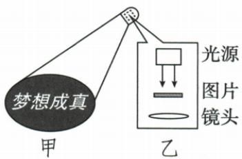

## 错法

原投影灯解析因投影放大、照片缩小就判原理不同，把条件不同的结果当不同原理。

## 正解

均以凸镜折射成实像，不同是物距区间和大小性质。原B按字面可成立，与A形成单选歧义；核对原书保留原题答案，不擅把原理换成特点。

## 例题

### 投影灯原书单选歧义

> 来源ID Q03-08；第三章透镜及其应用；1-50/full.md 第3897–3915；3925–3926行。原答案与解析定位：1-50/full.md 第3921–3923行。

例1 (2024 江苏苏州中考) 如图甲所示是公共场所的宣传投影灯, 装在高处的投影灯照在地面上出现图案, 其内部结构如图乙所示。下列说法正确的是 ( )

A. 不同方向都能看到图案是光在地面发生了漫反射  
B.该投影灯的成像原理与照相机相同

C.调小镜头与图片的距离图案变小  
D.地面上看到的是放大的虚像

**原资料答案与解析：**

例1 解析 漫反射的反射光线向四面八方传播,不同方向都能看到图案是光在地面发生了漫反射,A 正确;投影灯与照相机分别成倒立放大和倒立缩小的实像,它们的成像原理不同,B 错误;调小镜头与图片的距离,即减小物距,像将变大,C 错误;地面上看到的是放大的实像,D 错误。

答案 A

**展开解析（依据原详解补足理由与步骤）：**

原答案A；逐项检查：
- A正确：地面漫反射把光送向不同方向，各方向的人可看到图案。
- B按字面也正确：投影灯与照相机都利用凸透镜折射成实像，基本原理相同。放大与缩小是不同物距区间下的像性质，不能据此判成像原理不同。
- C错误：仍在投影成实像区间内减小物距，像距增大、像变大，须重新调清晰。
- D错误：真实光在地面形成放大实像，不是虚像。
已核扫描页，B确实写“成像原理”，不是OCR把“特点”识错。原题、原答案A和原详解保留，但按现有文字A、B均有物理依据，本条不把它当无歧义单选训练。
