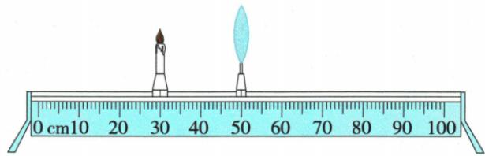
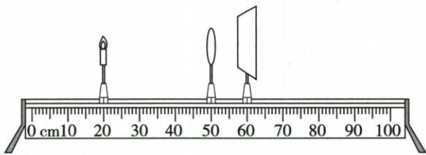

## 错法

屏60cm就说$v=60\,\mathrm{cm}$，物10cm就说$u=10\,\mathrm{cm}$，混位置与两点距离。

## 正解

距均相对光心。原焦距题$u=50-20=30\,\mathrm{cm}$，$v=60-50=10\,\mathrm{cm}$；移动题物10cm而镜50cm，$u=40\,\mathrm{cm}$。先作差再套成像，保留单位。

## 例题

### 等大像反推焦距和移动

> 来源ID Q03-11；第三章透镜及其应用；1-50/full.md 第4038–4048行。原答案与解析定位：1-50/full.md 第4056–4058行。

例1 (2024 山东淄博中考)在探究凸透镜成像规律时,蜡烛和凸透镜的位置如图所示,光屏上承接到烛焰等大的像(图中未画出光屏)。若保持凸透镜位置不变,将蜡烛调至 $10 \mathrm{~cm}$ 刻度线处时,下列判断正确的是 ()

A. 向右移动光屏能承接到烛焰的像

B. 移动光屏能承接到烛焰缩小的像

C.像的位置在 50 cm 和 60 cm 刻度线之间

D. 投影仪应用了该次实验的成像规律

**原资料答案与解析：**

解析 根据口诀可知,凸透镜成实像时,物远像近像变小,当蜡烛向左移动远离凸透镜时,光屏向左移动靠近凸透镜可再次承接到烛焰的像,故A错误;光屏上承接到烛焰等大的像时物距$u=2f$,由图可知,$u=20\,\mathrm{cm}$,则焦距$f=10\,\mathrm{cm}$,保持凸透镜位置不变,将蜡烛调至10cm刻度线处时,物距$u=40\,\mathrm{cm}$,则$u>2f$,根据简图法可知,此时$f<v<2f$,像的位置在60cm和70cm刻度线之间,成倒立、缩小的实像,是照相机的成像原理,故B正确,C、D错误。

答案 B

**展开解析（依据原详解补足理由与步骤）：**

原蜡烛30cm、透镜50cm，$u=50-30=20\,\mathrm{cm}$。等大实像$u=v=2f$，故$2f=20\,\mathrm{cm}$，$f=10\,\mathrm{cm}$，原屏在$50+20=70\,\mathrm{cm}$。蜡烛移到10cm，新$u=50-10=40\,\mathrm{cm}>2f$，成缩小实像，$10\,\mathrm{cm}<v<20\,\mathrm{cm}$，像在60至70cm之间。
- A错：原屏需向左靠镜，不是向右。
- B对：移到新像处可接缩小像。
- C错：50至60cm为$v<10\,\mathrm{cm}$，违背$v>f$。
- D错：此次缩小实像对应照相机，投影仪为放大实像。
选B。位置刻度必须作差才是物距。

### 由物像距离限定焦距

> 来源ID Q03-13；第三章透镜及其应用；1-50/full.md 第4106–4122行。原答案与解析定位：1-50/full.md 第4100–4102行。

例1（2024 山东临沂中考）在“探究凸透镜成像的规律”实验中,当蜡烛、凸透镜和光屏的位置如图所示时,光屏上承接到烛焰清晰的像。保持凸透镜的位置不变,则()

A. 实验所用凸透镜的焦距可能为 $10.0 \mathrm{~cm}$

B. 光屏上承接到的像是烛焰倒立、放大的实像

C. 将蜡烛和光屏的位置互换, 光屏上仍能承接到像

D. 将蜡烛移至 45.0 cm 刻度线上, 光屏上仍能承接到像

**原资料答案与解析：**

例1 解析 由图可知,物距 u>像距 v,且成实像,则 $u=30\ cm>2f$ , $2f>v=10\ cm>f$ , 即 $10\ cm>f>5\ cm$ , 故 A 错误; 凸透镜成实像时, 物距大于像距, 成倒立、缩小的实像, 故 B 错误; 将蜡烛和光屏的位置互换, 此时物距等于原来的像距, 由于光的折射中, 光路是可逆的, 故光屏上仍能承接到像, C 正确; 将蜡烛移至 45.0 cm 刻度线上, 此时物距 $u=5.0$ $cm<f$, 成正立、放大的虚像, 虚像不能用光屏承接, 故 D 错误。

答案 C

**展开解析（依据原详解补足理由与步骤）：**

原蜡烛20cm、透镜50cm、屏60cm，$u=50-20=30\,\mathrm{cm}$，$v=60-50=10\,\mathrm{cm}$。$u>v$且为实像，对应缩小，故$u>2f$、$f<v<2f$。由$f<10\,\mathrm{cm}$和$10\,\mathrm{cm}<2f$，后者两边除2得$5\,\mathrm{cm}<f$，因此$5\,\mathrm{cm}<f<10\,\mathrm{cm}$。
- A错：10cm为不包含的边界，不能作为f。
- B错：$u>v$为缩小实像。
- C对：物屏互换使u和v互换，可逆光路仍成像。
- D错：蜡烛45cm则$u=50-45=5\,\mathrm{cm}<f$，成不能承屏的虚像。
选C；不能从范围猜唯一焦距。
