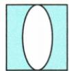

## 讲解

### 是什么

透镜是借透明介质界面折射改变光路的元件。凸镜中间比边缘厚，凹镜中间比边缘薄。主光轴通常为两球面球心连线，光心O是薄透镜模型中光通过后方向近似不变的点。

### 怎么来的

光经过透明介质前后界面发生折射，两界面共同改变方向。透镜分类要比较透明材料实际厚薄，而非看某一面凸起；原中空玻璃的椭圆是空气，左右玻璃均中间薄边缘厚。

### 什么时候能用

本章按空气中的普通玻璃、水、冰及薄透镜近似。材料及外部介质改变后不能仅凭形状无条件判光学作用；空洞题限定玻璃包围空气。

## 例题

### 中空玻璃体的类型

> 来源ID Q03-03；第三章透镜及其应用；1-50/full.md 第3729–3731行。原答案与解析定位：1-50/full.md 第3733–3735行。

例2 截面为长方形、中空部分为椭圆形的玻璃体如图所示,则这个玻璃体可以看成\_\_\_\_透镜。

**原资料答案与解析：**

解析 玻璃体是中空的(中间是空气),可以将玻璃体分成左、右两部分来看,这两部分都是中间薄、边缘厚,都是凹透镜。

答案 凹

**展开解析（依据原详解补足理由与步骤）：**

椭圆内部是空气，周围有色区域才是玻璃。把玻璃分为左右两部分，每部分沿主光轴附近中间薄、边缘厚，均相当于凹透镜，整体填凹。错误入口是把空气椭圆当一块凸玻璃。这针对玻璃包围空气的题给结构，不推广任意介质中的空洞。

## 易错

- 一面凸就一定凸镜：比较材料中间与边缘厚度。
- 把空洞当凸玻璃：先识别实际介质。
