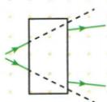
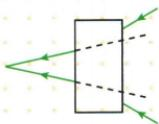

## 讲解

### 是什么

凸镜会聚、凹镜发散，描述它使折射光相对原来方向更趋向或更偏离主光轴，不等于折射后必相交或必分开。

### 怎么来的

本来发散的光经凸镜可能只减弱发散；本来会聚的光经凹镜可能只减弱会聚。把入射方向直线延长，与真实折射方向比较才看出透镜作用，平行光是直观特例。

### 什么时候能用

暗箱先认箭头及入射方向。冰取火还需近似平行太阳光和艾在焦点附近，不把圆形冰块均视作会聚透镜。

## 例题

### 暗箱的会聚与发散

> 来源ID Q03-01；第三章透镜及其应用；1-50/full.md 第3607–3613行。原答案与解析定位：1-50/full.md 第3615–3617行。

甲图，暗箱中应该是\_\_\_\_透镜。乙图，暗箱中应该是\_\_\_\_透镜。

  
甲

  
乙

**原资料答案与解析：**

解析 甲图,折射光线相对于入射光线更靠近主光轴,说明透镜对光有会聚作用。乙图,折射光线相对于入射光线远离主光轴,说明透镜对光有发散作用。

答案 凸凹

**展开解析（依据原详解补足理由与步骤）：**

甲箭头由左向右，光本来发散，经过透镜后仍发散，但比原方向的直线延长更靠近主光轴，说明会聚作用，填凸。乙箭头从右向左，本来会聚的光经透镜后会聚程度减弱，体现发散作用，填凹。不能只看最终两光线是否相交，必须比较透镜改变了什么。

### 削冰取火

> 来源ID Q03-05；第三章透镜及其应用；1-50/full.md 第3787–3787行。原答案与解析定位：1-50/full.md 第3767–3769行。

例2 (2023 湖北襄阳中考)西汉时期的《淮南万毕术》中,记载有“削冰令圆,举以向日,以艾承其影,则火生。”其中“削冰令圆”是把冰削成\_\_\_\_透镜;“以艾承其影”是把“艾”(易燃物)放在透镜的\_\_\_\_上。

**原资料答案与解析：**

例2 解析 题中描述的透镜是凸透镜;焦点处的温度最高,可以点燃“艾”。

答案 凸 焦点

**展开解析（依据原详解补足理由与步骤）：**

原OCR漏两处填空下划线，已对照1-50分段PDF实际第42页（印刷页码26）恢复填空位置；原答案两空为“凸、焦点”。冰削成中间厚、边缘薄的凸透镜，太阳光近似平行主轴，折射后在焦点附近集中，艾放在焦点附近获得集中光能而点燃。不是任意圆形冰块都能会聚，也不是凹透镜发散光点火。未改变原条件。

## 易错

- 出射光发散便判凹：要比较发散有无减弱。
- 出射光会聚便判凸：入射可能原已会聚。
