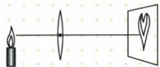

## 讲解

### 判据

物镜屏位置变化，先明确谁固定及实虚区间；固定物屏可用可逆性互换u和v。

### 流程

1. 标原位置，求u、v、判断区间。
2. 固定f且$u>f$，物远像近像小，物近像远像大。
3. 调清晰时屏或感光面跟随新的v。
4. 固定物屏移镜到u与v互换仍成像；原$u=v$时没有另一个不同互换位置。
5. 放大镜保持$u<f$，增大u可放大，跨f后规律失效。
6. 转换成原图左右方向后逐项核查选项。

## 例题

### 集体照片容纳所有人

> 来源ID Q03-07；第三章透镜及其应用；1-50/full.md 第3878–3883行。原答案与解析定位：1-50/full.md 第3885–3887行。

例 照集体相时发现有些人没有进入镜头,为了使全体人员都进入镜头,应采取下列哪种方式（）

A.照相机和镜头都不动,人站得离照相机近一些  
B.人不动,照相机离人近一些,镜头往里缩一些  
C.人不动,照相机离人近一些,镜头往外伸一些  
D.人不动,照相机离人远一些,镜头往里缩一些

**原资料答案与解析：**

解析 照集体相时,发现有些人没有进入镜头,说明像太大了,为了使全体人员都进入镜头,要使像小些,可使照相机镜头远离被拍摄物体,同时镜头靠近胶片,故 D 符合题意。

答案 D

**展开解析（依据原详解补足理由与步骤）：**

胶片范围固定，有些人超出画面，说明像太大，需增大物距，使像变小；同时减小像距重新调清晰。选D。
- A错：人靠近，物距减小、像变大。
- B错：相机靠近使物距减小，像变大；镜头内缩又不符合应增大的像距。
- C错：靠近且外伸虽符合成像调节方向，却使像更大。
- D对：相机远离人，像变小，镜头内缩减小像距，能再调清晰。
本题使用固定焦距镜头模型，不自行加入变焦功能。

### 航空器摄像头

> 来源ID Q03-09；第三章透镜及其应用；1-50/full.md 第3934–3934行。原答案与解析定位：1-50/full.md 第3930–3932行。

例2 (2024 广东中考)广东生产的无人驾驶电动垂直起降航空器首飞成功,彰显了我国科技在城市空中交通领域的领先地位。航空器可用于高空摄影、旅游观光等,航空器的摄像头相当于\_\_\_\_透镜,远处的物体通过摄像头成倒立缩小的\_\_\_\_(选填“实”或“虚”)像。在摄像头远离物体的过程中,像的大小将变\_\_\_\_。

**原资料答案与解析：**

例2 解析 航空器的摄像头采用凸透镜,根据凸透镜成像规律,物距大于2倍焦距时成倒立缩小的实像,物距越大,成的像越小。

答案 凸 实 小

**展开解析（依据原详解补足理由与步骤）：**

摄像头相当于凸透镜。远物$u>2f$，感光面得到倒立缩小实像，前两空凸、实。固定焦距镜头远离物体，u增大，清晰成像时v减小、像更小，第三空小。需要相应调焦，不能把未调焦期间的模糊影斑当清晰像。

### 固定物屏移动镜再成像

> 来源ID Q03-10；第三章透镜及其应用；1-50/full.md 第3952–3954行。原答案与解析定位：1-50/full.md 第3956–3956行；1-50/full.md 第3993–3995行。

(2024 河北中考)如图所示, 烛焰经凸透镜在光屏上成清晰的像, 此成像原理可用于制作\_\_\_\_。不改变蜡烛与光屏的位置, 向\_\_\_\_ (选填 “左” 或 “右”) 移动凸透镜到某一位置, 能再次在光屏上成清晰的像。若烛焰的高度大于凸透镜的直径, 在足够大的光屏上\_\_\_\_ (选填 “能” 或 “不能”) 成清晰且完整的像。

**原资料答案与解析：**

解析 由图可知,此时物距小于像距,烛焰在光屏上成倒立、放大的

实像,与投影仪的成像原理一样;根据光路的可逆性可知,向右移动透镜,当物距等于原来的像距时,光屏上成倒立、缩小的实像;光屏上所成实像的大小和清晰程度与物距、像距和透镜的焦距有关,与透镜的直径大小无关,所以仍能成完整的清晰的像。

答案 投影仪 右能

**展开解析（依据原详解补足理由与步骤）：**

图中$u<v$且有清晰倒立放大实像，对应投影仪。固定蜡烛与屏，向右移动镜，使新u等于旧v、新v等于旧u，依据光路可逆仍成清晰像，此次为倒立缩小，填右。
烛焰比镜片直径高仍能形成完整像，因为每个物点均可有光经过透镜不同区域，不要求镜片像窗框一样覆盖整个物体。足够大屏及正常有效光路下填能。口径会影响通过光量，原文“清晰程度与直径无关”只宜在教材几何光路范围理解，不作实际仪器的一般通则。

### 等大像反推焦距和移动

> 来源ID Q03-11；第三章透镜及其应用；1-50/full.md 第4038–4048行。原答案与解析定位：1-50/full.md 第4056–4058行。

例1 (2024 山东淄博中考)在探究凸透镜成像规律时,蜡烛和凸透镜的位置如图所示,光屏上承接到烛焰等大的像(图中未画出光屏)。若保持凸透镜位置不变,将蜡烛调至 $10 \mathrm{~cm}$ 刻度线处时,下列判断正确的是 ()

A. 向右移动光屏能承接到烛焰的像

B. 移动光屏能承接到烛焰缩小的像

C.像的位置在 50 cm 和 60 cm 刻度线之间

D. 投影仪应用了该次实验的成像规律

**原资料答案与解析：**

解析 根据口诀可知,凸透镜成实像时,物远像近像变小,当蜡烛向左移动远离凸透镜时,光屏向左移动靠近凸透镜可再次承接到烛焰的像,故A错误;光屏上承接到烛焰等大的像时物距$u=2f$,由图可知,$u=20\,\mathrm{cm}$,则焦距$f=10\,\mathrm{cm}$,保持凸透镜位置不变,将蜡烛调至10cm刻度线处时,物距$u=40\,\mathrm{cm}$,则$u>2f$,根据简图法可知,此时$f<v<2f$,像的位置在60cm和70cm刻度线之间,成倒立、缩小的实像,是照相机的成像原理,故B正确,C、D错误。

答案 B

**展开解析（依据原详解补足理由与步骤）：**

原蜡烛30cm、透镜50cm，$u=50-30=20\,\mathrm{cm}$。等大实像$u=v=2f$，故$2f=20\,\mathrm{cm}$，$f=10\,\mathrm{cm}$，原屏在$50+20=70\,\mathrm{cm}$。蜡烛移到10cm，新$u=50-10=40\,\mathrm{cm}>2f$，成缩小实像，$10\,\mathrm{cm}<v<20\,\mathrm{cm}$，像在60至70cm之间。
- A错：原屏需向左靠镜，不是向右。
- B对：移到新像处可接缩小像。
- C错：50至60cm为$v<10\,\mathrm{cm}$，违背$v>f$。
- D错：此次缩小实像对应照相机，投影仪为放大实像。
选B。位置刻度必须作差才是物距。

## 易错

- 不查区间背口诀：实虚像移动规律不同。
- 改u后仍说原屏清晰：须调对应v。
