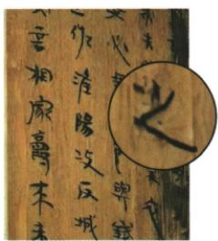
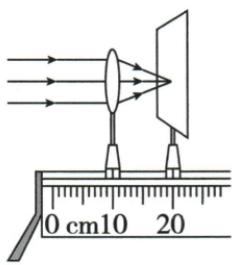
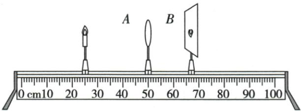

## 讲解

### 判据

光具座物镜屏实验先对准、测距、分区；屏无像须继续查条件。

### 流程

1. 测f，把物镜屏中心调到同一高度并沿主轴对准，使像居中。
2. 用刻度差求u、v，移屏找最清晰，记大小正倒。
3. 改变到$u>2f$、$u=2f$、$f<u<2f$，分别多次观察，验证普遍规律。
4. $u=f$或$u<f$时屏无有限清晰像，撤屏从原屏侧朝镜看。
5. 意外无像先查高度、范围及物距，不能直接判虚。
6. F形光源稳定且便于测像高及左右；遮半镜一般只暗不缺半像。

## 例题

### 固定物屏移动镜再成像

> 来源ID Q03-10；第三章透镜及其应用；1-50/full.md 第3952–3954行。原答案与解析定位：1-50/full.md 第3956–3956行；1-50/full.md 第3993–3995行。

(2024 河北中考)如图所示, 烛焰经凸透镜在光屏上成清晰的像, 此成像原理可用于制作\_\_\_\_。不改变蜡烛与光屏的位置, 向\_\_\_\_ (选填 “左” 或 “右”) 移动凸透镜到某一位置, 能再次在光屏上成清晰的像。若烛焰的高度大于凸透镜的直径, 在足够大的光屏上\_\_\_\_ (选填 “能” 或 “不能”) 成清晰且完整的像。

**原资料答案与解析：**

解析 由图可知,此时物距小于像距,烛焰在光屏上成倒立、放大的

实像,与投影仪的成像原理一样;根据光路的可逆性可知,向右移动透镜,当物距等于原来的像距时,光屏上成倒立、缩小的实像;光屏上所成实像的大小和清晰程度与物距、像距和透镜的焦距有关,与透镜的直径大小无关,所以仍能成完整的清晰的像。

答案 投影仪 右能

**展开解析（依据原详解补足理由与步骤）：**

图中$u<v$且有清晰倒立放大实像，对应投影仪。固定蜡烛与屏，向右移动镜，使新u等于旧v、新v等于旧u，依据光路可逆仍成清晰像，此次为倒立缩小，填右。
烛焰比镜片直径高仍能形成完整像，因为每个物点均可有光经过透镜不同区域，不要求镜片像窗框一样覆盖整个物体。足够大屏及正常有效光路下填能。口径会影响通过光量，原文“清晰程度与直径无关”只宜在教材几何光路范围理解，不作实际仪器的一般通则。

### 博物馆木牍与成像实验

> 来源ID Q03-14；第三章透镜及其应用；1-50/full.md 第4126–4171行。原答案与解析定位：1-50/full.md 第4173–4183行。

例2（2024 湖北中考）同学们参观博物馆时发现一件秦代木牍前放置着凸透镜,通过凸透镜看到的情景如图甲。为了弄清其原理,他们进行了如下探究。

甲

乙

丙

(1)如图乙,用太阳光照射凸透镜,移动光屏直至光屏上出现一个最小最亮的光斑,此凸透镜的焦距为\_\_\_\_cm。

(2)如图丙,将蜡烛放在较远处,移动光屏使光屏上呈现清晰的实像,观察像的性质,测出物距和像距;逐次改变物距,重复上述操作,实验记录如下表。

| 序号 | 物距/cm | 像的性质 / 正倒 | 像的性质 / 大小 | 像距/cm |
| --- | --- | --- | --- | --- |
| 1 | 24.0 | 倒立 | 缩小 | 17.2 |
| 2 | 22.0 | 倒立 | 缩小 | 18.8 |
| 3 | 20.0 | 倒立 | 等大 | 20.0 |
| 4 | 18.0 | 倒立 | 放大 | 22.4 |
| 5 | 16.0 | 倒立 | 放大 | 27.0 |
| ...... |  |  |  |  |

凸透镜成缩小实像时,物距\_\_\_\_(填“>”“<”或“=”）像距。

(3)小宇受第4、5组实验结果启发,推测文物与其前方凸透镜的距离u和凸透镜焦距f的关系为$f<u<2f$。小丽对小宇的观点提出了质疑,她继续减小物距,发现蜡烛在某位置时,无论怎样移动光屏,光屏上都看不到像。小丽撤去光屏,从图丙中\_\_\_\_(填“A”或“B”)侧向透镜方向观察,看到了正立放大的像,测得物距为8.0cm,她推测u和f的关系应为$u<f$。\_\_\_\_的推测合理,理由是\_\_\_\_。

**原资料答案与解析：**

例2 解析（1）平行于主光轴的光经凸透镜折射后，会会聚在主光轴的焦点上，焦点到光心的距离是凸透镜的焦距，由图乙可知该凸透镜的焦距 $f = 20.0 \, cm - 10.0 \, cm = 10.0 \, cm$ 。

(2) 分析表中数据可知, 凸透镜成缩小实像时, 物距 > 像距。

(3)继续减小物距,发现蜡烛在某位置时,无论怎样移动光屏,光屏上都看不到像,说明此时凸透镜成虚像或不成像,撤去光屏后,应从图丙中B侧向透镜方向观察,看到了正立放大的虚像。小丽测得物距为8.0 cm,小于10.0 cm,她推测u和f的关系应为$u<f$;因为博物馆木牍上的字所成的是正立放大的像,且小丽推测的依据是实验中看到了正立放大的像,与博物馆看到的现象一样,所以小丽的推测合理。

答案 (1) 10.0(或 10)

(2)>

(3) B 小丽 博物馆木牍上的字所成的是正立放大的像, 小丽推测的依据是实验中看到了正立放大的像, 与博物馆看到的现象一样 (或博物馆木牍上的字所成的是正立放大的像, 小字推测的依据是实验中看到了倒立放大的像, 与博物馆看到的现象不一样)

**展开解析（依据原详解补足理由与步骤）：**

(1) 原图镜10.0cm、光斑20.0cm，太阳光近似平行，最小最亮斑定位焦点，$f=20.0-10.0=10.0\,\mathrm{cm}$。
(2) 前两组缩小实像分别$u=24.0\,\mathrm{cm}>v=17.2\,\mathrm{cm}$、$u=22.0\,\mathrm{cm}>v=18.8\,\mathrm{cm}$，填>。第三组$u=v=20.0\,\mathrm{cm}$等大，第四五组$u<v$放大。测量数据照原表保留，不按理想公式擅改。
(3) 看不到屏像不能立即断虚像，$u=f$、未对准或屏范围不足也可能。撤屏从B侧（原屏侧）朝镜观察，见正立放大像，再结合$u=8.0\,\mathrm{cm}<f=10.0\,\mathrm{cm}$，才确认虚像。木牍所见也正立放大，符合小丽；小宇的$f<u<2f$为倒立放大实像，只“放大”相同，正倒不同。答案B、小丽，理由必须带正立放大这一相同特征。

## 易错

- 三中心仅说同一条直线：调的是同一高度及主轴对准。
- 屏无像一律虚：边界和屏范围也须查。
