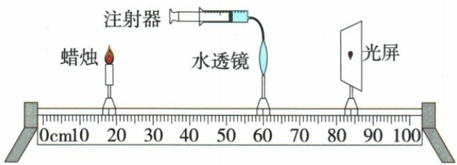
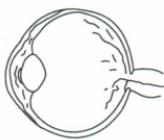
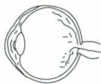
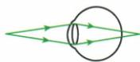
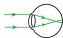
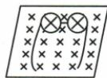
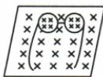

## 讲解

### 判据

光屏模拟视网膜，或比较异常正常眼球，先看真实交点在前后，再选增强或减弱会聚。

### 流程

1. 定光方向和视网膜或屏位置。
2. 像在前减弱会聚用凹；像在后增强会聚用凸。
3. 注水变厚会聚增强，像更靠镜；抽水相反。
4. 依原图把前后转换左右，同时核对操作和结果。
5. 眼镜内正立缩小图样支持凹镜；放大图样结合题意为凸镜焦距内观察。
6. 不由题图补个人诊断或配镜度数。

## 例题

### 水透镜注水模拟近视

> 来源ID Q03-17；第三章透镜及其应用；1-50/full.md 第4285–4302行。原答案与解析定位：1-50/full.md 第4320–4322行。

例1（2024 河南中考）在“爱眼日”宣传活动中,小明用如图所示的装置研究眼睛的成像,此时烛焰在光屏上成清晰的像,用此模拟正常眼睛的成像。接下来下列操作可模拟近视眼的是()

A. 向水透镜注水, 烛焰的像成在光屏右侧  
B. 向水透镜注水, 烛焰的像成在光屏左侧  
C.从水透镜抽水,烛焰的像成在光屏右侧   
D.从水透镜抽水,烛焰的像成在光屏左侧

**原资料答案与解析：**

例1 解析 近视眼的晶状体较厚,对光的偏折能力较强,远处物体清晰的像成在视网膜前方,所以模拟近视眼时,应向水透镜注水,使清晰的像成在光屏左侧,B 正确。

答案B

**展开解析（依据原详解补足理由与步骤）：**

原图蜡烛左、镜中、屏右。注水使镜更厚、会聚增强，像移到原屏左侧，即更靠近透镜，模拟视网膜前成像。
A注水对但右侧错；B注水与左侧均对；C抽水使像右移，不能模拟所问近视；D抽水与左移不对应。选B，左右只针对本图，改变光路方向后不可死记。

### 晶状体厚度和眼镜

> 来源ID Q03-18；第三章透镜及其应用；1-50/full.md 第4306–4314；4332–4334行。原答案与解析定位：1-50/full.md 第4324–4326行。

例2（2024 山西中考）如图为青少年眼病患者眼球与正常眼球对比图。关于该患者的晶状体及视力矫正，下列说法正确的是（）

A. 对光的会聚能力太强, 需佩戴近视眼镜

  
患者眼球

  
正常眼球

B. 对光的会聚能力太强, 需佩戴远视眼镜  
C. 对光的会聚能力太弱, 需佩戴近视眼镜  
D. 对光的会聚能力太弱, 需佩戴远视眼镜

**原资料答案与解析：**

例2 解析 由图可知,患者眼球与正常眼球相比,晶状体变厚,对光的会聚能力增强,远处的光线进入人眼后成像在视网膜的前方,造成视网膜成像不清,需要佩戴由凹透镜制成的近视眼镜。A 正确，B、C、D 错误。

答案A

**展开解析（依据原详解补足理由与步骤）：**

患者图晶状体较正常厚，会聚能力太强，远物成像在视网膜前，需近视凹镜。A强会聚及近视镜均符合，正确；B会聚判断对但远视镜种类错；C、D均误判会聚能力太弱。选A，保留两原图，不补图中无法确定的健康推断。

### 近视图和眼镜图

> 来源ID Q03-19；第三章透镜及其应用；1-50/full.md 第4336–4348行。原答案与解析定位：1-50/full.md 第4328–4330行。

例3 (2024 四川宜宾中考)据专家介绍,12\~18岁是青少年近视的高发期,爱眼护眼势在必行。如图所示,\_\_\_\_(选填“甲”或“乙”)图表示近视眼成像原理,应佩戴\_\_\_\_(选填“丙”或“丁”)图的眼镜进行矫正。

  
甲

  
乙

  
丙

  
丁

**原资料答案与解析：**

例3 解析 乙图将光线会聚在视网膜前方,是近视眼的成像原理;近视眼应该佩戴凹透镜进行矫正,凹透镜成正立、缩小的虚像,丁图符合题意。

答案 乙丁

**展开解析（依据原详解补足理由与步骤）：**

乙的真实光交点在视网膜前，表示近视；甲交点在视网膜后。丁镜内图案缩小，符合凹镜正立缩小虚像及发散作用；丙放大图样不作近视矫正镜。填乙、丁。第一空看会聚点相对视网膜，第二空看镜片作用，各自有依据。

## 易错

- 前死记左：换方向后左右改变。
- 操作对便选：结果方向也须对。
