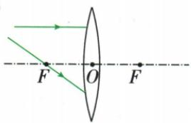
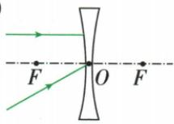
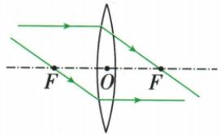
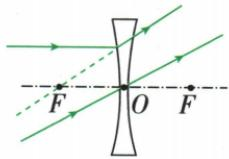
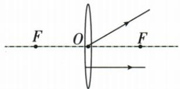
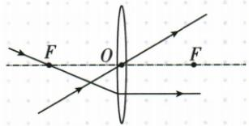
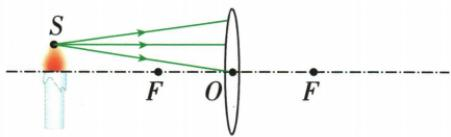
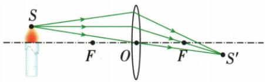

## 讲解

### 判据

有O、F或特殊光路时，先识平行主轴、过O、过F；反推光用可逆性。

### 流程

1. 判断透镜种类和箭头，标O及两F。
2. 凸镜平行光过对侧F，过入射侧F则折射后平行，过O不变向。
3. 凹镜平行光的反向延长线过入射侧虚F；入射延长指向对侧虚F则折射后平行，过O不变向。
4. 反推规则可逆使用，但箭头仍朝实际前进方向。
5. 任意光先用两可靠特殊光定位像，再从其他入射点接像；实际光实线，辅助反向延长虚线。

## 例题

### 凸凹透镜的特殊光线作图

> 来源ID Q03-02；第三章透镜及其应用；1-50/full.md 第3689–3705行。原答案与解析定位：1-50/full.md 第3707–3723行。

例1 请将光路图补充完整。

(1)

(2)

**原资料答案与解析：**

解析（1）平行于主光轴的光线经凸透镜折射后过焦点；过焦点的光线经凸透镜折射后平行于主光轴。（2）平行于主光轴的光线经凹透镜折射后，其折射光线的反向延长线过虚焦点；过光心的光线经凹透镜折射后传播方向不改变。

答案 (1) 如图所示

(2)如图所示

**展开解析（依据原详解补足理由与步骤）：**

(1) 凸镜上方平行主轴的光，折射后连接入射点与右焦点；经过左焦点的另一入射光，折射后画成平行主轴。
(2) 凹镜平行主轴光折射后发散：连接左虚焦点与入射点，向右延长为真实折射光，入射点向左虚焦点的反向延长线才用虚线。过O的光沿原方向直线延长。
两幅原答案图保留，实际光箭头沿原光前进方向，不指向反向延长线上的虚焦点。

### 由折射光反推入射光

> 来源ID Q03-04；第三章透镜及其应用；1-50/full.md 第3773–3775行。原答案与解析定位：1-50/full.md 第3755–3757行。

例1 (2024 福建中考) 在图中, 根据折射光线画出对应的入射光线。

**原资料答案与解析：**

例1 答案 如图所示

**展开解析（依据原详解补足理由与步骤）：**

原资料只给作图答案，理由按本章补写。上方折射光经过O，通过光心不改方向，向左沿直线延长得入射光。下方折射光平行主轴，依据光路可逆，入射光须通过左焦点：连接左F和透镜上对应入射点并向左延长。入射箭头均朝透镜，画线顺序不是传播方向。

### 两特殊光定位第三条光

> 来源ID Q03-12；第三章透镜及其应用；1-50/full.md 第4064–4066行。原答案与解析定位：1-50/full.md 第4075–4079行。

例2 图中 O 为凸透镜的光心, F 为焦点, 请画出烛焰上的 S 点发出的三条光线(中间一条光线平行于主光轴)经凸透镜后的折射光线, 并确定其像的位置 $S'$ 。

**原资料答案与解析：**

解析 根据凸透镜的成像规律,先作出平行于主光轴和过光心的两条特殊光线的折射光线,确定像 $S'$ 的位置;由于 S 点发出的所有光线经透镜折射后都过像点 $S'$ ,再连接 $S'$ 与最上面一条光线的入射点。

答案 如图所示

**展开解析（依据原详解补足理由与步骤）：**

S发出的中间光平行主轴，折射后过右F；最下方通过O，沿原方向延长。两条真实折射光交点为S′。最上方任意光连接它在透镜上的入射点与S′即为折射光，箭头沿透镜到S′。不是每条光都能硬套过焦点，先用可靠两条光定位再接任意光。

## 易错

- 凹镜真实光画向虚F：只有反向延长线过它。
- 每条光都套过F：任意光接已经定位的像点。
