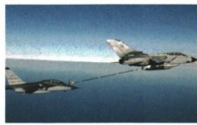
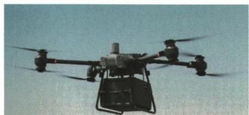

## 错法

加油机保持匀速水平飞行，就忽略输出燃油的质量变化，误判动能和势能都不变。

## 正解

先记录研究对象质量。加油机的质量减少，即使速度和高度不变，两类能仍减少；质量不变的无人机货物水平匀速时才可直接判二者不变。不能把接收燃油的战斗机与输出燃油的加油机互换。

## 例题

### 加油机质量改变时的能量比较

> 来源ID Q10-08；第十章功和机械能；101-150/full.md 第1156–1161行。原答案与解析定位：101-150/full.md 第1163–1165行。

例2 如图所示,空中加油机正在给匀速水平飞行的战斗机加油,加油机和战斗机保持稳定的高度和相同的速度匀速飞行,则在此过程中加油机的()

A. 动能和重力势能都减小   
B. 动能和重力势能都不变   
C. 动能减小, 重力势能不变   
D. 动能不变, 重力势能减小

**原资料答案与解析：**

解析 加油机在给战斗机加油的过程中,保持稳定的高度匀速飞行,但加油机的油量减少,加油机的质量减小,速度不变,所以加油机的动能减小;加油机的质量减小,高度不变,所以加油机的重力势能减小,故 A 正确。

答案 A

**展开解析（依据原详解补足理由与步骤）：**

对象是加油机；向战斗机输出燃油使自身质量减小。高度和速度都保持相同，质量减小使动能、重力势能都减小，A对。B把两者都当不变，C漏掉质量对重力势能的影响，D漏掉质量对动能的影响，都错。接收燃油的战斗机是另一个对象，不可用它的质量增加代替加油机质量变化。

### 无人机货物的机械能变化

> 来源ID Q10-13；第十章功和机械能；101-150/full.md 第1369–1382行。原答案与解析定位：101-150/full.md 第1363–1365行。

例 (2024 河北中考)2024 年 5 月 7 日,河北省首条低空无人机物流运输航线试航成功。如图为正在运输货物的无人机,下列说法正确的是 ()

A.无人机上升过程中,货物的重力势能可能减小   
B.无人机水平匀速飞行时,货物的机械能保持不变   
C.无人机在某一高度悬停时,货物的机械能一定为零   
D.无人机下降过程中,货物的动能一定增大

**原资料答案与解析：**

例 解析 无人机上升的过程中,货物质量不变,高度增加,重力势能增加,A 错误;无人机水平匀速飞行过程中,货物质量不变,高度不变,速度不变,所以动能和重力势能都不变,则机械能不变,B 正确;无人机在某一高度悬停时,货物速度为零,动能为零,但是有一定的高度,所以有重力势能,机械能不为零,C 错误;无人机下降过程中货物速度不一定增大,所以动能不一定增大,D 错误。

答案 B

**展开解析（依据原详解补足理由与步骤）：**

研究的是质量不变的货物。A错：上升时高度增加，重力势能增加。B对：水平匀速时高度、速度、质量都不变，两类能均不变，机械能不变。C错：相对地面悬停速度为零，动能零，但处于一定高度，按地面为零势能参照仍有重力势能。D错：下降只保证高度减小，不保证速度增大，可能匀速或减速。B是由状态量直接得出的不变，不能泛化为“飞行器任何阶段只受重力、机械能守恒”。
