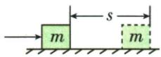
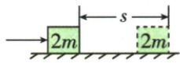
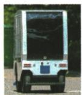

## 讲解

### 是什么

功率是单位时间做功的多少，$P=W/t$，单位W，$1\,\mathrm W=1\,\mathrm{J/s}$。功是总量，功率是快慢，两者不是同一个物理量。

### 怎么来的

同功比较时间、同时间比较功，这两种比较都可归为比值W除以t。对沿速度方向的恒力，$P=Fs/t=F(s/t)=Fv$，中间用的是速度定义。公式中字母W代表功，单位W代表瓦，要从上下文区分。

### 什么时候能用

W与t要来自同一过程，得到的是这一段平均功率。初中匀速同向恒力可直接用Fv。功率大不保证总功多，还要看时间；暂停时拉力机械功率零不表示电机全部能耗零。

## 例题

### 超音速汽车的路程功率与重力功

> 来源ID Q10-04；第十章功和机械能；101-150/full.md 第977–977行。原答案与解析定位：101-150/full.md 第979–981行。

例 (2024 山东淄博中考)在某次测试中,一款重为 $6.4 \times 10^{4} \mathrm{~N}$ 的超音速汽车以 $1260 \mathrm{~km} / \mathrm{h}$ 的速度在水平轨道上匀速直线行驶,受到的阻力为 $1.8 \times 10^{5} \mathrm{~N}$ 。 $10 \mathrm{~s}$ 内汽车通过的路程是 \_\_\_\_ m,牵引力做功的功率是 \_\_\_\_ W,重力做功是 \_\_\_\_ J。

**原资料答案与解析：**

解析 已知汽车的速度 $v = 1260 \mathrm{~km} / \mathrm{h} = 350 \mathrm{~m} / \mathrm{s}$ ，则 $10 \mathrm{~s}$ 内汽车通过的路程 $s = vt = 350 \mathrm{~m} / \mathrm{s} \times 10 \mathrm{~s} = 3500 \mathrm{~m}$ ；汽车做匀速直线运动，受力平衡，则 $F_{\text {牵}} = f = 1.8 \times 10^{5} \mathrm{~N}$ ，牵引力做功的功率 $P = F_{\text {牵}} v = 1.8 \times 10^{5} \mathrm{~N} \times 350 \mathrm{~m} / \mathrm{s} = 6.3 \times 10^{7} \mathrm{~W}$ ；重力的方向是竖直向下的，汽车运动的方向与重力的方向垂直，重力不做功。

答案 3500 $6.3 \times 10^{7}$ 0

**展开解析（依据原详解补足理由与步骤）：**

速度换算$1260/3.6=350\,\mathrm{m/s}$，10秒路程$350\times10=3500\,\mathrm m$。匀速直线运动水平方向平衡，牵引力等于阻力$1.8\times10^5\,\mathrm N$；$P=Fv=1.8\times10^5\times350=6.3\times10^7\,\mathrm W$。重力向下而路程水平，重力做功为0。汽车重力给在题中不意味着牵引力等于重力；只有对应方向平衡的力才能等量。

### 同力同距离同时间比较功率

> 来源ID Q10-05；第十章功和机械能；101-150/full.md 第985–999行。原答案与解析定位：101-150/full.md 第1013–1015行。

例1（2024 江苏连云港中考）如图所示，一个人先后两次用同样的时间、同样大小的力，将不同质量的物体在不同的表面上分别移动相同的距离。该力在此过程中所做功的大小分别为 $W_{1}$ 、 $W_{2}$ ，功率的大小分别为 $P_{1}$ 、 $P_{2}$ ，关于它们之间的大小关系说法正确的是（）

  
光滑表面

  
粗糙表面

A. $W_{1} <   W_{2}$ $P_{1} <   P_{2}$

B. $W_{1} > W_{2}$ $P_{1} > P_{2}$

C. $W_{1} = W_{2}$ $P_{1} = P_{2}$

D. $W_{1} <   W_{2}$ $P_{1} > P_{2}$

**原资料答案与解析：**

例1 解析 因为用相同的力移动相同的距离,根据 $W=Fs$ 可知,该力在此过程中所做功的大小相等;所用时间相同,根据 $P = \frac{W}{t}$ 可知,功率的大小相等,C 正确。

答案 C

**展开解析（依据原详解补足理由与步骤）：**

两次拉力都水平，大小相同，移动距离也相同，因此$W_1=Fs=W_2$。时间相同，$P_1=W_1/t=P_2$。C正确；A、B的功和功率不等都错，D两项不等也错。表面光滑或粗糙和质量不同可以影响运动状态，但题目已经给定同F、同s、同t，不能越过这些条件另作猜测。

### 无人配送车压强功与功率

> 来源ID Q10-06；第十章功和机械能；101-150/full.md 第1003–1009行。原答案与解析定位：101-150/full.md 第1017–1024行。

例2 (2024 山东济南中考)如图所示是一辆无人配送车。若该无人配送车装运快递后的总重为 6000 N, 在某小区的平直道路上匀速行驶了 60 m, 用时 40 s, 此过程中受到的牵引力为 600 N, 轮胎与地面接触的总面积为 800 cm²。通过计算回答: 该无人配送车在 40 s 的时间里,

(1)对水平地面的压强是多少?  
(2)牵引力做功是多少?   
(3)牵引力做功的功率是多少?

**原资料答案与解析：**

例2 解析（1）对水平地面的压强 $p=\frac{F}{S}=\frac{G}{S}=\frac{6\ 000\ N}{800\times10^{-4}\ m^{2}}=7.5\times10^{4}\ Pa$ 。

(2) 牵引力做功 $W = F_{\text{牵}} s = 600 \, N \times 60 \, m = 3.6 \times 10^{4} \, J$ 。  
(3) 牵引力做功的功率

$$
P = \frac {W}{t} = \frac {3 . 6 \times 1 0 ^ {4} \mathrm{J}}{4 0 \mathrm{s}} = 9 0 0 \mathrm{W。}
$$

**展开解析（依据原详解补足理由与步骤）：**

水平地面压力等于总重力6000 N；面积$800\,\mathrm{cm^2}=0.08\,\mathrm{m^2}$，压强$6000/0.08=75000\,\mathrm{Pa}$。水平牵引力600 N与60米路程对应，$W=600\times60=36000\,\mathrm J$。同一40秒内平均功率$P=36000/40=900\,\mathrm W$。也可速度$60/40=1.5\,\mathrm{m/s}$，$P=600\times1.5=900\,\mathrm W$。压力用6000 N，水平牵引功用600 N，两力不能混。

## 易错

不能用汽车重力乘水平速度作牵引功率。
