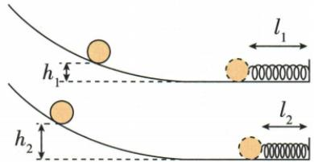

## 讲解

### 是什么

弹性势能是物体由于弹性形变而具有的能，例如压缩的弹簧或弯曲的跳板。比较同一弹性物体，在弹性限度内形变越大，弹性势能通常越大。

### 怎么来的

外力压弯跳板或压缩弹簧时做功，使能量储存在形变中；恢复形状时能量可以转化为被推动物体的动能。实验用同一弹簧的压缩量作比较，须以原长减压缩后的长度得到形变量。

### 什么时候能用

不能用形变大小直接比较不同材料、不同刚度的弹簧；超过弹性限度不能保证恢复，也不能沿用同一规律。弹簧长度和弹性形变量不是同一个量。

## 例题

### 跳板跳水过程中的三种机械能

> 来源ID Q10-07；第十章功和机械能；101-150/full.md 第1145–1150行。原答案与解析定位：101-150/full.md 第1152–1154行。

例1 运动中蕴含着许多物理知识,有关跳板跳水过程中能量变化的说法正确的是 ( )

A.运动员用力下压跳板的过程中,跳板的弹性势能减小   
B.运动员被跳板向上弹起的过程中,重力势能减小   
C.运动员离开跳板向上运动的过程中,动能减小   
D.运动员从最高点下落的过程中,动能不变

**原资料答案与解析：**

解析 运动员用力下压跳板的过程中,跳板的弹性形变程度变大,弹性势能增大,A 错误;运动员被跳板向上弹起的过程中,运动员的质量不变,高度变大,重力势能增大,B 错误;运动员离开跳板向上运动的过程中,质量不变,速度减小,动能减小,C 正确;运动员从最高点下落的过程中,质量不变,速度变大,动能增大,D 错误。

答案 C

**展开解析（依据原详解补足理由与步骤）：**

A错：跳板被压弯，弹性形变增大，弹性势能增大。B错：运动员弹起高度增加，质量不变，重力势能增大。C对：离板上升期间在重力作用下速度减小，动能减小。D错：从最高点下落时速度增大，动能增大。比较弹性势能的对象是跳板，比较另两种能的对象是运动员；最高点也只保证竖直速度为零，斜向运动仍可能有水平动能。

### 压缩弹簧探究重力势能

> 来源ID Q10-11；第十章功和机械能；101-150/full.md 第1224–1241行。原答案与解析定位：101-150/full.md 第1185–1191行。

例3（2023山东威海中考节选）小明探究重力势能大小与物体质量和高度的关系，实验装置如图所示。

(1)将铁球从斜面由静止释放后到压缩弹簧,记录铁球速度减为0时弹簧的长度。整个过程涉及的能量转化情况为\_\_\_\_\_,铁球重力势能的大小可以用被压缩后弹簧的长度来反映,长度越长,则说明铁球的重力势能越\_\_\_\_(选填“大”或“小”)。

(2)将同一铁球先后从同一斜面的不同高度 $h_1, h_2 (h_1 < h_2)$ 处由静止释放, 弹簧被压缩后的长度分别为 $l_1, l_2 (l_1 > l_2)$ , 则你能得出的结论是 \_\_\_\_。

(3)若要探究重力势能大小与物体质量的关系,请简要写出你的设计思路:\_\_\_\_。

**原资料答案与解析：**

例3 解析（1）铁球下滑，重力势能转化为动能，压缩弹簧，动能转化为弹性势能；铁球重力势能的大小可以用被压缩后弹簧的长度来反映，长度越长，弹簧的形变越小，弹性势能越小，则说明铁球的重力势能越小。

答案（1）重力势能先转化为动能，动能再转化为弹性势能 小

(2) 质量相同, 高度越低, 重力势能越小

(3) 将质量不同的铁球从同一斜面的同一高度由静止释放, 比较弹簧被压缩后的长度

**展开解析（依据原详解补足理由与步骤）：**

铁球先下滑，重力势能转化为动能，再压弹簧，动能转化为弹性势能。同一弹簧原长固定，压缩后的长度越长，压缩量越小，储能越少，所以原球重力势能越小。比较同一球两次，$h_1<h_2$而$l_1>l_2$，说明质量相同、高度较低时重力势能较小。检验质量影响则改用不同质量球，从同一斜面同一高度静止释放，比较同一弹簧速度首次为零时的长度。不能把“弹簧越长”误看成“形变越大”。

## 易错

跳板恢复过程中弹性势能减小，并不是上弹运动员的重力势能减小。
