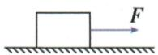
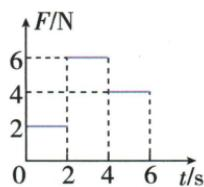
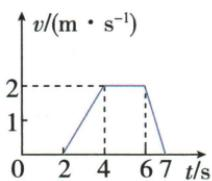

## 讲解

### 判据

力在时间段内分次改变，速度图给出路程；先按共同时间节点划分，路程来自对应的速度图面积，功来自该段力乘该段路程。

### 流程

1. 对齐两图时间轴。2. 根据静止或匀速段找受力平衡，确定摩擦力。3. 速度均非负时用每段矩形或三角形面积求路程。4. 每个恒力区间算$W_i=F_i s_i$，再加总。5. 撤去拉力后该拉力的功为零，物体仍可因惯性运动。

## 例题

### 分段拉力做功与速度图像面积

> 来源ID Q10-03；第十章功和机械能；101-150/full.md 第832–870行。原答案与解析定位：101-150/full.md 第878–880行。

例2 (2024 山东德州中考)水平面上的物体受到水平拉力 F 的作用, 拉力 F 的大小与时间 t 的关系如图甲所示, $t=6$ s 时, 将拉力 F 撤掉, 物体运动的速度 v 与时间 t 的关系如图乙所示, 已知物体运动的 v-t 图像与时间轴围成的面积大小等于物体运动的路程, 下列说法正确的是 ()

A.0\~2 s 内物体受到的摩擦力为 0  
B.2\~4 s 内物体受到的摩擦力为 6 N  
C.2\~6 s 内拉力 F 做的功为 28 J  
D.2\~7 s 内物体运动的路程为 5 m

甲

乙

**原资料答案与解析：**

例2 解析 由图可知,0\~2 s 内物体静止,受到静摩擦力,为 2 N, A 错误;4\~6 s 内,物体做匀速直线运动,受到滑动摩擦力的大小为 4 N;2\~4 s 内,物体做加速运动,受到的滑动摩擦力大小也为 4 N,B 错误;2\~4 s 内拉力做的功 $W_{1}=F_{1}s_{1}=12\ J$ ,4\~6 s 内拉力做的功 $W_{2}=F_{2}s_{2}=16\ J$ ,故 2\~6 s 内拉力 F 做的功为 $W_{1}+W_{2}=28\ J$ , C 正确;2\~7 s 内物体运动的路程为 7 m,D 错误。

答案 C

**展开解析（依据原详解补足理由与步骤）：**

A错：0至2秒v为0，水平力平衡，静摩擦力等于2 N拉力。B错：4至6秒匀速，滑动摩擦力等于4 N；在同接触条件下2至4秒虽加速，滑动摩擦仍为4 N，6 N是拉力。C对：2至4秒路程为三角形面积$s_1=(4-2)\times2/2=2\,\mathrm m$，功$W_1=6\times2=12\,\mathrm J$；4至6秒$s_2=(6-4)\times2=4\,\mathrm m$，$W_2=4\times4=16\,\mathrm J$，总28 J。D错：6至7秒撤力后路程$(7-6)\times2/2=1\,\mathrm m$，全段$2+4+1=7\,\mathrm m$。此段仍在运动，但撤去的拉力不继续做功。

## 易错

不要用最大力乘全程；这道题速度图面积等于路程已由题目明示，不能随意推广到含负速度的图。
