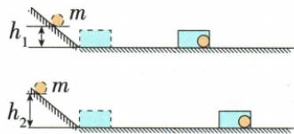

## 讲解

### 判据

小球撞木块或纸盒，停止距离是可观察效果；要把它解释成动能大小，必须让承受碰撞的物体及摩擦条件相同。

### 流程

1. 检验速度，用同球从不同高度静止释放。2. 检验质量，用不同质量且滚动条件相似的球从同高度释放，以近似保持到达水平面速度相同。3. 每次纸盒复位，轨道和接触面一致。4. 比较停止距离，推断能对外做功多少。5. 水平面若完全光滑，纸盒可能不停止，原“停止距离”判据失效。

## 例题

### 小球撞纸盒探究动能因素

> 来源ID Q10-10；第十章功和机械能；101-150/full.md 第1209–1221行。原答案与解析定位：101-150/full.md 第1181–1183行。

例2（2024陕西中考节选）如图，在“探究动能大小与哪些因素有关”的实验中，将质量相同的小球从同一斜面的不同高度由静止释放，比较纸盒被推动的距离可知：质量相同的物体，速度越大，动能越\_\_\_\_。如果要探究动能大小与物体质量的关系，应该将质量不同的小球从同一斜面的\_\_\_\_（选填“相同”或“不同”）高度由静止释放，比较纸盒被推动的距离。

**原资料答案与解析：**

例2 解析 由题意可知,质量相同的物体,速度越大,动能越大;如果要探究动能大小与物体质量的关系,应该将质量不同的小球从同一斜面的相同高度由静止释放,保持小球到达水平面的速度相同,比较纸盒被推动的距离。

答案 大 相同

**展开解析（依据原详解补足理由与步骤）：**

同质量小球由不同高度静止释放，较高释放点使到达水平面的速度较大，推动同样纸盒更远，表示可做更多功，动能更大，第一空“大”。检验质量影响要让速度相同，采用相似小球、同斜面同高度静止释放，第二空“相同”。纸盒、水平面和初始位置保持一致，不能换纸盒或换摩擦面后仍只拿停止距离比较。

## 易错

纸盒移动远只在同样实验条件下反映较大初始动能。
