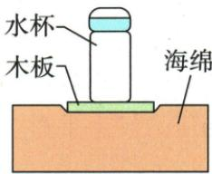

## 错法

杯静止压力等G便选压力就是重力，把大小相同当同一作用。

## 正解

杯重力地球对杯，杯压力杯对板，受力对象不同；杯压力与板支持互为相互作用。原A与B错，压强按对应界面$\frac{G_{1}}{S_{1}}$的C对。

## 例题

### 水杯木板海绵的分层压强

> 来源ID Q08-04；第八章压强；51-100/full.md 第3235–3240行。原答案与解析定位：51-100/full.md 第3242–3254行。

例3 (2024 河南中考)如图,把木板放在海绵上,木板上放一水杯,静止时木板保持水平。若水杯重为 $G_{1}$ ,木板重为 $G_{2}$ ,水杯底面积为 $S_{1}$ ,木板底面积为 $S_{2}$ 。下列说法正确的是()

A. 水杯对木板的压力就是水杯受到的重力  
B. 水杯对木板的压力和木板对水杯的支持力是平衡力  
C. 水杯对木板的压强为 $\frac{G_{1}}{S_{1}}$   
D. 木板对海绵的压强为 $\frac{G_{2}}{S_{2}}$

**原资料答案与解析：**

解析 水杯对木板的压力大小等于水杯受到的重力,但压力不是重力,A 错误;水杯对木板的压力和木板对水杯的支持力是一对相互作用力,B 错误;水杯对木板的压力大小等于水杯的重力 $G_{1}$ , 受力面积为 $S_{1}$ , 则水杯对木板的压强为 $\frac{G_{1}}{S_{1}}$ , C 正确;木板对海绵的压力大小等于木板与水杯的重力之和 $G_{1} + G_{2}$ , 受力面积为 $S_{2}$ , 则木板对海绵的压强为 $\frac{G_{1} + G_{2}}{S_{2}}$ , D 错误。

答案 C

**展开解析（依据原详解补足理由与步骤）：**

A错：杯对板压力大小等G₁，但施力受力与重力不同，不能说压力就是重力。B错：杯压板与板支持杯分属两物，为相互作用。C对：杯给板压力G₁、接触杯底S₁，压强$\frac{G_{1}}{S_{1}}$。D错：板对海绵承杯及板总重G₁+G₂，压强应(G₁+G₂)/S₂。选C，每问先标接触界面，不能跨层用压力或面积。
