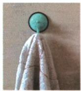

## 错法

看到$F=pS=200\,\mathrm{N}$就把它画向上，认为大气压力直接与挂物重力平衡。

## 正解

墙竖直时主要大气压差沿墙法线压紧吸盘；真正阻止下滑的是墙向上的静摩擦。填平整、200、静摩擦，两个方向受力分别分析。

## 例题

### 吸盘横向大气压力和竖向摩擦

> 来源ID Q08-16；第八章压强；101-150/full.md 第3–5行。原答案与解析定位：101-150/full.md 第7–9行。

例2 (2024 江苏无锡中考)生活中常用如图所示的吸盘挂钩来挂毛巾,使用时排尽吸盘内的空气,吸附在\_\_\_\_(选填“平整”或“不平整”)的墙面上,以防止漏气。若吸盘的横截面积为 $2 \times 10^{-3} \mathrm{~m}^{2}$ ,外界大气压为 $1 \times 10^{5} \mathrm{~Pa}$ ,则排尽空气后的吸盘受到的大气压力为\_\_\_\_N,吸盘挂钩不会掉落是因为受到墙壁对它竖直向上的\_\_\_\_力。

**原资料答案与解析：**

例2 解析 使用时排尽吸盘内的空气,吸附在平整的墙面上,以防止空气进入吸盘;排尽空气后的吸盘受到的大气压力 $F=pS=1\times10^{5}\ Pa\times2\times10^{-3}\ m^{2}=200\ N$ ;吸盘挂钩有向下掉的趋势,它不会掉落是因为受到墙壁对它竖直向上的摩擦力。

答案 平整 200 (静) 摩擦

**展开解析（依据原详解补足理由与步骤）：**

吸盘贴平整墙面便于密封，第一空平整。题定排尽空气，外大气压力$F=pS=1\times 10^{5}\times 2\times 10^{-3}=200\,\mathrm{N}$，第二空200。该压力主要垂直墙面，使接触受压；挂钩重力向下，墙对挂钩的向上静摩擦阻止滑落，第三空静摩擦。不能把200N水平压紧力直接叫向上托住的力。
