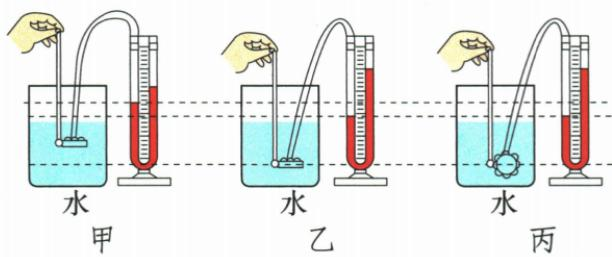

## 讲解

### 是什么

探头橡皮膜把外压变化传给密闭管内空气，U管一端连探头、另一端通常通大气，液面高度差Δh反映两端压差。被测液体密度与U管显示液密度是不同量。

### 怎么来的

压差越大液面差通常越大，同一压差下ρ管gΔh相同，显示液ρ较小则Δh更大。正常压强计一端并非直接开口，所以不能无条件视作同压连通器。

### 什么时候能用

使用先未加压液面等高，轻按膜检查响应且保持密封；不等高可重装管平衡内压，不能倒液补液伪校零。橡皮管漏气、高度差不稳或无响应应排查，不把只瞬时动一下就宣称密封完好。

## 例题

### 探头怎样增大U管高度差

> 来源ID Q08-08；第八章压强；51-100/full.md 第3466–3479行。原答案与解析定位：51-100/full.md 第3481–3481行。

如图，小明将压强计的探头放入水中某一深度处，记下U形管中两侧液面的高度差 $h$ 。下列操作能够使高度差 $h$ 增大的是（）

A. 将探头向下移动一段距离   
B. 将探头水平向左移动一段距离   
C. 将探头放在酒精中的同样深度处  
D. 将探头在原深度处向其他方向任意转动一个角度

**原资料答案与解析：**

答案A

**展开解析（依据原详解补足理由与步骤）：**

原资料只列A，依据液体压强补写。A下移增深度，水压增大，U管差增大，对。B水平移动同深度，压强不变，错。C换密度小于水的酒精且深度同，压强减小，错。D同深度只转朝向，各方向压强同，差不增，错。这里水槽ρ和U管液密度不同角色，不能混用。

### 液体压强深度方向密度实验

> 来源ID Q08-10；第八章压强；51-100/full.md 第3600–3610行。原答案与解析定位：51-100/full.md 第3622–3632行。

例1 (2024 河南中考)在“探究液体压强与哪些因素有关”时,同学们根据生活经验,提出如下猜想:

①可能与深度有关；②可能与方向有关；③可能与液体密度有关。

(1)请写出能支持猜想①的一个生活现象：\_\_\_\_。  
(2)为了验证猜想,他们利用图所示的装置进行实验。实验前,应观察U形管两侧液面是否\_\_\_\_。  
(3) 比较图中 \_\_\_\_ 两次实验可得出液体压强与深度的关系; 比较乙、丙两次实验可得出: 同种液体内部同一深度, 液体向各方向的压强 \_\_\_\_。  
(4)为探究液体压强与液体密度的关系,他们将探头放入另一杯浓盐水中,使探头在盐水中的朝向及\_\_\_\_与图乙相同,观察比较U形管两侧液面高度差。  
(5)为使 U 形管两侧液面高度差更明显,可将 U 形管中的液体换成密度\_\_\_\_(选填“更大”或“更小”)的液体。

**原资料答案与解析：**

例1 解析 (4) 探究液体压强与液体密度的关系, 应控制橡皮膜的朝向和深度相同。

(5)烧杯内液体对橡皮膜产生的压强等于U形管两侧相差的液柱产生的压强,烧杯内液体密度、橡皮膜的深度不变,U形管内液体密度越小,两侧液面高度差越大。所以,要使U形管两侧液面高度差更明显,可将U形管内液体换成密度更小的液体。

答案（1）游泳时，越往水的深处走，身体感受到的压迫越大（或水从瓶子侧壁的小孔喷出时，水位下降，喷射距离变小；或拦河大坝设计成下宽上窄的形状）

(2) 相平 (或在同一高度)

(3)甲、乙 相等  
(4) 深度  
(5) 更小

**展开解析（依据原详解补足理由与步骤）：**

(1) 不自编现象，原答案可选游泳越向深处压迫越大，或侧孔水位下降喷距变小，或坝下宽上窄。
(2) 探头未加压时U管液面应相平，是零基准；不平应重新连接排除密闭内压差。
(3) 甲乙同水同朝向而乙更深，比较深度；乙丙同深度只改朝向，显示高度差相同，说明同液同深各方向压强相等。
(4) 换浓盐水探ρ影响，朝向和深度与乙相同，仅改外液ρ。
(5) 若要同一受测压差下更明显读数，换密度更小的U管液体：用Δp表示受测压差，关系$\Delta p=\rho_{\text{管}}g\Delta h$。两边除$\rho_{\text{管}}g$，得$\Delta h=\frac{\Delta p}{\rho_{\text{管}}g}$；固定Δp和g时，减小管液密度，液面差增大。不能换成更密液就说越重越灵敏。

## 易错

- U管两端永同压相平：有一端连密闭探头。
- 换外液ρ和显示液ρ混用：一个改待测压，一个改显示灵敏程度。
