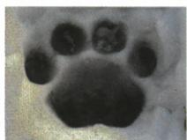
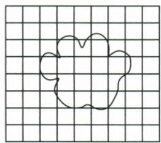

## 讲解

### 是什么

受力面积是所求压力分布的实际接触面积，叠放时不自动等大物底面积；四脚着地通常取四脚接触面积总和。$1\,\mathrm{cm^{2}}=10^{-4}\,\mathrm{m^{2}}$，$1\,\mathrm{mm}^{2}=10^{-6}\,\mathrm{m^{2}}$。

### 怎么来的

面积单位要平方：$1\,\mathrm{cm}=10^{-2}\,\mathrm{m}$，两边平方得$1\,\mathrm{cm^{2}}=(10^{-2}\,\mathrm{m})^{2}=10^{-4}\,\mathrm{m^{2}}$。大甲放小乙上，实际接触受小乙顶面限制；脚印格数乘每格面积再按接触脚数累计。

### 什么时候能用

先确认问的接触层面和有几处接触。面积换算不能沿长度千百倍照抄；鞋脚等原题可用平均面积近似，不宣称真实压力均匀。

## 例题

### 叠放正方体接触面积

> 来源ID Q08-01；第八章压强；51-100/full.md 第3075–3075；3146–3152行。原答案与解析定位：51-100/full.md 第3154–3156行。

把一个重力为 10 N、底面积为 $10 \, cm^{2}$ 的正方体甲，放在一个重力为 5 N、边长为 2 cm 的正方体乙的正上方，那么正方体乙受到甲的压力产生的压强是（）

$A.2.5\times 10$ $^{4}$ Pa

B. $1.5 \times 10^{4}$ Pa

C. $10^{4}$ Pa

D.1 Pa

**原资料答案与解析：**

解析 将甲叠放在乙的正上方, 甲对乙的压力 $F = G_{\text{甲}} = 10 \mathrm{~N}$ ; 甲的底面积为 $10 \mathrm{~cm}^2$ , 乙的底面积为 $S_{\text{乙}} = 2 \mathrm{~cm} \times 2 \mathrm{~cm} = 4 \mathrm{~cm}^2$ , 乙的底面积小于甲的底面积, 当甲叠放在乙的正上方时, 接触面积 $S = S_{\text{乙}} = 4 \mathrm{~cm}^2 = 4 \times 10^{-4} \mathrm{~m}^2$ , 乙受到甲的压力产生的压强 $p = \frac{F}{S} = \frac{10 \mathrm{~N}}{4 \times 10^{-4} \mathrm{~m}^2} = 2.5 \times 10^{4} \mathrm{~Pa}$ 。

答案 A

**展开解析（依据原详解补足理由与步骤）：**

问乙受到甲的压力，不是乙对地面：甲给乙10N，乙自身5N不能加到此压力。甲底10cm²、乙边长2cm故顶面4cm²，两者实际接触4cm²。$1\,\mathrm{cm^{2}}=(0.01\,\mathrm{m})^{2}=10^{-4}\,\mathrm{m^{2}}$，所以$S=4\times 10^{-4}\,\mathrm{m^{2}}$。
压强$\frac{10}{(4\times 10^{-4})}=2.5\times 10^{4}\,\mathrm{Pa}$，A正确。$B1.5\times 10^{4}$既不对应正确压力也不对应正确接触面；C10⁴用甲底10cm²代接触面；D1Pa数量级与单位换算错。

### 脚印方格和东北虎质量

> 来源ID Q08-06；第八章压强；51-100/full.md 第3270–3287行。原答案与解析定位：51-100/full.md 第3314–3326行。

例2 (2024 北京中考)近年来在东北林区发现了越来越多野生东北虎的足迹。生物学家为了估算某只野生东北虎的质量,在松软、平坦且足够深的雪地上,选取该东北虎四脚着地停留时的脚印,其中的一个脚印如图甲所示。在方格纸上描绘出脚印的轮廓,如图乙所示,图中每个小方格的面积均为 $9 \mathrm{~cm}^{2}$ , 数出脚印轮廓所围小方格的个数(凡大于半格的都算一个格,小于半格的都不算),用数出的小方格的个数乘以一个小方格的面积,就大致得出了脚印的面积。测出脚印的深度,在脚印旁边相同的雪地上放一底面积为 $100 \mathrm{~cm}^{2}$ 的平底容器,在容器中缓缓放入适当的物体,当容器下陷的深度与脚印的深度相同时,测出容器及内部物体的总质量为 $30 \mathrm{~kg}$ 。忽略脚趾和脚掌之间空隙的面积, $g$ 取 $10 \mathrm{~N/kg}$ ,求:

(1)该东北虎一只脚印的面积。

(2)该东北虎的质量。

  
甲

乙

**原资料答案与解析：**

例2 解析（1）一只脚印轮廓在方格纸上所围成的小方格的个数 $N=15$，一只脚印的面积 $S=NS_{\text{格}}=15\times9\ cm^{2}=135\ cm^{2}$ 。

(2) 设容器的底面积为 $S_{0}$ ，容器及内部物体的总质量为 $m_{0}$ ，

容器对雪地的压强 $p_{0}=\frac{F_{0}}{S_{0}}=\frac{m_{0}g}{S_{0}}=$ $\frac{30\ kg\times10\ N/kg}{100\times10^{-4}\ m^{2}}=3\times10^{4}\ Pa,$

设东北虎的质量为 m，东北虎四脚着地停留时对雪地的压强 $p = \frac{F}{S_{\text{总}}} = \frac{mg}{4S}$ ，依据东北虎脚印深度和容器在雪地的下陷深度相同，可知 $p = p_{0}$ ， $m = \frac{4pS}{g} =$

$$
\frac {4 \times 3 \times 1 0 ^ {4} \mathrm{Pa} \times 1 3 5 \times 1 0 ^ {- 4} \mathrm{m} ^ {2}}{1 0 \mathrm{N/kg}} =
$$

162 kg。

**展开解析（依据原详解补足理由与步骤）：**

(1) 按原题大于半格计1、小于半格不计，按原轮廓逐格核对共15格，原解析也为15格。每格9cm²，一脚$S=15\times 9=135\,\mathrm{cm^{2}}$。
(2) 平底容器质量30kg，压力$30\times 10=300\,\mathrm{N}$；底面积$100\,\mathrm{cm^{2}}=0.01\,\mathrm{m^{2}}$，压强$\frac{300}{0.01}=3\times 10^{4}\,\mathrm{Pa}$。同一性质雪地下陷深度相同，按题估测模型将平均压强视为相等。虎四脚停留，总接触面积$4\times 135\,\mathrm{cm^{2}}=540\,\mathrm{cm^{2}}=0.054\,\mathrm{m^{2}}$。虎重力$F=pS_{\text{总}}=3\times 10^{4}\times 0.054=1620\,\mathrm{N}$；质量$m=\frac{F}{g}=\frac{1620}{10}=162\,\mathrm{kg}$。
这是原题方格与压痕的估测，不能宣称精确到每脚受力一样或现实雪总满足唯一关系。

## 易错

- 4cm²换成0.04m²：漏平方。
- 一脚面积当四脚总面积：按题脚数累加。
