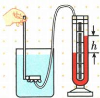
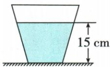
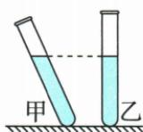
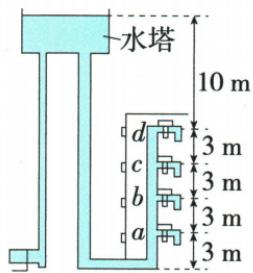

## 讲解

### 是什么

静止液体因重力和流动性，对底和侧面有压强。均匀液体中相对自由液面的水柱压强增量$p=\rho gh$，ρ用$\mathrm{kg/m^{3}}$，h是到自由液面的竖直深度m，g用$\mathrm{N/kg}$，p用Pa。

### 怎么来的

取截面积S、深度h的假想液柱，体积$V=Sh$，质量$m=\rho Sh$，重力$G=\rho Shg$；在静液模型中柱底承受其重力所对应压差，$p=\frac{G}{S}=\frac{\rho Shg}{S}=\rho gh$。S抵消说明同深度压差不由该液柱粗细决定。同液同深各方向压强同。

### 什么时候能用

静止、密度近似均匀、重力场近似一致。若自由液面另受气压，绝对压强还含表面气压，本章通常求液体产生的增量。h不是斜管长、离地高或距容器底高；流动时不能不加条件套静液关系。

## 例题

### 探头怎样增大U管高度差

> 来源ID Q08-08；第八章压强；51-100/full.md 第3466–3479行。原答案与解析定位：51-100/full.md 第3481–3481行。

如图，小明将压强计的探头放入水中某一深度处，记下U形管中两侧液面的高度差 $h$ 。下列操作能够使高度差 $h$ 增大的是（）

A. 将探头向下移动一段距离   
B. 将探头水平向左移动一段距离   
C. 将探头放在酒精中的同样深度处  
D. 将探头在原深度处向其他方向任意转动一个角度

**原资料答案与解析：**

答案A

**展开解析（依据原详解补足理由与步骤）：**

原资料只列A，依据液体压强补写。A下移增深度，水压增大，U管差增大，对。B水平移动同深度，压强不变，错。C换密度小于水的酒精且深度同，压强减小，错。D同深度只转朝向，各方向压强同，差不增，错。这里水槽ρ和U管液密度不同角色，不能混用。

### 水对桶底与桶对桌面

> 来源ID Q08-09；第八章压强；51-100/full.md 第3565–3571行。原答案与解析定位：51-100/full.md 第3573–3578行。

例 如图所示,铁桶重为 $10 \, N$ , 桶的底面积为 $100 \, cm^{2}$ , 往桶里倒入 $2.5 \, kg$ 的水, 水深 $15 \, cm$ , 铁桶平放在水平桌面上, 求: (水的密度为 $1.0 \times 10^{3} \, kg/m^{3}$ , g 取 $10 \, N/kg$ )

(1) 水对桶底的压强；  
(2) 水对桶底的压力;  
(3)水平桌面受到桶的压强。

**原资料答案与解析：**

解析（1）水的深度 $h=15\ cm=0.15\ m$ ，则水对桶底的压强 $p=\rho gh=1.0\times10^{3}\ kg/m^{3}\times10\ N/kg\times0.15\ m=1\ 500\ Pa$ 。

(2) 桶的底面积 $S = 100 \mathrm{~cm}^{2} = 1.0 \times 10^{-2} \mathrm{~m}^{2}$ , 由 $p = \frac{F}{S}$ 得, 水对桶底的压力 $F = p S = 1500 \mathrm{~Pa} \times 1.0 \times 10^{-2} \mathrm{~m}^{2} = 15 \mathrm{~N}$ 。  
(3) 桶内水的重力 $G_{\text{水}}=mg=2.5\ kg\times10\ N/kg=25\ N$ ，水平桌面受到桶的压力 $F'=G_{\text{桶}}+G_{\text{水}}=10\ N+25\ N=35\ N$ ，水平桌面受到桶的压强 $p=\frac{F'}{S}=\frac{35\ N}{1.0\times10^{-2}\ m^{2}}=3\ 500\ Pa$ 。

答案 (1) $1500 \mathrm{~Pa}$ (2) $15 \mathrm{~N}$ (3) $3500 \mathrm{~Pa}$

**展开解析（依据原详解补足理由与步骤）：**

(1) 水深$15\,\mathrm{cm}=0.15\,\mathrm{m}$，水压$p=\rho gh=1000\times 10\times 0.15=1500\,\mathrm{Pa}$。
(2) 桶底$100\,\mathrm{cm^{2}}=0.01\,\mathrm{m^{2}}$，水对桶底压力$F=pS=1500\times 0.01=15\,\mathrm{N}$。水重力$2.5\times 10=25\,\mathrm{N}$，不等于15N，因为原桶上宽下窄，侧壁也承担作用。
(3) 桶与水整体静止，桌面压力是总重$10+25=35\,\mathrm{N}$。接触底面积0.01m²，桌面压强$\frac{35}{0.01}=3500\,\mathrm{Pa}$。同一题两个F和两个p分清对象，不能拿15N作整个桶的压力。

### 相同试管质量同的两液

> 来源ID Q08-11；第八章压强；51-100/full.md 第3614–3616行。原答案与解析定位：51-100/full.md 第3634–3636行。

例2（2024 江苏常州中考）如图所示, 甲、乙两支完全相同的试管内分别装有质量相等的不同液体, 甲试管倾斜、乙试管竖直, 两试管内液面相平。甲试管内的液体密度为 $\rho_{\text{甲}}$ , 液体对试管底部的压强为 $p_{\text{甲}}$ ; 乙试管内的液体密度为$\rho_{\text{乙}}$ ，液体对试管底部的压强为 $p_{\text{乙}}$ ，则 $\rho_{\text{甲}}$ \_\_\_\_ $\rho_{\text{乙}}, p_{\text{甲}}$ \_\_\_\_ $p_{\text{乙}}$ 。

**原资料答案与解析：**

例2 解析 由图可知,甲试管内的液体体积比乙试管内的液体体积大,因液体质量相同,由 $\rho=\frac{m}{V}$ 可知, $\rho_{\text{甲}}<\rho_{\text{乙}}$ 。因两试管内液面相平,即两试管内液体高度相等,由 $p=\rho gh$ 可知, $p_{\text{甲}}<p_{\text{乙}}$ 。

答案 < <

**展开解析（依据原详解补足理由与步骤）：**

甲倾斜、乙竖直，原图液面在同一水平高度且两底在同一水平基准，因此竖直深度同；倾斜甲沿管长度更长，同截面容积更多，$V_{\text{甲}}>V_{\text{乙}}$。题给液体质量同，$\rho =\frac{m}{V}$，所以$\rho _{\text{甲}}<\rho _{\text{乙}}$。再用$p=\rho gh$，同h同g且甲ρ小，$p_{\text{甲}}<p_{\text{乙}}$。两空<、<。不能把沿斜管长度当竖直深度；相同质量不自动使液体底压相同。

### 关闭龙头时水塔c处压强

> 来源ID Q08-12；第八章压强；51-100/full.md 第3644–3669行。原答案与解析定位：51-100/full.md 第3640–3642行。

例3 (2024 广东广州中考)某居民楼水塔液面与各楼层水龙头的竖直距离如图所示, 若 $\rho_{\text{水}}=1.0\times10^{3}\ kg/m^{3}$ , g 取 10 $\mathrm{N/kg}$, 水龙头关闭时, c 处所受水的压强为 ()

A. $3.0 \times 10^{4} \mathrm{~Pa}$

B. $9.0 \times 10^{4} \mathrm{~Pa}$

C. $1.0 \times 10^{5} \mathrm{~Pa}$

D. $1.3 \times 10^{5} \mathrm{~Pa}$

**原资料答案与解析：**

例3 解析 水龙头关闭时, c 处水的深度 $h_{c}=10\ m+3\ m=13\ m$ , c 处所受水的压强 $p_{c}=\rho_{*}gh_{c}=1.0\times10^{3}\ kg/m^{3}\times10\ N/kg\times13\ m=1.3\times10^{5}\ Pa$ , A、B、C 错误, D 正确。

答案D

**展开解析（依据原详解补足理由与步骤）：**

原图自由液面到d为10m，d到c再3m，所以c深度$h=10+3=13\,\mathrm{m}$。水静止，c水的压强$\rho gh=1000\times 10\times 13=1.3\times 10^{5}\,\mathrm{Pa}$，D对。$A3.0\times 10^{4}$只算相邻楼层3m，$B9.0\times 10^{4}$误取地面到c高度，$C1.0\times 10^{5}$只算液面到d的10m，均不是从自由液面到c的完整竖直距离。此处为相对自由液面压力的水柱增量，未把大气总压混入。

## 易错

- h用斜管长：取竖直距离。
- 液体越多底压必大：比较ρ和h，不单看总重。
