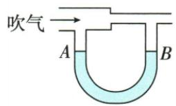

## 讲解

### 是什么

初中通常连通器上端开口、下端相通，装同种液体且静止、各自由面受相同外气压时液面相平。茶壶、水位计、水塔等可据此理解。

### 怎么来的

在下方同一水平连通液体位置，两侧压强必须相等；同ρ、同表面气压，ρgh相同便h相同，所以自由面等高。两端气压不同或液体不同，平衡可需不同高度；仍流动时也不应用静止相平结论。

### 什么时候能用

先查连通、同液、静止、表面外压同。吹气U管两上端压强不同，液面不相平是平衡结果，不否定连通器条件规律。水塔关闭龙头时按静液深度求压，开启流动另需考虑。

## 例题

### 关闭龙头时水塔c处压强

> 来源ID Q08-12；第八章压强；51-100/full.md 第3644–3669行。原答案与解析定位：51-100/full.md 第3640–3642行。

例3 (2024 广东广州中考)某居民楼水塔液面与各楼层水龙头的竖直距离如图所示, 若 $\rho_{\text{水}}=1.0\times10^{3}\ kg/m^{3}$ , g 取 10 $\mathrm{N/kg}$, 水龙头关闭时, c 处所受水的压强为 ()

A. $3.0 \times 10^{4} \mathrm{~Pa}$

B. $9.0 \times 10^{4} \mathrm{~Pa}$

C. $1.0 \times 10^{5} \mathrm{~Pa}$

D. $1.3 \times 10^{5} \mathrm{~Pa}$

**原资料答案与解析：**

例3 解析 水龙头关闭时, c 处水的深度 $h_{c}=10\ m+3\ m=13\ m$ , c 处所受水的压强 $p_{c}=\rho_{*}gh_{c}=1.0\times10^{3}\ kg/m^{3}\times10\ N/kg\times13\ m=1.3\times10^{5}\ Pa$ , A、B、C 错误, D 正确。

答案D

**展开解析（依据原详解补足理由与步骤）：**

原图自由液面到d为10m，d到c再3m，所以c深度$h=10+3=13\,\mathrm{m}$。水静止，c水的压强$\rho gh=1000\times 10\times 13=1.3\times 10^{5}\,\mathrm{Pa}$，D对。$A3.0\times 10^{4}$只算相邻楼层3m，$B9.0\times 10^{4}$误取地面到c高度，$C1.0\times 10^{5}$只算液面到d的10m，均不是从自由液面到c的完整竖直距离。此处为相对自由液面压力的水柱增量，未把大气总压混入。

### 粗细管吹气与U管液面

> 来源ID Q08-19；第八章压强；101-150/full.md 第81–99行。原答案与解析定位：101-150/full.md 第101–103行。

例2 如图所示,将一根玻璃管制成粗细不同的两段,管的下方与一个装有部分水的连通器相通。当从管的一端吹气时,连通器两端A、B液面高度变化情况正确的是()

A.A 液面上升

B.A 液面下降

C.B 液面下降

D.A、B液面高度均不变

**原资料答案与解析：**

解析 粗管中的空气流速小,压强大;细管中的空气流速大,压强小,则 A 液面上方的气体压强大,B 液面上方的气体压强小,所以 A 液面下降,B 液面上升。

答案B

**展开解析（依据原详解补足理由与步骤）：**

A上方粗管空气速度较小压强较大，B上方细管流速大压强小，A较大压力把A液面向下压，B液面上升。A上升错、B下降对、C的B下降错、D不变错，选B。这个U管两端上方气压不同，不能套同大气压连通器液面必相平。

## 易错

- 连通就所有液面同高：还须同液静止同外压。
- 气压不同仍套相平：会有液柱差平衡压差。
