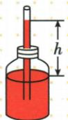
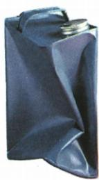

## 讲解

### 判据

密封、吸管或冷却容器，先比内外压；吸盘再按横竖分别找平衡力。

### 流程

1. 定外气压及内部有无排气、冷却等改变。
2. 外压较大，推向内或推液进入低压区域，不另加吸力。
3. 排尽空气模型作用面积S，外压$F=pS$；内压不零需按压差算净作用。
4. 吸盘横向压紧，竖向重力由向上静摩擦平衡。
5. 举应用仅取原资料已列实例，不从注射器吸液推所有注射过程都靠气压。

## 例题

### 简易气压计搬到高楼

> 来源ID Q08-13；第八章压强；51-100/full.md 第3695–3697行。原答案与解析定位：51-100/full.md 第3699–3699行。

小明将圆形厚壁玻璃瓶装满带颜色的水,用插有细玻璃管的橡皮塞塞紧瓶口,然后向细管内吹入少量气体,细管内水柱如图所示。将该装置从一楼拿到十楼,会发现 h \_\_\_\_ (选填“增大”“减小”或“不变”)。

**原资料答案与解析：**

答案 增大

**展开解析（依据原详解补足理由与步骤）：**

原资料只给增大，理由按压差补写。厚壁瓶内部封闭气体经细管水柱与外大气平衡，在温度等条件近似不变时，楼层更高外气压减小，瓶内外压差增大，推细管水柱升高，h增大。瓶内气体体积也可能变化，结论是这个装置给定操作的定性趋势，不说瓶内气压绝对恒定，更不能把所有天气温度变化混成楼层效应。

### 铁桶浇冷水被压扁

> 来源ID Q08-15；第八章压强；51-100/full.md 第3882–3884行。原答案与解析定位：51-100/full.md 第3876–3878行。

例1（2024 河北中考）如图所示,在铁桶内放少量的水,用火加热,沸腾之后把桶口堵住,然后浇上冷水。在\_\_\_\_作用下,铁桶被压扁了。这种作用在生活中有很多应用,请举出一个实例:\_\_\_\_。

**原资料答案与解析：**

例1 解析 铁桶里的水被加热, 产生大量的水蒸气。桶口堵住, 浇上冷水, 温度降低, 水蒸气液化, 桶内的气压变小, 在大气压的作用下铁桶被压扁。

答案 大气压 吸盘(或拔罐、活塞式抽水机、胶头滴管吸取液体等)

**展开解析（依据原详解补足理由与步骤）：**

加热使桶内有大量水蒸气，封口后冷却，部分水蒸气液化，桶内气体减少压强降低，外大气与内压不平衡，外压把桶压扁，填大气压。应用仅用原答案列吸盘、活塞抽水机或胶头滴管等，不自编。未开始讲热学时本题局部说明液化是气变液即可；原件保留，不提供复现加热密封操作指导。

### 吸盘横向大气压力和竖向摩擦

> 来源ID Q08-16；第八章压强；101-150/full.md 第3–5行。原答案与解析定位：101-150/full.md 第7–9行。

例2 (2024 江苏无锡中考)生活中常用如图所示的吸盘挂钩来挂毛巾,使用时排尽吸盘内的空气,吸附在\_\_\_\_(选填“平整”或“不平整”)的墙面上,以防止漏气。若吸盘的横截面积为 $2 \times 10^{-3} \mathrm{~m}^{2}$ ,外界大气压为 $1 \times 10^{5} \mathrm{~Pa}$ ,则排尽空气后的吸盘受到的大气压力为\_\_\_\_N,吸盘挂钩不会掉落是因为受到墙壁对它竖直向上的\_\_\_\_力。

**原资料答案与解析：**

例2 解析 使用时排尽吸盘内的空气,吸附在平整的墙面上,以防止空气进入吸盘;排尽空气后的吸盘受到的大气压力 $F=pS=1\times10^{5}\ Pa\times2\times10^{-3}\ m^{2}=200\ N$ ;吸盘挂钩有向下掉的趋势,它不会掉落是因为受到墙壁对它竖直向上的摩擦力。

答案 平整 200 (静) 摩擦

**展开解析（依据原详解补足理由与步骤）：**

吸盘贴平整墙面便于密封，第一空平整。题定排尽空气，外大气压力$F=pS=1\times 10^{5}\times 2\times 10^{-3}=200\,\mathrm{N}$，第二空200。该压力主要垂直墙面，使接触受压；挂钩重力向下，墙对挂钩的向上静摩擦阻止滑落，第三空静摩擦。不能把200N水平压紧力直接叫向上托住的力。

## 易错

- 给药推注也说大气压吸：原提醒区分推与吸。
- 200N就是竖直承重：主要垂直墙面。
