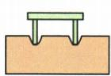
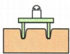
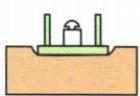
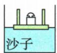
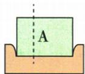

## 讲解

### 判据

用海绵凹陷比较压力效果，先查材料同、只变F或只变S。

### 流程

1. 选择易观察形变材料，同材料凹陷反映效果。
2. 查F效应时S同，只改承载重力。
3. 查S效应时F同，换同物方向或接触形式。
4. 图3图4换海绵沙子，$\frac{F}{S}$相同即p同，凹陷不能跨材料直接比压强。
5. 切去部分改S也改F，不能验证仅面积作用。
6. 结论附控制条件，而非只说越大越明显。

## 例题

### 压力效果海绵沙子完整实验

> 来源ID Q08-07；第八章压强；51-100/full.md 第3291–3306；3342–3354行。原答案与解析定位：51-100/full.md 第3328–3340行。

例3（2024黑龙江齐齐哈尔中考）在“探究影响压力作用效果的因素”实验中，实验小组利用小桌、砝码、海绵、沙子等器材在水平台面上进行探究。

  
图1

  
图2

  
图3

  
图4

  
图5

(1)实验中压力的作用效果是通过海绵\_\_\_\_来体现的，\_\_\_\_（选填“可以”或“不可以”）用木板代替海绵来完成实验。

(2) 比较图 1、图 2 所示的实验现象, 将小桌分别正立放在海绵上, 这样做的目的是控制 \_\_\_\_ 相同; 改变压力的大小, 可以得出结论: \_\_\_\_ 。

(3) 比较图 2、图 3 所示的实验现象可以得出另一结论, 下列实例中, 可用此结论解释的是 \_\_\_\_。

A.书包的背带做得很宽

B.严禁货车超载

(4)图3中桌面对海绵的压强为 $p_{1}$ ，小航将图3中的小桌、砝码平放在表面平整的沙子上，静止时如图4所示，桌面对沙子的压强为 $p_{2}$ 。则 $p_{1}$ \_\_\_\_ $p_{2}$ （选填“<”“=”或“>”）。

(5)小彬选用质地均匀的长方体物块 A 代替小桌进行探究,如图 5 所示,将物块 A 沿竖直虚线方向切成大小不同的两部分。将左边部分移开后,发现剩余部分对海绵的压力作用效果没有发生变化,由此他得出结论:压力的作用效果和受力面积无关。你认为他在探究过程中存在的问题是 \_\_\_\_。

**原资料答案与解析：**

例3 解析（4）压强大小跟压力大小和受力面积大小有关，图3、图4中压力相同，受力面积相同，由 $p=\frac{F}{S}$ 可知压强相同。

(5)为了探究压力的作用效果与受力面积的关系,应保持压力大小不变。小彬在探究时,将物块A沿竖直方向切成大小不同的两部分,这两部分对海绵的压力不同,因此探究过程中存在的问题是没有控制压力的大小相同。小彬可以改变物块A的放置方向,从而在改变受力面积的同时保持压力大小不变。

答案 (1) 被压下的深浅 不可以

(2) 受力面积 受力面积相同时, 压力越大, 压力的作用效果越明显

(3) A

(4)=

(5)没有控制压力大小相同

**展开解析（依据原详解补足理由与步骤）：**

(1) 通过被压下深浅反映作用效果，为转换法；木板形变难辨，按本实验不可以替代。
(2) 图1图2同小桌脚接触，控制受力面积相同；加砝码增压力，凹陷更明显，结论是面积同压力越大效果越明显。
(3) 图2图3同桌加同砝码，压力同而接触由脚变桌面，面积大效果减弱。A宽背带控制压力增面积，能用此结论；B限载改变压力，不能用这一对照结论，选A。
(4) 图3图4压力、受力面积相同，按$p=\frac{F}{S}$压强相等；海绵与沙子的形变不同不表示同一压强不同，比较凹陷须同一种材料。
(5) 沿竖直方向切走部分后面积变且质量压力同变，没控制压力大小相同。正常应换同物放置方向以保持压力只改面积，不能据该切割实验断压强与面积无关。

## 易错

- 海绵更软凹深就p大：材料不同无直接可比。
- 竖切验证面积因素：压力未保持。
